# 文章搜索


## 文章搜索页的静态结构

> 目标：实现文章搜索页面的主要静态结构和样式


首页入口：

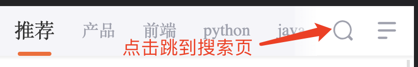

搜索页面：

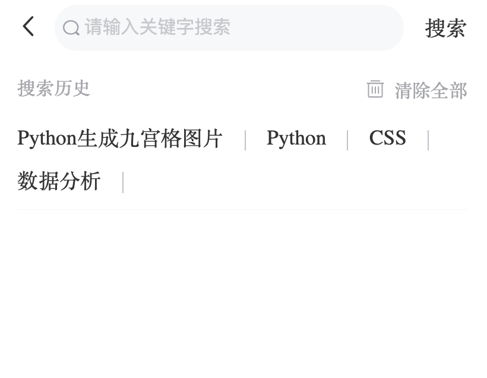

**操作步骤**

1. 为首页 Tab 栏右边的 ”放大镜“ 按钮添加点击事件，点击后跳转到搜索页：

```jsx
import { useHistory } from 'react-router'
```

```jsx
const history = useHistory()
```

```jsx
<Icon type="iconbtn_search" onClick={() => history.push('/search')} />
```


2. 在 `pages/Search/index.js` 中编写页面的静态结构：

```jsx
import Icon from '@/components/Icon'
import NavBar from '@/components/NavBar'
import classnames from 'classnames'
import { useHistory } from 'react-router'
import styles from './index.module.scss'

const Search = () => {
  const history = useHistory()

  return (
    <div className={styles.root}>
      {/* 顶部导航栏 */}
      <NavBar
        className="navbar"
        onLeftClick={() => history.go(-1)}
        extra={
          <span className="search-text">搜索</span>
        }
      >
        <div className="navbar-search">
          <Icon type="iconbtn_search" className="icon-search" />

          <div className="input-wrapper">
            {/* 输入框 */}
            <input type="text" placeholder="请输入关键字搜索" />

            {/* 清空输入框按钮 */}
            <Icon type="iconbtn_tag_close" className="icon-close" />
          </div>
        </div>
      </NavBar>

      {/* 搜索历史 */}
      <div className="history" style={{ display: 'block' }}>
        <div className="history-header">
          <span>搜索历史</span>
          <span>
            <Icon type="iconbtn_del" />清除全部
          </span>
        </div>

        <div className="history-list">
          <span className="history-item">
            Python生成九宫格图片<span className="divider"></span>
          </span>
          <span className="history-item">
            Python<span className="divider"></span>
          </span>
          <span className="history-item">
            CSS<span className="divider"></span>
          </span>
          <span className="history-item">
            数据分析<span className="divider"></span>
          </span>
        </div>
      </div>

      {/* 搜素建议结果列表 */}
      <div className={classnames('search-result', 'show')}>
        <div className="result-item">
          <Icon className="icon-search" type="iconbtn_search" />
          <div className="result-value">
            <span>{'高亮'}</span>{`其余`}
          </div>
        </div>
      </div>
    </div>
  )
}

export default Search
```


## 搜索关键字的输入与防抖处理

> 目标：从文本输入框获取输入的关键字内容，且运用防抖机制降低获取频繁


实现思路：

- 防抖实现步骤：
  - 1）清理之前的定时器 
  - 2）新建定时器执行任务


**操作步骤**

1. 声明一个用于存放关键字的状态

```jsx
import { useState } from 'react'
```

```jsx
// 搜索关键字内容
const [keyword, setKeyword] = useState('')
```


2. 为输入框设置 `value` 属性和 `onChange` 事件

```jsx
<input
  type="text"
  placeholder="请输入关键字搜索"
  value={keyword}
  onChange={onKeywordChange}
  />
```

```jsx
const onKeywordChange = e => {
  const text = e.target.value.trim()
  setKeyword(text)
  console.log(text)
}
```


当前效果：每次键盘敲击都会打印出输入框中的内容

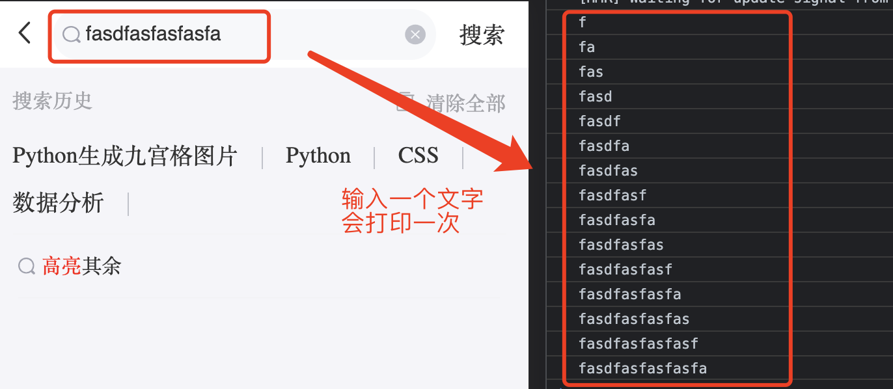


3. 防抖处理

```jsx
import { useRef } from 'react'
```

```jsx
// 存储防抖定时器
const timerRef = useRef(-1)

const onKeywordChange = e => {
  const text = e.target.value.trim()
  setKeyword(text)

  // 清除之前的定时器
  clearTimeout(timerRef.current)

  // 新建任务定时器
  timerRef.current = setTimeout(() => {
    console.log(text)
  }, 500)
}

// 销毁组件时记得最好要清理定时器
useEffect(() => {
  return () => {
    clearTimeout(timerRef.current)
  }
}, [])
```


---


## 发送请求获取搜索建议数据

> 目标：将输入的关键发送到服务端，获取和该关键字匹配的建议数据


实现思路：

- 通过 Redux Action 来发送请求，获取结果数据后保存在 Redux Store 中


**操作步骤**

1. 创建 `store/reducer/search.js`，编写 Reducer 函数

```jsx
const initialState = {
  suggestions: [],
}

export const search = (state = initialState, action) => {
  const { type, payload } = action

  switch (type) {
    case 'search/suggestions':
      return {
        ...state,
        suggestions: payload
      }

    default:
      return state
  }
}
```


2. 在 `store/index.js`中配置新建的 reducer

```js
// ...
import { search } from './search'

const rootReducer = combineReducers({
  // ...
  search
})
```


3. 创建 `store/actions/search.js`，编写 Action Creator：

```js
import http from '@/utils/http'

/**
 * 设置建议结果到 Redux 中
 * @param {Array} list 建议结果
 */
const setSuggestions = list => {
  return {
    type: 'search/suggestions',
    payload: list
  }
}

/**
 * 获取输入联想建议列表
 * @param {string} q 查询内容
 * @returns thunk
 */
export const getSuggestions = keyword => {
  return async dispatch => {
    // 请求建议结果
    const res = await http.get('/suggestion', {
      params: {
        q: keyword
      }
    })
    const { options } = res.data.data

    // 转换结果：将每一项建议拆分成关键字匹配的高亮部分和非高亮部分
    const list = options.map(item => {
      const rest = item.substr(keyword.length)
      return { keyword, rest }
    })

    // 保存到 Redux 中
    dispatch(setSuggestions(list))
  }
}
```


4. 在之前的防抖定时器中调用 Action：

```jsx
import { getSuggestions } from '@/store/actions/search'
```

```jsx
const dispatch = useDispatch()

// 代表是否正处于搜索操作中
const [isSearching, setIsSearching] = useState(false)

const onKeywordChange = e => {
  const text = e.target.value.trim()
  setKeyword(text)

  // 清除之前的定时器
  clearTimeout(timerRef.current)

  // 新建任务定时器
  timerRef.current = setTimeout(() => {
    // 仅当输入的关键字不为空时，执行搜索
    if (text) {
      setIsSearching(true)
      dispatch(getSuggestions(text))
    } else {
      setIsSearching(false)
    }
  }, 500)
}
```

## 高亮处理

+ 封装高亮函数

```jsx
const highLight = (str: string, keyword: string) => {
  const reg = new RegExp(keyword, 'gi')
  return str.replace(reg, (match) => {
    return `<span style="color: red;">${match}</span>`
  })
}
```

+ 封装高亮

```jsx
{/* 搜素建议结果列表 */}
<div
className={classnames('search-result', {
  show: isSearching,
})}
>
{suggestions.map((item, index) => {
  return (
    <div className="result-item" key={index}>
      <Icon className="icon-search" type="iconbtn_search" />
      <div
        className="result-value"
        dangerouslySetInnerHTML={{ __html: highLight(item, keyword) }}
      ></div>
    </div>
  )
})}
```


---


## 搜索建议结果列表的渲染

> 目标：从 Redux 中获取搜索建议数据，渲染到界面上


实现思路：

- 使用 `useSelector`从 Redux 中获取数据


**操作步骤**

1. 从 Redux 中获取搜索建议数据

```jsx
import { getSuggestions } from '@/store/actions/search'
```

```jsx
const suggestions = useSelector(state => state.search.suggestions)
```


2. 将搜索建议数据渲染到界面上

```jsx
<div className={classnames('search-result', 'show')}>
  {suggestions.map((item, index) => {
    return (
      <div className="result-item" key={index}>
        <Icon className="icon-search" type="iconbtn_search" />
        <div className="result-value">
          <span>{item.keyword}</span> {item.rest}
        </div>
      </div>
    )
  })}
</div>
```


效果：

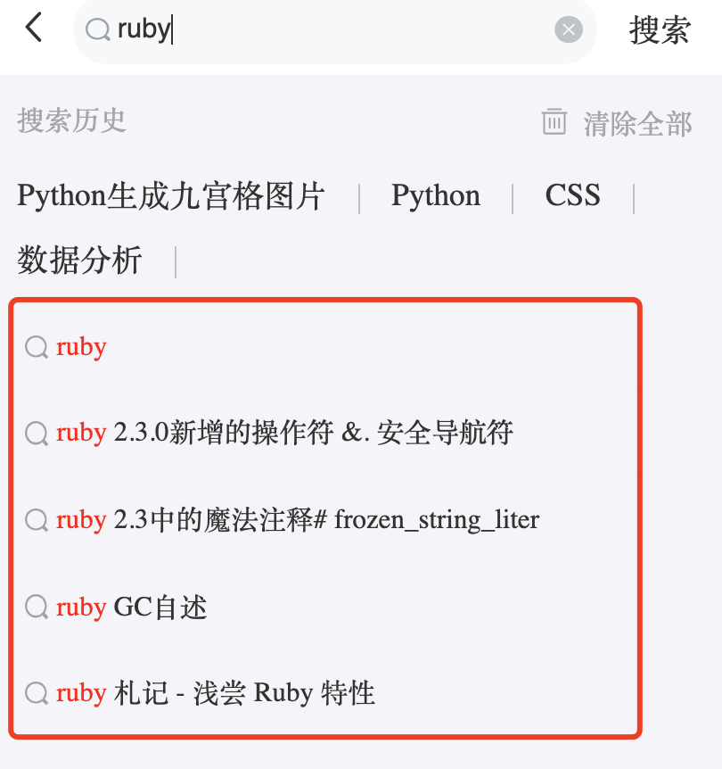


---


## 搜索建议列表和搜索历史的按需显示

> 目标：实现在做搜索操作时只显示搜索建议列表；其他情况只显示搜索历史


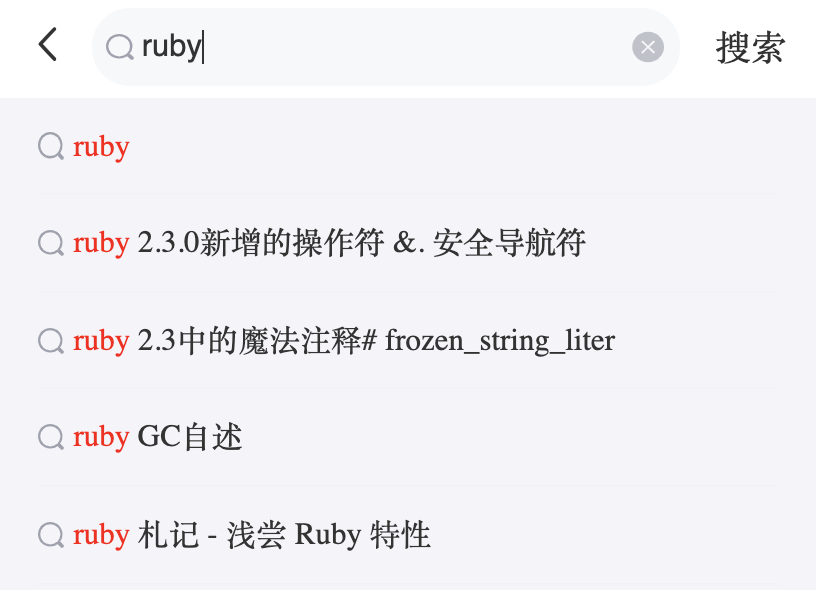


实现思路：

- 利用之前创建的 `isSearching` 状态，控制建议列表和搜索历史的显示、隐藏


**操作步骤**

+ 提供isSearching状态

```jsx
// 是否显示搜索
const [isSearching, setIsSearching] = useState(false)
```

+ 修改isSearching状态

```jsx
const onChange = (e: React.ChangeEvent<HTMLInputElement>) => {
  const text = e.target.value.trim()
  setKeyword(text)

  window.clearTimeout(timerRef.current)
  timerRef.current = window.setTimeout(() => {
    // console.log('发送请求')
    if (text) {
      setIsSearching(true)
      dispatch(getSuggestList(text))
    } else {
      setIsSearching(false)
    }
  }, 500)
}
```

+ 根据isSearching状态控制显示和隐藏

```jsx
{/* 搜索历史 */}
<div
  className="history"
  style={{ display: isSearching ? 'none' : 'block' }}
>

{/* 搜素建议结果列表 */}
<div
  className={classnames('search-result', {
    show: isSearching,
  })}
>
```


---


## 清空输入框关键字的按钮

> 目标：点击输入框内的 x 按钮，清空输入的关键字内容


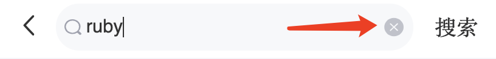


实现思路：

- 清空输入框绑定的状态
- 清空 Redux 中保存的搜索建议结果


**操作步骤**

+ 给清空功能注册点击事件

```jsx
{/* 清空输入框按钮 */}
<Icon
  type="iconbtn_tag_close"
  className="icon-close"
  onClick={onClear}
/>
```

+ 触发action实现清空

```jsx
const onClear = () => {
  // 清空搜索关键字
  setKeyword('')
  // 设置搜索状态
  setIsSearching(false)
  // 清空redux中的数据
  dispatch(clearSuggestions())
}
```

+ 在reducer中提供清空的处理

```jsx

export type SearchAction =
  | {
      type: 'search/saveSuggestions'
      payload: string[]
    }
  | {
      type: 'search/clearSuggestions'
    }

export default function reducer(state = initValue, action: SearchAction) {
  if (action.type === 'search/saveSuggestions') {
    return {
      ...state,
      suggestions: action.payload,
    }
  }
  if (action.type === 'search/clearSuggestions') {
    return {
      ...state,
      suggestions: [],
    }
  }
  return state
}
```

+ 在actions中，提供清空的action

```jsx
/**
 * 清空推荐记录
 */
export function clearSuggestions(): SearchAction {
  return {
    type: 'search/clearSuggestions',
  }
}

```


----


## 动态渲染搜索历史记录

> 目标：将每次输入的搜索关键字记录下来，再动态渲染到界面上


实现思路：

- 在成功搜索后，将关键字存入 Redux 和 LocalStorage 中
- 从 Redux 中获取所有关键字，并渲染到界面


**操作步骤**

1. 在 `store/reducers/search.js`中，添加操作搜索历史相关的 Reducer 逻辑：

```js
const initialState = {
	// ...
  histories: []
}

export const search = (state = initialState, action) => {
  const { type, payload } = action

  switch (type) {
    case 'search/add_history':
      return {
        ...state,
        histories: [payload, ...state.histories]
      }
      
    // ...
  }
}
```


2. 在`utils/storage.js`中，添加在本地缓存中操作搜索历史相关的工具函数：

```js
// 搜索关键字的本地缓存键名
const SEARCH_HIS_KEY = 'itcast_history_k'

/**
 * 从缓存获取搜索历史关键字
 */
export const getLocalHistories = () => {
  return JSON.parse(localStorage.getItem(SEARCH_HIS_KEY)) || []
}

/**
 * 将搜索历史关键字存入本地缓存
 * @param {Array} histories 
 */
export const setLocalHistories = histories => {
  localStorage.setItem(SEARCH_HIS_KEY, JSON.stringify(histories))
}

/**
 * 删除本地缓存中的搜索历史关键字
 */
export const removeLocalHistories = () => {
  localStorage.removeItem(SEARCH_HIS_KEY)
}
```


3. 在 `store/actions/search.js`中，修改原先请求搜索建议的 Action Creator：

```js
export const getSuggestions = keyword => {
  return async (dispatch, getState) => {
    // ...

    // 搜索成功后，保存为历史关键字
    // 1）保存搜索关键字到 Redux 中
    await dispatch(addSearchHistory(keyword))
    // 2）保存搜索关键字到 LocalStorage 中
    const { histories } = getState().search
    setLocalHistories(histories)
  }
}
```


4. 在 `store/index.js`中，添加从本地缓存初始化搜索历史的逻辑：

```js
import { getLocalHistories, getTokenInfo } from '@/utils/storage'

const store = createStore(
  // ...

  // 参数二：初始化时要加载的状态
  {
		// ...
    
    search: {
      histories: getLocalHistories(),
      suggestions: []
    }
  },

  // ...
)
```


5. 在搜索页面中，从 Redux 获取搜索历史数据，再渲染到界面

```js
const histories = useSelector(state => state.search.histories)
```

```jsx
<div className="history-list">
  {histories.map((item, index) => {
    return (
      <span className="history-item" key={index}>
        {item}<span className="divider"></span>
      </span>
    )
  })}
</div>
```


效果：

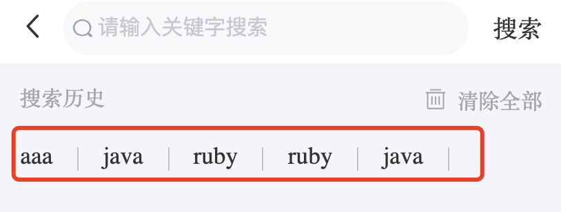


---

## 点击搜索添加历史记录

> 目标：点击顶部 ”搜索“ 按钮，或点击搜索建议列表中的一项，跳转到搜索详情页


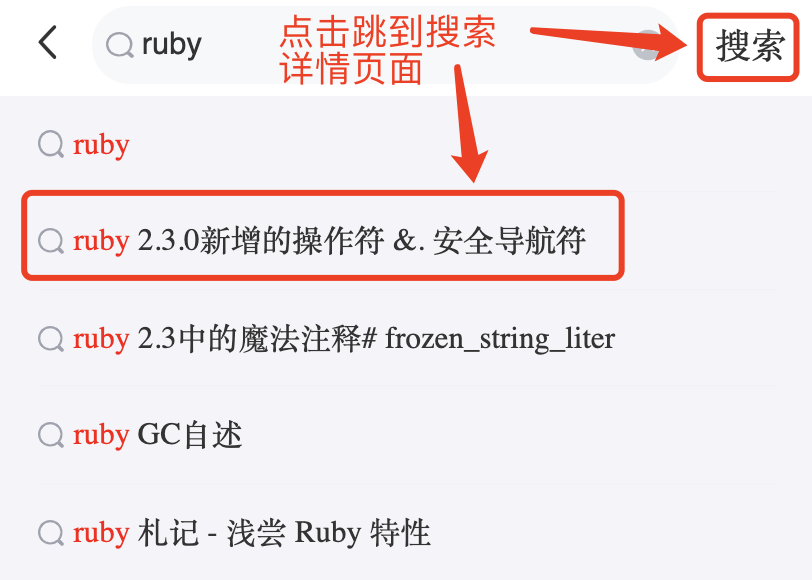


**操作步骤**

+ 注册事件进行搜索

```jsx
<NavBar
  className="navbar"
  onLeftClick={() => history.go(-1)}
  extra={
    <span className="search-text" onClick={() => onSearch(keyword)}>
      搜索
    </span>
  }
>

<div className="history-list">
  {histories.map((item, index) => {
    return (
      <span
        className="history-item"
        key={index}
        onClick={() => onSearch(item)}
      >
        {index !== 0 && <span className="divider"></span>}
        {item}
      </span>
    )
  })}
</div>

<div
  className="result-item"
  key={index}
  onClick={() => onSearch(item)}
>
  <Icon className="icon-search" type="iconbtn_search" />
  <div
    className="result-value"
    dangerouslySetInnerHTML={{
      __html: highlight(item, keyword),
    }}
  ></div>
</div>
```

+ 提供 *onSearch*方法

```jsx
const onSearch = (key: string) => {
  // console.log(key)
  // 保存搜索记录
  if (!key) return
  dispatch(addSearchList(key))
}
```

+ 在reducers中处理history

```jsx
const initValue: SeartchType = {
  // 存放推荐的结果
  suggestions: [],
  // 存放历史记录
  histories: [],
}

export type SearchAction =
  | {
      type: 'search/saveSuggestions'
      payload: string[]
    }
  | {
      type: 'search/clearSuggestions'
    }
  | {
      type: 'search/saveHistories'
      payload: string[]
    }

if (action.type === 'search/saveHistories') {
  return {
    ...state,
    histories: action.payload,
  }
}
```

+ actions中处理添加历史记录的action

```jsx

export function addSearchList(keyword: string): RootThunkAction {
  return async (dispatch, getState) => {
    // 获取到原来的histories
    let histories = getState().search.histories
    // 1. 不允许有重复的历史记录, 先删除原来历史记录中的keyword
    histories = histories.filter((item) => item !== keyword)
    // 添加keyword
    histories = [keyword, ...histories]
    // 最多显示10条
    if (histories.length > 10) {
      histories = histories.slice(0, 10)
    }
    // 保存 redux
    dispatch({
      type: 'search/saveHistories',
      payload: histories,
    })
    // 保存到本地
    setLocalHistories(histories)
  }
}

```

+ 页面渲染

```jsx
<div className="history-list">
    {histories.map((item, index) => {
      return (
        <span
          className="history-item"
          key={index}
          onClick={() => onSearch(item)}
        >
          {index !== 0 && <span className="divider"></span>}
          {item}
        </span>
      )
    })}
  </div>
```


---


## 清空搜索历史记录

> 目标：点击”清除全部“按钮后，删除全部的搜索历史记录


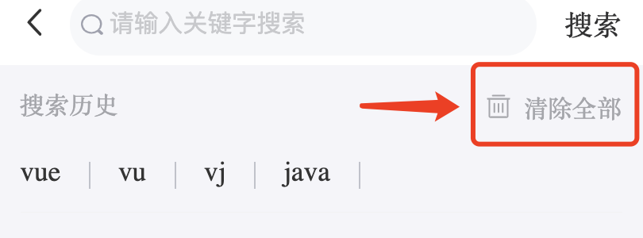


实现思路：

- 删除 Redux 和 LocalStorage 中存储的历史记录


**操作步骤**

+ 给清空按钮注册点击事件

```jsx
<div className="history-header">
  <span>搜索历史</span>
  <span onClick={onClearHistory}>
    <Icon type="iconbtn_del" />
    清除全部
  </span>
</div>
```

+ 显示弹窗

```jsx

const onClearHistory = () => {
  // 清空历史记录
  Dialog.confirm({
    title: '温馨提示',
    content: '你确定要清空记录吗？',
    onConfirm: function () {
      dispatch(clearHistories())
    },
  })
}
```

+ 在actions中准备action

```jsx
/**
 * 清空历史记录
 * @returns
 */
export function clearHistories(): RootThunkAction {
  return async (dispatch) => {
    // 清空本地历史记录
    removeLocalHistories()
    // 清空redux数据
    dispatch({
      type: 'search/clearHistories',
    })
  }
}

```

+ 在reducers中处理action

```jsx
export type SearchAction =
  | {
      type: 'search/clearHistories'
    }
    
export default function reducer(state = initValue, action: SearchAction) {

  if (action.type === 'search/clearHistories') {
    return {
      ...state,
      histories: [],
    }
  }
  return state
}

```


---


## 搜索详情页的静态结构

> 目标：实现搜索详情页的静态结构和样式


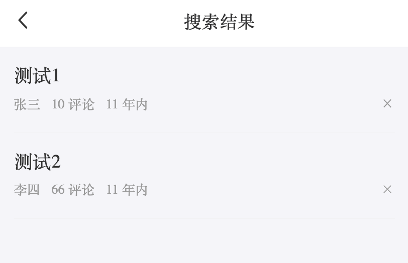


**操作步骤**

1. 将资源包中对应的样式文件，拷贝到 `pages/Search/Result/`目录下，然后编写该目录下的`index.js`：

```jsx
import NavBar from '@/components/NavBar'
import styles from './index.module.scss'

const SearchResult = () => {
  return (
    <div className={styles.root}>
      {/* 顶部导航栏 */}
      <NavBar>搜索结果</NavBar>

      <div className="article-list">
        <div>文章列表</div>
      </div>
    </div>
  )
}

export default SearchResult

```

2. 配置路由

```jsx
<Route path="/search" exact component={Search}></Route>
<Route path="/search/result" exact component={SearchResult}></Route>
```

3. 搜索的时候需要跳转

```jsx
const onSearch = (key: string) => {
  // console.log(key)
  // 保存搜索记录
  if (!key) return
  dispatch(addSearchList(key))

  // 跳转页面
  history.push('/search/result?key=' + key)
}
```


## 请求搜索详情页数据

> 目标：获取从搜索页面传入的参数后，调用后端接口获取搜索详情


**操作步骤**

1. 获取通过 URL 地址传入到搜索详情页的查询字符串参数 `q`

```js
// 获取通过 URL 地址传入的查询字符串参数
const params = new URLSearchParams(location.search)
const key = params.get('key')
```


2. 在 `store/reducers/search.js` 中添加保存搜索详情数据的 Reducer 逻辑

```js
const initValue: SeartchType = {
  // 存放推荐的结果
  suggestions: [],
  // 存放历史记录
  histories: [],
  // 存放搜索的结果
  results: [],
}

export default function reducer(state = initValue, action: SearchAction) {
  if (action.type === 'search/saveResults') {
    return {
      ...state,
      results: action.payload,
    }
  }
  return state
}
```


3. 在 `store/actions/search.js`中编写 Action Creator：

```jsx
/**
 * 获取搜索结果数据
 */
export function getSearchResults(
  keyword: string,
  page: number
): RootThunkAction {
  return async (dispatch) => {
    const res = await request.get<ResultRes>('search', {
      params: {
        q: keyword,
        page,
        per_page: 10,
      },
    })
    dispatch({
      type: 'search/saveResults',
      payload: res.data.results,
    })
  }
}

```


4. 在搜索详情页面中，通过 `useEffect` 在进入页面时调用以上编写的 Action：

```jsx
const location = useLocation()
const search = new URLSearchParams(location.search)
const key = search.get('key')!
const dispatch = useDispatch()
useEffect(() => {
  dispatch(getSearchResults(key, 1))
}, [dispatch, key])
```


---


## 渲染搜索详情列表

> 目标：将请求到的搜索详情数据渲染到界面上


**操作步骤**

1. 从 Redux 中获取搜索详情数据

```js
import { useDispatch, useSelector } from 'react-redux'
```

```js
const articles = useSelector(state => state.search.searchResults)
```


2. 将数据渲染成列表

```jsx
<div className="article-list">
  {results.map((item) => (
    <ArticleItem
      key={item.art_id}
      article={item}
      channelId={-1}
    ></ArticleItem>
  ))}
</div>
```


## 加载更多数据

+ 引入组件

```
import { InfiniteScroll } from 'antd-mobile-v5'
```

+ 渲染组件

```js
{/* 无限加载 */}
<InfiniteScroll loadMore={loadMore} hasMore={hasMore} />
```

+ 提供属性

```jsx
// 是否有更多数据
const [hasMore, setHasMore] = useState(true)
// 加载状态
const [loading, setLoading] = useState(false)
```

+ 加载更多的逻辑

```jsx
let page = 1

const loadMore = async () => {
  if (loading) return
  setLoading(true)
  await dispatch(getSearchResults(key, page))
  page = page + 1
  setLoading(false)
  if (page > 5) {
    setHasMore(false)
  }
}
```


---

## 点击搜索详情列表跳到文章详情页

> 目标：实现在搜索详情列表中点击一个列表项，跳转到文章的详情页面


**操作步骤**

1. 为搜索详情列表项添加点击事件

```jsx
<div key={article.art_id} onClick={() => gotoAritcleDetail(article.art_id)}>
  // ...
</div>
```

```jsx
// 跳转到文章详情页面
const gotoAritcleDetail = articleId => {
  history.push(`/article/${articleId}`)
}
```


---


# 文章详情页


## 文章详情页的基本静态结构

> 目标：实现详情页基本的文章内容展示相关的静态结构和样式


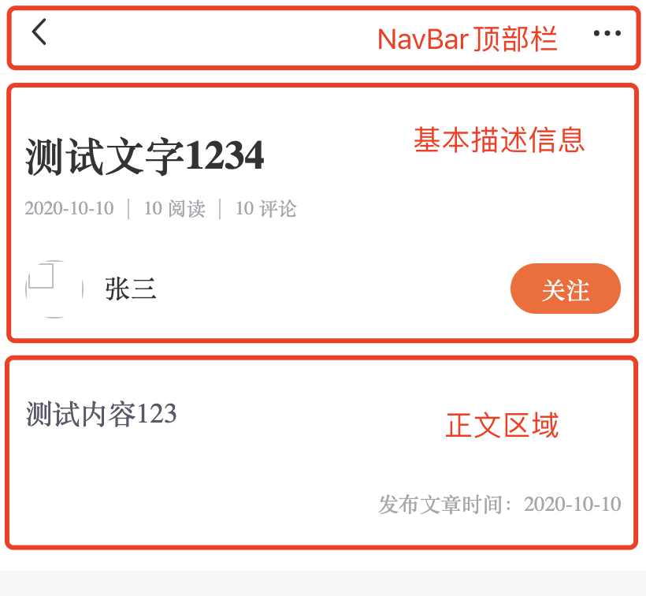


**操作步骤**

1. 将资源包的相关样式文件拷贝到 `pages/Article/`目录，然后编写该目录下的 `index.js`：

```jsx
import Icon from '@/components/Icon'
import NavBar from '@/components/NavBar'
import { useHistory } from 'react-router'
import styles from './index.module.scss'

const Article = () => {
  const history = useHistory()

  return (
    <div className={styles.root}>
      <div className="root-wrapper">
        {/* 顶部导航栏 */}
        <NavBar
          onLeftClick={() => history.go(-1)}
          extra={
            <span>
              <Icon type="icongengduo" />
            </span>
          }
        >
          {/* <div className="nav-author">
            
            <span className="name">{'张三'}</span>
            <span className="follow">关注</span>
          </div> */}
        </NavBar>

        <>
          <div className="wrapper">
            <div className="article-wrapper">
              {/* 文章描述信息栏 */}
              <div className="header">
                <h1 className="title">{'测试文字1234'}</h1>

                <div className="info">
                  <span>{'2020-10-10'}</span>
                  <span>{10} 阅读</span>
                  <span>{10} 评论</span>
                </div>

                <div className="author">
                  
                  <span className="name">{'张三'}</span>
                  <span className="follow">关注</span>
                </div>
              </div>

              {/* 文章正文内容区域 */}
              <div className="content">
                <div className="content-html dg-html">测试内容123</div>
                <div className="date">发布文章时间：{'2020-10-10'}</div>
              </div>
            </div>
          </div>
        </>
      </div>
    </div>
  )
}

export default Article

```


---

## 请求文章详情数据

+ 准备action actions/article.js

```jsx
import request from '@/utils/request'

export function getArticleInfo(id: string) {
  return async (dispatch: any) => {
    const res = await request.get(`/articles/${id}`)
    const info = res.data
    console.log(info)
  }
}

```

+ 组件中发送请求

```jsx
const Article = () => {
  const history = useHistory()
  const dispatch = useDispatch()
  const Params = useParams<{ id: string }>()

  // 获取动态路由参数
  const articleId = Params.id

  useEffect(() => {
    dispatch(getArticleInfo(articleId))
  })
}
```

+ 处理reducer

```jsx
// 初始状态
type Detail = {
  art_id: string
  attitude: number
  aut_id: string
  aut_name: string
  aut_photo: string
  comm_count: number
  content: string
  is_collected: boolean
  is_followed: boolean
  like_count: number
  pubdate: string
  read_count: number
  title: string
}
type ArticleType = {
  info: Detail
}
const initialState: ArticleType = {
  // 文章详情数据
  info: {},
} as ArticleType

type ArticleAction = {
  type: 'article/setArticleInfo'
  payload: ArticleType
}

export default function article(state = initialState, action: ArticleAction) {
  switch (action.type) {
    case 'article/setArticleInfo':
      return {
        ...state,
        info: action.payload,
      }
    default:
      return state
  }
}

```

+ 修改store/reducer/index.ts

```jsx
import login from './login'
import profile from './profile'
import home from './home'
import search from './search'
import article from './article'
import { combineReducers } from 'redux'
// import search from './search'
const reducer = combineReducers({
  login,
  profile,
  home,
  search,
  article,
})

export default reducer
```

+ 修改store/indexts

```
type ActionType =
  | HomeType
  | LoginType
  | ProfileType
  | SearchType
  | ArticleAction
```

+ 修改action

```jsx
import request from '@/utils/request'
import { HomeThunkAction } from '..'

export function getArticleInfo(id: string): HomeThunkAction {
  return async (dispatch) => {
    const res = await request.get(`/articles/${id}`)
    const info = res.data
    dispatch({
      type: 'article/setArticleInfo',
      payload: info,
    })
  }
}

```


## 渲染文章详情

> 目标：将请求到的文章详情数据，渲染到界面上

**操作步骤**

```jsx
import Icon from '@/components/Icon'
import NavBar from '@/components/NavBar'
import { RootState } from '@/store'
import { getArticleInfo } from '@/store/actions/article'
import { useEffect } from 'react'
import { useDispatch, useSelector } from 'react-redux'
import { useHistory, useParams } from 'react-router'
import styles from './index.module.scss'
import dayjs from 'dayjs'
import classNames from 'classnames'

const Article = () => {
  const history = useHistory()
  const dispatch = useDispatch()
  const Params = useParams<{ id: string }>()

  // 获取动态路由参数
  const articleId = Params.id

  const info = useSelector((state: RootState) => {
    return state.article.info
  })
  useEffect(() => {
    dispatch(getArticleInfo(articleId))
  }, [dispatch, articleId])

  return (
    <div className={styles.root}>
      <div className="root-wrapper">
        {/* 顶部导航栏 */}
        <NavBar
          onLeftClick={() => history.go(-1)}
          extra={
            <span>
              <Icon type="icongengduo" />
            </span>
          }
        >
          {/* <div className="nav-author">
            
            <span className="name">{'张三'}</span>
            <span className="follow">关注</span>
          </div> */}
        </NavBar>

        <>
          <div className="wrapper">
            <div className="article-wrapper">
              {/* 文章描述信息栏 */}
              <div className="header">
                <h1 className="title">{info.title}</h1>

                <div className="info">
                  <span>{dayjs(info.pubdate).format('YYYY-MM-DD')}</span>
                  <span>{info.read_count} 阅读</span>
                  <span>{info.comm_count} 评论</span>
                </div>

                <div className="author">
                  
                  <span className="name">{info.aut_name}</span>
                  <span
                    className={classNames(
                      'follow',
                      info.is_followed ? 'followed' : ''
                    )}
                  >
                    {info.is_followed ? '已关注' : '关注'}
                  </span>
                </div>
              </div>

              {/* 文章正文内容区域 */}
              <div className="content">
                <div
                  className="content-html dg-html"
                  dangerouslySetInnerHTML={{ __html: info.content }}
                ></div>
                <div className="date">
                  发布文章时间：{dayjs(info.pubdate).format('YYYY-MM-DD')}
                </div>
              </div>
            </div>
          </div>
        </>
      </div>
    </div>
  )
}

export default Article

```


## 文章内容防 XSS 攻击

> 目标：清理正文中的不安全元素，防止 XSS 安全漏洞


实现思路：

- 使用 `dompurify` 对 HTML 内容进行净化处理


**操作步骤**

1. 安装包

```bash
npm i dompurify --save
```


2. 在页面中调用 `dompurify` 来对文章正文内容做净化：

```js
import DOMPurify from 'dompurify'
```

```jsx
<div
  className="content-html dg-html"
  dangerouslySetInnerHTML={{ __html: DOMPurify.sanitize(info.content || '') }}
  ></div>
```


---


## 文章内容中的代码高亮

> 目标：实现嵌入文章中的代码带有语法高亮效果


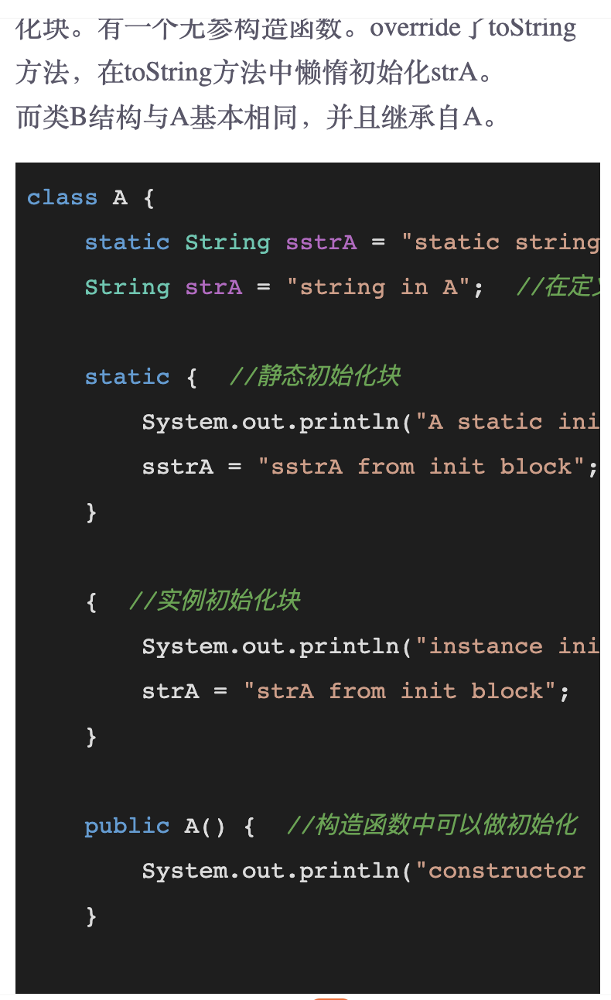


实现思路：

- 通过 `highlight.js` 库实现对文章正文 HTML 中的代码元素自动添加语法高亮


**操作步骤**

1. 安装包

```bash
npm i highlight.js --save
```


2. 在页面中引入 `highlight.js` 

```jsx
import hljs from 'highlight.js'
import 'highlight.js/styles/vs2015.css'
```


3. 在文章加载后，对文章内容中的代码进行语法高亮

```jsx
useEffect(() => {
  // 配置 highlight.js
  hljs.configure({
    // 忽略未经转义的 HTML 字符
    ignoreUnescapedHTML: true,
  })
  // 获取到内容中所有的code标签
  const codes = document.querySelectorAll('.dg-html code')
  codes.forEach((el) => {
    // 让code进行高亮
    hljs.highlightElement(el as HTMLElement)
  })
}, [detail])
```


---


## 页面滚动后在导航栏显示文章作者

> 目标：实现当页面滚动至描述信息部分消失，顶部导航栏上显示作者信息


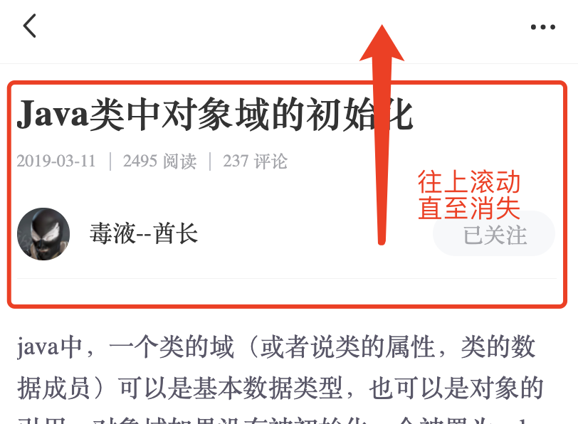


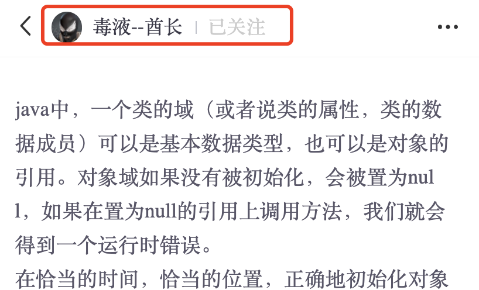


实现思路：

- 为顶部导航栏组件 NavBar 设置中间部分的内容
- 监听页面的 `scroll` 事件，在页面滚动时判断描述信息区域的 `top` 是否小于等于 0；如果是，则将 NavBar 中间内容设置为显示；否则设置为隐藏


**操作步骤**

1. 为顶部导航栏添加作者信息

```jsx
{/* 顶部导航栏 */}
<NavBar
  className="navBar"
  onLeftClick={() => history.go(-1)}
  extra={
    <span>
      <Icon type="icongengduo" />
    </span>
  }
>
  {isShowAuthor ? (
    <div className="nav-author">
      
      <span className="name">{detail.aut_name}</span>
      <span
        className={classNames(
          'follow',
          detail.is_followed ? 'followed' : ''
        )}
      >
        {detail.is_followed ? '已关注' : '关注'}
      </span>
    </div>
  ) : (
    ''
  )}
</NavBar>

```


2. 声明状态和对界面元素的引用

```jsx
// 是否显示顶部信息
const [isShowAuthor, setIsShowAuthor] = useState(false)
const authorRef = useRef<HTMLDivElement>(null)
```

3. 设置滚动事件监听，判断是否显示导航栏中的作者信息

```jsx
useEffect(() => {
  const onScroll = function () {
    const rect = authorRef.current?.getBoundingClientRect()!
    console.log(rect)
    if (rect.top <= 0) {
      setIsShowAuthor(true)
    } else {
      setIsShowAuthor(false)
    }
  }
  document.addEventListener('scroll', onScroll)
  return () => {
    document.removeEventListener('scroll', onScroll)
  }
}, [])
```


----


## 文章评论：封装没有评论时的界面组件

> 目标：实现一个组件，展示没有任何评论时的提示信息


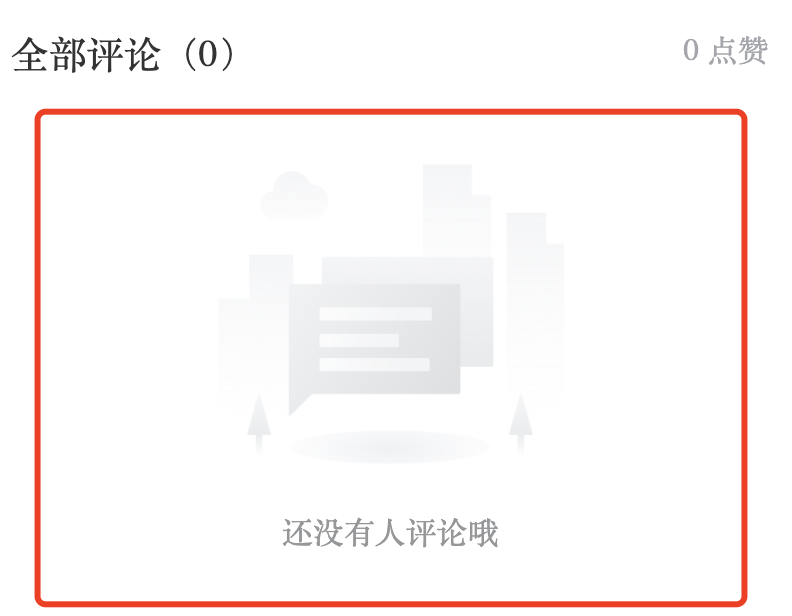


**操作步骤**

1. 创建 `components/NoComment/` 目录，并将资源包中对应的样式文件拷贝进来，然后再编写 `index.js`代码：

```jsx
import noCommentImage from '@/assets/none.png'
import styles from './index.module.scss'

const NoComment = () => {
  return (
    <div className={styles.root}>
      
      <p className="no-comment">还没有人评论哦</p>
    </div>
  )
}

export default NoComment
```


---


## 文章评论：封装用户评论列表项组件

> 目标：将评论列表中的一项封装成一个组件


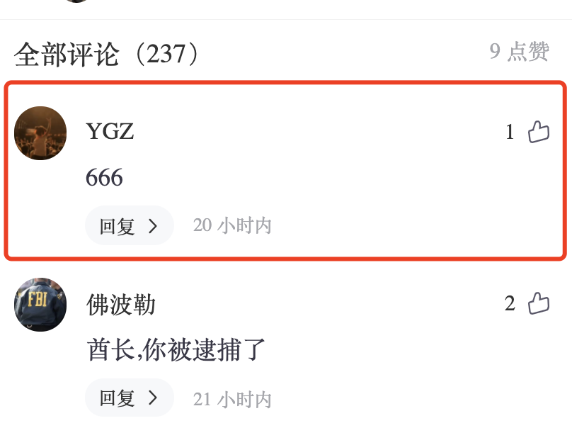

**操作步骤**

1. 创建 `pages/Article/components/CommentItem/`目录，拷贝资源包中的样式文件到该目录，然后编写 `index.js`代码：

```jsx
import Icon from '@/components/Icon'
import classnames from 'classnames'
import styles from './index.module.scss'

const CommentItem = () => {
  return (
    <div className={styles.root}>
      {/* 评论者头像 */}
      <div className="avatar">
        
      </div>

      <div className="comment-info">
        {/* 评论者名字 */}
        <div className="comment-info-header">
          <span className="name">{'abc'}</span>

          {/* 关注或点赞按钮 */}
          <span className="thumbs-up">
            {0}
            <Icon type={'iconbtn_like_sel'} />
            <Icon type={'iconbtn_like2'} />
          </span>
        </div>

        {/* 评论内容 */}
        <div className="comment-content">{'评论内容'}</div>

        <div className="comment-footer">
          {/* 回复按钮 */}

          <span className="replay">
            0回复 <Icon type="iconbtn_right" />
          </span>

          {/* 评论日期 */}
          <span className="comment-time">{'2020-12-12'}</span>
        </div>
      </div>
    </div>
  )
}

export default CommentItem

```

---


## 文章评论：请求评论列表数据

> 目标：调用后端接口，获取当前文章的评论数据


**操作步骤**

1. 在 `store/reducers/article.js`中，添加操作评论相关状态的 Reducer 逻辑：

```js
// 初始状态
const initialState = {
  // ...
  
  // 评论加载中的标识
  isLoadingComment: true,

  // 评论数据
  comment: {
    // 评论列表数组
    results: []
  },
}

export const article = (state = initialState, action) => {
  const { type, payload } = action

  switch (type) {
    // 评论正在加载中：将加载标识设置为 true
    case 'article/comment_loading':
      return {
        ...state,
        isLoadingComment: true
      }

    // 评论加载完成：将加载标识设置为 false，并设置详情数据
    case 'article/comment_success':
      return {
        ...state,
        isLoadingComment: false,
        comment: {
          ...payload,
          results: payload.results
        }
      }

    // ...
  }
}
```


2. 在 `store/actions/article.js  `  中，编写 Action  Creator:

```js
/**
 * 设置为正在加载评论
 */
export const setCommentPending = () => {
  return {
    type: 'article/comment_loading'
  }
}

/**
 * 设置为非加载评论的状态，并将评论数据保存到 Redux
 * @param {Array} comments 评论
 */
export const setCommentSuccess = comments => {
  return {
    type: 'article/comment_success',
    payload: comments
  }
}

/**
 * 获取文章的评论列表
 * @param {String} obj.type 评论类型
 * @param {String} obj.source 评论ID
 * @returns thunk
 */
export const getArticleComments = ({ type, source }) => {
  return async dispatch => {
    // 准备发送请求
    dispatch(setCommentPending())

    // 发送请求
    const res = await http.get('/comments', {
      params: { type, source }
    })

    // 请求成功，保存数据
    dispatch(setCommentSuccess(res.data.data))
  }
}
```


3. 在进入文章详情页面时调用 Action

```js
import { getArticleComments, getArticleInfo } from "@/store/actions/article"
```

```jsx
// 进入页面时
useEffect(() => {
  // 请求文章详情数据
  dispatch(getArticleInfo(articleId))

  // 请求评论列表数据
  dispatch(getArticleComments({
    type: 'a',
    source: articleId
  }))
}, [dispatch, articleId])
```


---


## 文章评论：渲染评论列表

> 目标：将请求到的评论数据渲染到界面上

**操作步骤**

1. 从 Redux 中获取评论数据

```jsx
const { detail, comment } = useSelector((state: RootState) => state.article)
```


2. 在之前渲染文章正文的元素下，渲染文章评论相关的元素：

```jsx
<div className="comment">
    {/* 评论总览信息 */}
    <div className="comment-header">
      <span>全部评论（{detail.comm_count}）</span>
      <span>{detail.like_count} 点赞</span>
    </div>
    {/* 评论列表 */}
    {detail.comm_count === 0 ? (
      <NoComment></NoComment>
    ) : (
      comment.results?.map((item) => (
        <CommentItem key={item.com_id} comment={item}></CommentItem>
      ))
    )}
  </div>
</div>
```


## 文章评论：上拉发送请求加载更多评论

> 目标：在自定义 Hook 引发触底时，调用后端接口获取下一页的评论数据


**操作步骤**

+ 修改样式

```css
.wrapper {
  // overflow-y: auto;
  flex: 1;
  background-color: #f7f8fa;
}
```

+ 在组件中，分发action

```jsx
const hasMore = comment.last_id !== comment.end_id
const loadMore = async () => {
  await dispatch(getMoreCommentList(id, comment.last_id))
}
```

+ 准备action

```jsx
// 获取文章的评论
export function getMoreCommentList(
  id: string,
  offset: string
): RootThunkAction {
  return async (dispatch) => {
    const res = await request.get('/comments', {
      params: {
        type: 'a',
        source: id,
        offset,
      },
    })
    dispatch({
      type: 'article/saveMoreComment',
      payload: res.data,
    })
  }
}

```


+ reducer处理

```jsx
if (action.type === 'article/saveMoreComment') {
  return {
    ...state,
    comment: {
      ...action.payload,
      results: [...state.comment.results, ...action.payload.results],
    },
  }
}
```


## 文章评论：封装并显示评论工具栏组件

> 目标：将详情页底部的评论工具栏封装成一个组件，并在文章详情页中调用


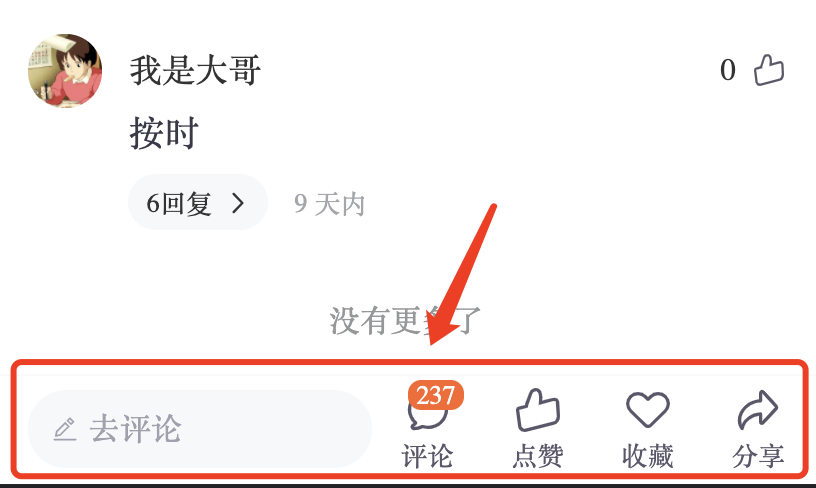


**操作步骤**

静态结构

```jsx
import Icon from '@/components/Icon'
import styles from './index.module.scss'

const CommentFooter = () => {
  return (
    <div className={styles.root}>
      <div className="input-btn">
        <Icon type="iconbianji" />
        <span>去评论</span>
      </div>

      <>
        <div className="action-item">
          <Icon type="iconbtn_comment" />
          <p>评论</p>
          <span className="bage">{0}</span>
        </div>
        {/* 'iconbtn_like2' */}
        <div className="action-item">
          <Icon type={'iconbtn_like_sel'} />
          <p>点赞</p>
        </div>
      </>
      <div className="action-item">
        {/* 'iconbtn_collect' */}
        <Icon type={'iconbtn_collect_sel'} />
        <p>收藏</p>
      </div>
      <div className="action-item">
        <Icon type="iconbtn_share" />
        <p>分享</p>
      </div>
    </div>
  )
}

export default CommentFooter

```

+ 渲染Footer组件

```jsx
import Icon from '@/components/Icon'
import { RootState } from '@/store'
import { useSelector } from 'react-redux'
import styles from './index.module.scss'

const CommentFooter = () => {
  const { detail } = useSelector((state: RootState) => state.article)
  return (
    <div className={styles.root}>
      <div className="input-btn">
        <Icon type="iconbianji" />
        <span>去评论</span>
      </div>

      <>
        <div className="action-item">
          <Icon type="iconbtn_comment" />
          <p>评论</p>
          <span className="bage">{detail.comm_count}</span>
        </div>
        {/* 'iconbtn_like2' */}
        <div className="action-item">
          <Icon
            type={detail.attitude === 1 ? 'iconbtn_like_sel' : 'iconbtn_like2'}
          />
          <p>点赞</p>
        </div>
      </>
      <div className="action-item">
        {/* 'iconbtn_collect' */}
        <Icon
          type={detail.is_collected ? 'iconbtn_collect_sel' : 'iconbtn_collect'}
        />
        <p>收藏</p>
      </div>
      <div className="action-item">
        <Icon type="iconbtn_share" />
        <p>分享</p>
      </div>
    </div>
  )
}

export default CommentFooter
```


## 点赞功能

+ 给点赞按钮注册点击事件

```jsx
{/* 'iconbtn_like2' */}
<div className="action-item" onClick={onLike}>
  <Icon
    type={detail.attitude === 1 ? 'iconbtn_like_sel' : 'iconbtn_like2'}
  />
  <p>点赞</p>
</div>
```

+ 点赞是发送action

```jsx
const onLike = async () => {
  await dispatch(likeAritcle(detail.art_id, detail.attitude))
}
```

+ 提供action


```jsx

export function likeAritcle(id: string, attitude: number): RootThunkAction {
  return async (dispatch) => {
    if (attitude === 1) {
      // 取消点赞
      await request.delete('/article/likings/' + id)
    } else {
      // 点赞
      await request.post('/article/likings', { target: id })
    }
    // 更新
    await dispatch(getArticleDetail(id))
  }
}
```

## 收藏功能

和点赞一样


## 关注用户功能

和点赞一样


## 吸顶组件的封装

```jsx
import styles from './index.module.scss'
import { useEffect, useRef } from 'react'
type Props = {
  children: React.ReactElement | string
  top?: number
}
const Sticky = ({ children, top = 0 }: Props) => {
  const placeRef = useRef<HTMLDivElement>(null)
  const childrenRef = useRef<HTMLDivElement>(null)
  useEffect(() => {
    const place = placeRef.current!
    const child = childrenRef.current!
    const onScroll = () => {
      if (place.getBoundingClientRect().top <= top) {
        // 应该吸顶
        child.style.position = 'fixed'
        child.style.top = top + 'px'
        place.style.height = child.offsetHeight + 'px'
      } else {
        child.style.position = 'static'
        child.style.top = 'auto'
        place.style.height = '0px'
      }
    }
    window.addEventListener('scroll', onScroll)
    return () => {
      window.removeEventListener('scroll', onScroll)
    }
  }, [top])

  return (
    <div className={styles.root}>
      {/* 占位元素 */}
      <div className="sticky-placeholder" ref={placeRef} />

      {/* 吸顶显示的元素 */}
      <div className="sticky-container" ref={childrenRef}>
        {children}
      </div>
    </div>
  )
}

export default Sticky

```


---


## 文章评论：封装评论表单组件

> 目标：将发表评论的表单界面封装成一个组件


风格一：直接评论一篇文章时

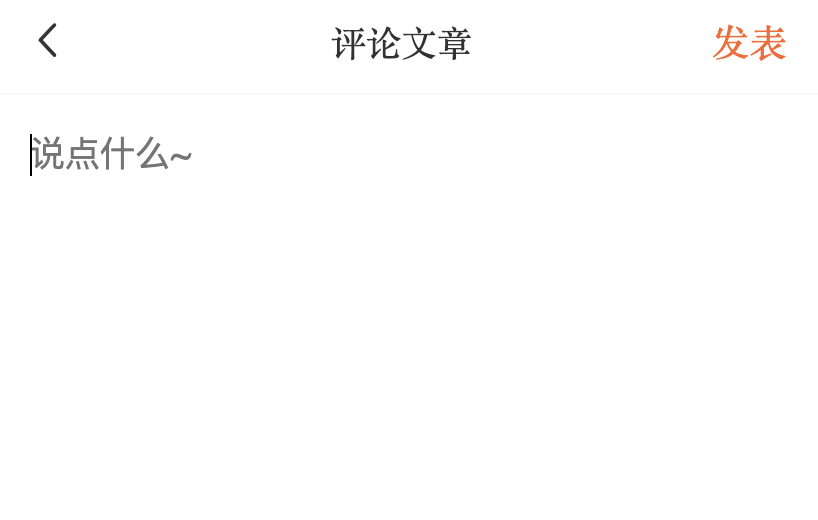

风格二：回复某人的评论时

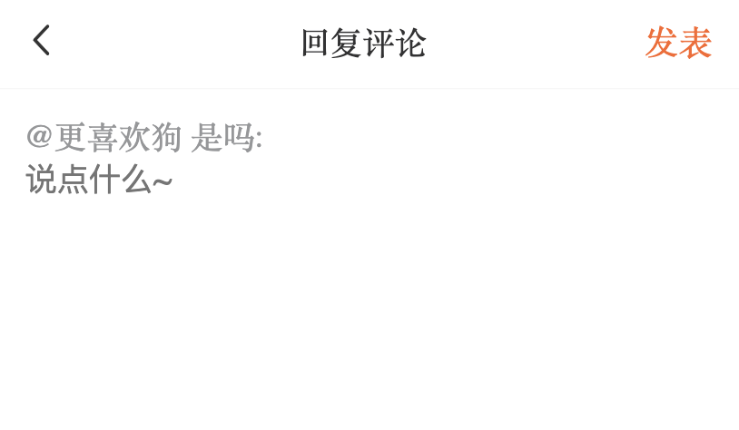


**操作步骤**

1. 创建 `pages/Article/components/CommentInput/` 目录，拷贝资源包相关样式文件到该目录，然后编写 `index.js`：

```jsx
import NavBar from '@/components/NavBar'
import { useEffect, useRef, useState } from 'react'
import styles from './index.module.scss'

type Props = {
  id: string
  name: string
  onClose: () => void
  articleId: string
}
const CommentInput = ({ id, name, onClose, articleId }: Props) => {
  // 输入框内容
  const [value, setValue] = useState('')

  // 输入框引用
  const txtRef = useRef<HTMLTextAreaElement>(null)

  useEffect(() => {
    // 输入框自动聚焦
    setTimeout(() => {
      txtRef.current!.focus()
    }, 600)
  }, [])

  // 发表评论
  const onSendComment = async () => {}

  return (
    <div className={styles.root}>
      {/* 顶部导航栏 */}
      <NavBar
        onLeftClick={onClose}
        extra={
          <span className="publish" onClick={onSendComment}>
            发表
          </span>
        }
      >
        {name ? '回复评论' : '评论文章'}
      </NavBar>

      <div className="input-area">
        {/* 回复别人的评论时显示：@某某 */}
        {name && <div className="at">@{name}:</div>}

        {/* 评论内容输入框 */}
        <textarea
          ref={txtRef}
          placeholder="说点什么~"
          rows={10}
          value={value}
          onChange={(e) => setValue(e.target.value.trim())}
        />
      </div>
    </div>
  )
}

export default CommentInput

```


---


## 文章评论：显示评论表单抽屉

> 目标：点击评论工具栏的“输入框”，弹出一个抽屉式评论表单


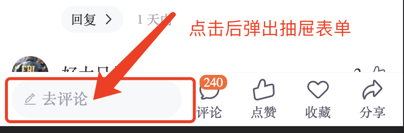


**操作步骤**

1. 声明用于控制抽屉显示隐藏的状态

```jsx
// 评论抽屉状态
const [commentDrawerStatus, setCommentDrawerStatus] = useState({
  visible: false,
  id: 0
})
```


2. 在页面中创建评论表单抽屉

```jsx
import { Drawer } from "antd-mobile"
```

```jsx
<div className={styles.root}>
  <div className="root-wrapper">
		// ...
  </div>

  {/* 评论抽屉 */}
  <Drawer
    className="drawer"
    position="bottom"
    style={{ minHeight: document.documentElement.clientHeight }}
    children={''}
    sidebar={
      <div className="drawer-sidebar-wrapper">
        {commentDrawerStatus.visible && (
          <CommentInput
            id={commentDrawerStatus.id}
            onClose={onCloseComment}
            onComment={onAddComment}
            />
        )}
      </div>
    }
    open={commentDrawerStatus.visible}
    onOpenChange={onCloseComment}
    />

</div>
```


3. 编写表单抽屉上的一系列回调函数

```jsx
// 关闭评论抽屉表单
const onCloseComment = () => {
  setCommentDrawerStatus({
    visible: false,
    id: 0
  })
}

// 发表评论后，插入到数据中
const onAddComment = comment => {

}
```


4. 为评论工具栏“输入框”设置点击回调函数：

```jsx
{/* 评论工具栏 */}
<CommentFooter
  // ...
  onComment={onComment}
  />
```

```jsx
// 点击评论工具栏“输入框”，打开评论抽屉表单
const onComment = () => {
  setCommentDrawerStatus({
    visible: true,
    id: info.art_id
  })
}
```


---


## 文章评论：发表评论后更新评论列表

> 目标：当在评论抽屉表单中发表评论后，将新发表的评论显示到评论列表中


实现思路：

- 我们不用重新请求后端接口来获取最新的评论列表数据，因为提交评论表单，调用后端接口后返回了新评论的数据对象，我们只需要将该对象添加到列表数据中即可


**操作步骤**

1. 在 `store/reducers/article.js`中，添加修改文章详情、修改评论相关的 Reducer 逻辑：

```js
export const article = (state = initialState, action) => {
  const { type, payload } = action

  switch (type) {
    // 修改文章详情信息
    case 'article/set_info':
      return {
        ...state,
        info: {
          ...state.info,
          ...payload
        }
      }
      
    // 修改评论数据
    case 'article/set_comment':
      return {
        ...state,
        comment: {
          ...state.comment,
          ...payload
        }
      }

    // ...
  }
}
```


2. 在 `store/actions/article.js` 中，编写 Action  Creator：

```jsx
/**
 * 修改 Redux 中的文章详情数据
 * @param {Object} partial 文章详情中的一个或多个字段值
 */
export const setArticleInfo = partial => {
  return {
    type: 'article/set_info',
    payload: partial
  }
}

/**
 * 修改 Redux 中的评论数据
 * @param {Object} partial 评论中的一个或多个字段值
 */
export const setArticleComments = partial => ({
  type: 'article/set_comment',
  payload: partial
})
```


3. 在抽屉表单发表评论后的回调函数 `onAddComment` 中调用 Action：

```jsx
// 发表评论后，插入到数据中
const onAddComment = comment => {
  // 将新评论添加到列表中
  dispatch(setArticleComments({
    results: [comment, ...comments]
  }))

  // 将文章详情中的评论数 +1
  dispatch(setArticleInfo({
    comm_count: info.comm_count + 1
  }))
}
```


---


## 文章评论：封装回复某人的评论界面

> 目标：将针对某个用户的评论回复界面封装成单独组件


在评论列表中点击“回复”某人的评论：

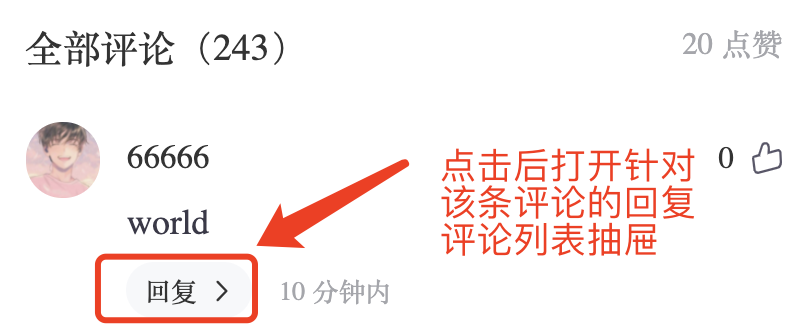


进入针对该评论的回复评论抽屉界面：

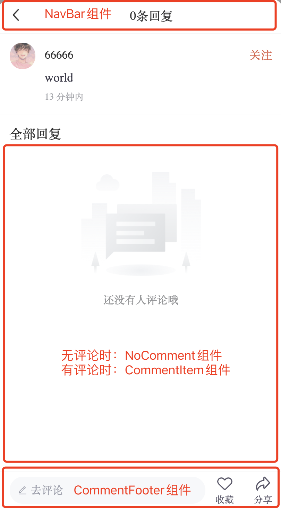


**操作步骤**

+ 静态结构

```jsx
import NavBar from '@/components/NavBar'
import NoComment from '../NoComment'
import CommentFooter from '../CommentFooter'
import styles from './index.module.scss'

/**
 * 回复评论界面组件
 * @param {Object} props.originComment 原评论数据
 * @param {String} props.articleId 文章ID
 * @param {Function} props.onClose 关闭抽屉的回调函数
 */
type Props = {
  articleId?: string
  onClose?: () => void
}
const CommentReply = ({ articleId, onClose }: Props) => {
  return (
    <div className={styles.root}>
      <div className="reply-wrapper">
        {/* 顶部导航栏 */}
        <NavBar className="transparent-navbar" onLeftClick={onClose}>
          <div>{0}条回复</div>
        </NavBar>

        {/* 原评论信息 */}
        <div className="origin-comment">原评论</div>

        {/* 回复评论的列表 */}
        <div className="reply-list">
          <div className="reply-header">全部回复</div>

          <NoComment />
        </div>

        {/* 评论工具栏，设置 type="reply" 不显示评论和点赞按钮 */}
        <CommentFooter />
      </div>
    </div>
  )
}

export default CommentReply

```


1. 创建 `pages/Article/components/CommentReply/`目录，拷贝资源包中相应样式文件到该目录，然后编写 `index.js`

```jsx
import NavBar from '@/components/NavBar'
import NoComment from '@/components/NoComment'
import http from '@/utils/http'
import { Drawer } from 'antd-mobile'
import { useEffect, useState } from 'react'
import CommentFooter from '../CommentFooter'
import CommentInput from '../CommentInput'
import CommentItem from '../CommentItem'
import styles from './index.module.scss'

/**
 * 回复评论界面组件
 * @param {Object} props.originComment 原评论数据 
 * @param {String} props.articleId 文章ID 
 * @param {Function} props.onClose 关闭抽屉的回调函数
 */
const CommentReply = ({ originComment, articleId, onClose }) => {
  // 评论相关数据
  const [comment, setComment] = useState({})

  // 抽屉表单状态
  const [drawerStatus, setDrawerStatus] = useState({
    visible: false,
    id: originComment.com_id
  })

  useEffect(() => {
    // 加载回复评论的列表数据
    const loadData = async () => {
      const res = await http.get('/comments', {
        params: {
          type: 'c',
          source: originComment.com_id
        }
      })
      setComment(res.data.data)
    }

    // 只有当原评论数据的 com_id 字段有值才开始加载数据
    if (originComment?.com_id) {
      loadData()
    }
  }, [originComment.com_id])

  // 展示评论窗口
  const onComment = () => {
    setDrawerStatus({
      visible: true,
      id: originComment.com_id
    })
  }

  // 关闭评论窗口
  const onCloseComment = () => {
    setDrawerStatus({
      visible: false,
      id: 0
    })
  }

  // 发表评论后，插入到数据中
  const onInsertComment = newItem => {
    setComment({
      ...comment,
      total_count: comment.total_count + 1,
      results: [newItem, ...comment.results]
    })
  }

  return (
    <div className={styles.root}>
      <div className="reply-wrapper">

        {/* 顶部导航栏 */}
        <NavBar className="transparent-navbar" onLeftClick={onClose}>
          {comment.total_count}条回复
        </NavBar>

        {/* 原评论信息 */}
        <div className="origin-comment">
          <CommentItem
            type="origin"
            commentId={originComment.com_id}
            authorPhoto={originComment.aut_photo}
            authorName={originComment.aut_name}
            likeCount={originComment.like_count}
            isFollowed={originComment.is_followed}
            isLiking={originComment.is_liking}
            content={originComment.content}
            replyCount={originComment.reply_count}
            publishDate={originComment.pubdate}
          />
        </div>

        {/* 回复评论的列表 */}
        <div className="reply-list">
          <div className="reply-header">全部回复</div>

          {comment?.results?.length === 0 ? (
            <NoComment />
          ) : (
            comment?.results?.map(item => {
              return (
                <CommentItem
                  key={item.com_id}
                  commentId={item.com_id}
                  authorPhoto={item.aut_photo}
                  authorName={item.aut_name}
                  likeCount={item.like_count}
                  isFollowed={item.is_followed}
                  isLiking={item.is_liking}
                  content={item.content}
                  replyCount={item.reply_count}
                  publishDate={item.pubdate}
                />
              )
            })
          )}
        </div>

        {/* 评论工具栏，设置 type="reply" 不显示评论和点赞按钮 */}
        <CommentFooter
          type="reply"
          placeholder="去评论"
          onComment={onComment}
        />
      </div>

      {/* 评论表单抽屉 */}
      <Drawer
        className="drawer"
        position="bottom"
        style={{ minHeight: document.documentElement.clientHeight }}
        children={''}
        sidebar={
          <div className="drawer-sidebar-wrapper">
            {drawerStatus.visible && (
              <CommentInput
                id={drawerStatus.id}
                name={originComment.aut_name}
                articleId={articleId}
                onClose={onCloseComment}
                onComment={onInsertComment}
              />
            )}
          </div>
        }
        open={drawerStatus.visible}
        onOpenChange={onCloseComment}
      />
    </div>
  )
}

export default CommentReply
```


---


## 文章评论：显示回复评论抽屉

> 目标：点击某个用户评论中的“回复” 按钮，打开回复评论抽屉界面


**操作步骤**

1. 在文章详情页面中添加回复抽屉

```jsx
import CommentReply from "./components/CommentReply"
```

```jsx
{/* 回复抽屉 */}
<Drawer
  className="drawer-right"
  position="right"
  style={{ minHeight: document.documentElement.clientHeight }}
  children={''}
  sidebar={
    <div className="drawer-sidebar-wrapper">
      {replyDrawerStatus.visible && (
        <CommentReply
          originComment={replyDrawerStatus.data}
          articleId={info.art_id}
          onClose={onCloseReply}
          />
      )}
    </div>
  }
  open={replyDrawerStatus.visible}
  onOpenChange={onCloseReply}
  />
```


2. 添加回复抽屉相关的回调函数

```jsx
// 关闭回复评论抽屉
const onCloseReply = () => {
  setReplyDrawerStatus({
    visible: false,
    data: {}
  })
}
```


3. 设置评论列表项上的 `onOpenReply` 回调函数

```jsx
{comments?.map(item => {
  return (
    <CommentItem
      // ...
      onOpenReply={() => onOpenReply(item)}
      />
  )
})}
```

```jsx
// 点击评论中的 “回复” 按钮，打开回复抽屉
const onOpenReply = data => {
  setReplyDrawerStatus({
    visible: true,
    data
  })
}
```


---


## 文章评论：点击“评论”按钮滚动到评论列表

> 目标：点击评论工具栏上的“评论”按钮，文章详情页面直接滚动到评论区域


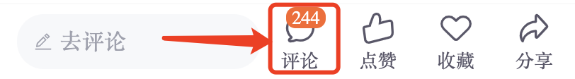


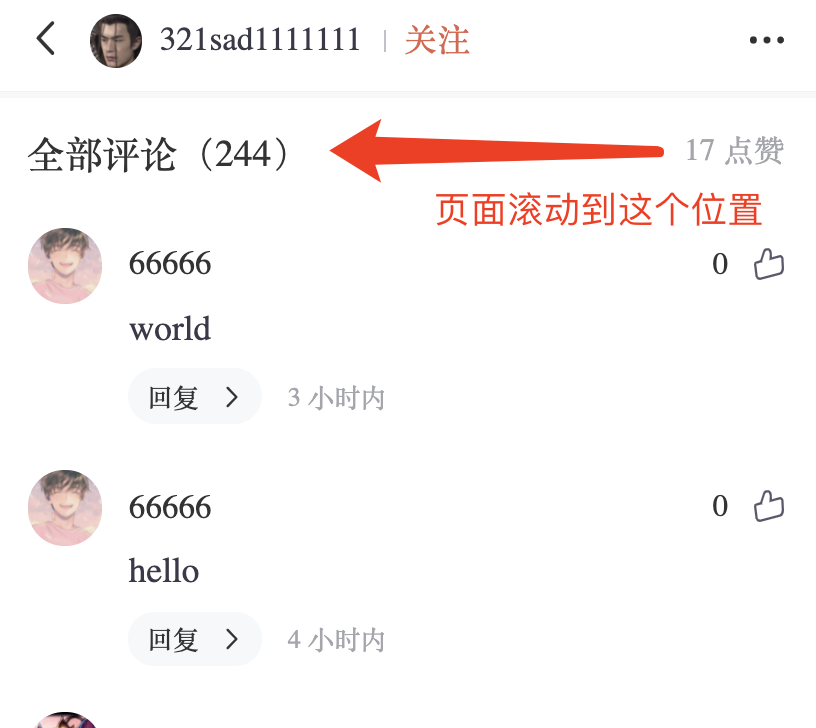


实现思路：

- 点击按钮后，将页面滚动容器的 `scrollTop` 设置为评论列表容器的`offsetTop`即可


**操作步骤**

1. 为文章评论容器元素添加 ref 引用

```jsx
const commentRef = useRef()
```

```jsx
{/* 文章评论区 */}
<div className="comment" ref={commentRef}>
```


2. 为评论工具栏组件设置 `onShowComment` 回调函数

```jsx
{/* 评论工具栏 */}
<CommentFooter
  // ...
  onShowComment={onShowComment}
  />
```

```jsx
// 点击工具栏评论按钮，滚动到评论区位置
const onShowComment = () => {
  wrapperRef.current.scrollTop = commentRef.current.offsetTop - 46
}
```

以上代码中 `- 46` 是为了显示出评论区的统计信息，而不被顶部导航栏盖住：

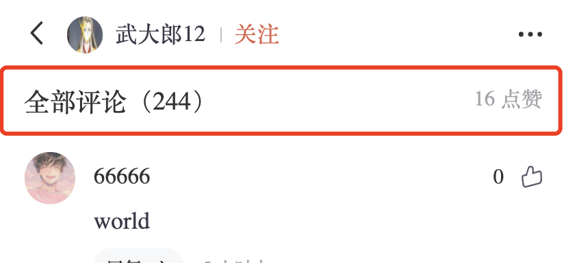


## 文章评论：给评论点赞

> 目标：点击每一条评论中的点赞按钮，为当前评论点赞


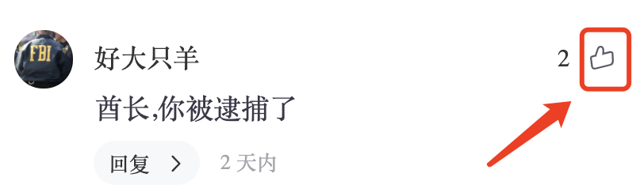


**操作步骤**

1. 在`store/actions/article.js`中，编写更新对某条评论点赞的 Action Creator：

```js
/**
 * 取消评论点赞
 * @param {String} id 评论id
 * @param {Boolean} isLiking 是否点赞
 * @returns thunk
 */
export const setCommentLiking = (id, isLiking) => {
  return async (dispatch, getState) => {
    // 获取评论数据
    const { comment } = getState().article
    const { results } = comment

    // 点赞
    if (isLiking) {
      await http.post('/comment/likings', { target: id })

      // 更新 Redux 中的评论数据
      dispatch(setArticleComments({
        results: results.map(item => {
          if (item.com_id === id) {
            return {
              ...item,
              is_liking: true,
              like_count: item.like_count + 1,
            }
          } else {
            return item
          }
        })
      }))
    }
    // 取消点赞
    else {
      await http.delete(`/comment/likings/${id}`)

      // 更新 Redux 中的评论数据
      dispatch(setArticleComments({
        results: results.map(item => {
          if (item.com_id === id) {
            return {
              ...item,
              is_liking: false,
              like_count: item.like_count - 1,
            }
          } else {
            return item
          }
        })
      }))
    }
  }
}
```


2. 为评论项组件 `CommentItem` 添加 `onThumbsUp` 回调函数：

```jsx
{comments?.map(item => {
  return (
    <CommentItem
      // ...
      onThumbsUp={() => onThumbsUp(item.com_id, item.is_liking)}
      />
  )
})}
```

```jsx
// 对某条评论点赞
const onThumbsUp = (commentId, isLiking) => {
  // 取反
  const newIsLiking = !isLiking

  // 调用 Action
  dispatch(setCommentLiking(commentId, newIsLiking))
}
```


---


## 给文章点赞

> 目标：点击底部评论工具栏上的 “点赞” 按钮，为当前文章点赞


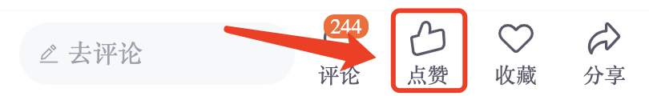


**操作步骤**

1. 在 `store/actions/article.js`中，编写更新文章的点赞信息相关的 Action Creator：

```js
/**
 * 文章点赞
 * @param {String} id 文章ID
 * @param {Number} attitude 0-取消点赞|1-点赞
 * @returns thunk
 */
export const setArticleLiking = (id, attitude) => {
  return async (dispatch, getState) => {
    // 获取文章详情
    const { info } = getState().article
    let likeCount = info.like_count

    // 取消点赞
    if (attitude === 0) {
      await http.delete(`/article/likings/${id}`)
      likeCount--
    }
    // 点赞
    else {
      await http.post('/article/likings', { target: id })
      likeCount++
    }

    // 更新 Redux 中的数据
    dispatch(setArticleInfo({
      attitude,
      like_count: likeCount
    }))
  }
}
```


2. 为评论工具栏设置 `onLike` 回调函数

```jsx
{/* 评论工具栏 */}
<CommentFooter
  // ...
  onLike={onLike}
  />
```

```jsx
// 点击工具栏点赞按钮
const onLike = () => {
  // 在 “点赞” 和 “不点赞” 之间取反
  const newAttitude = info.attitude === 0 ? 1 : 0

  // 调用 Action 
  dispatch(setArticleLiking(info.art_id, newAttitude))
}
```


---


## 收藏文章

> 目标：点击评论工具栏上的“收藏”按钮，实现对当前文章的收藏


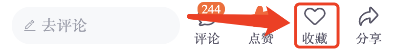


**操作步骤**

1. 在 `store/actions/article.js` 中，编写收藏文章相关的 Action Creator：

```js
/**
 * 文章收藏
 * @param {String} id 文章id
 * @param {Boolean} isCollect 是否收藏
 * @returns thunk
 */
export const setAritcleCollection = (id, isCollect) => {
  return async dispatch => {
    // 收藏
    if (isCollect) {
      await http.post('/article/collections', { target: id })
    }
    // 取消收藏
    else {
      await http.delete(`/article/collections/${id}`)
    }

    // 更新 Redux 中的文章数据
    dispatch(setArticleInfo({
      is_collected: isCollect
    }))
  }
}
```


2. 为评论工具栏设置 `onCollected` 回调函数

```jsx
{/* 评论工具栏 */}
<CommentFooter
  // ...
  onCollected={onCollected}
  />
```

```jsx
// 收藏文章
const onCollected = () => {
  // 取反
  const newIsCollect = !info.is_collected

  // 调用 Action
  dispatch(setAritcleCollection(info.art_id, newIsCollect))
}
```


---


## 关注作者

> 目标：点击文章详情页的 “关注” 按钮，关注当前文章的作者


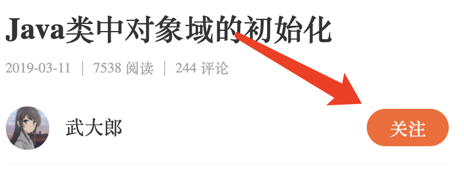


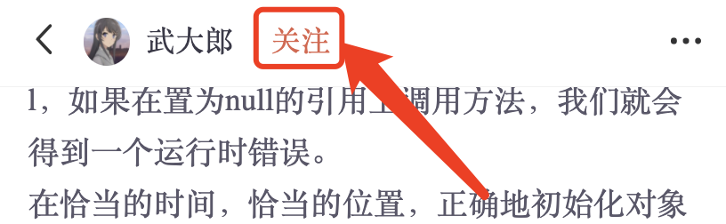


**操作步骤**

1. 在 `store/actions/article.js`中，编写关注文章作者的 Action Creator:

```js
/**
 * 关注作者
 * @param {String} id 作者id
 * @param {Boolean} id 是否关注
 * @returns thunk
 */
export const setAuthorFollow = (id, isFollow) => {
  return async dispatch => {
    // 关注
    if (isFollow) {
      await http.post('/user/followings', { target: id })
    }
    // 取消关注
    else {
      await http.delete(`/user/followings/${id}`)
    }

    dispatch(setArticleInfo({
      is_followed: isFollow
    }))
  }
}
```


2. 为界面上的两处“关注” 按钮设置点击事件：

```jsx
<span 
  className={classnames('follow', info.is_followed ? 'followed' : '')}
  onClick={onFollow}
  >
  {info.is_followed ? '已关注' : '关注'}
</span>
```

```jsx
// 关注作者
const onFollow = async () => {
  // 取反
  const isFollow = !info.is_followed

  // 调用 Action
  dispatch(setAuthorFollow(info.aut_id, isFollow))
}
```

 

---


## 分享文章

> 目标：点击分享按钮，弹出分享抽屉式菜单


分享按钮：

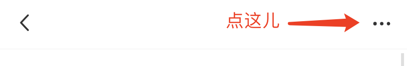

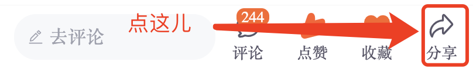

弹出菜单：

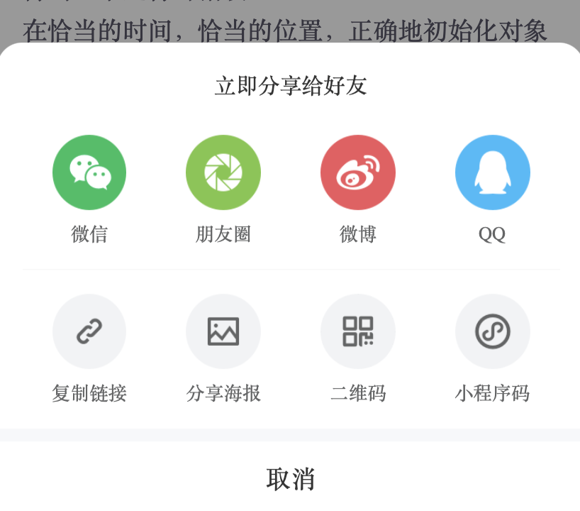


**操作步骤**

1. 封装抽屉中的界面组件

创建 `pages/Article/components/Share/`目录，拷贝资源包中对应的样式文件到该目录下，然后编写 `index.js`：

```jsx
import styles from './index.module.scss'

const Share = ({ onClose }) => {
  return (
    <div className={styles.root}>
      {/* 标题 */}
      <div className="share-header">立即分享给好友</div>

      {/* 第一排菜单 */}
      <div className="share-list">
        <div className="share-item">
          
          <span>微信</span>
        </div>
        <div className="share-item">
          
          <span>朋友圈</span>
        </div>
        <div className="share-item">
          
          <span>微博</span>
        </div>
        <div className="share-item">
          
          <span>QQ</span>
        </div>
      </div>
      
      {/* 第二排菜单 */}
      <div className="share-list">
        <div className="share-item">
          
          <span>复制链接</span>
        </div>
        <div className="share-item">
          
          <span>分享海报</span>
        </div>
        <div className="share-item">
          
          <span>二维码</span>
        </div>
        <div className="share-item">
          
          <span>小程序码</span>
        </div>
      </div>

      {/* 取消按钮 */}
      <div className="share-cancel" onClick={onClose}>取消</div>
    </div>
  )
}

export default Share
```


2. 在文章详情页中创建分享菜单抽屉及控制菜单开关的状态、函数：

```jsx
import Share from "./components/Share"
```

```jsx
// 分享抽屉状态
const [shareDrawerStatus, setShareDrawerStatus] = useState({
  visible: false
})

// 打开分享抽屉
const onOpenShare = () => {
  setShareDrawerStatus({
    visible: true
  })
}

// 关闭分享抽屉
const onCloseShare = () => {
  setShareDrawerStatus({
    visible: false
  })
}
```

```jsx
{/* 分享抽屉 */}
<Drawer
  className="drawer-share"
  position="bottom"
  style={{ minHeight: document.documentElement.clientHeight }}
  children={''}
  sidebar={
    <Share onClose={onCloseShare} />
  }
  open={shareDrawerStatus.visible}
  onOpenChange={onCloseShare}
  />
```


3. 为顶部导航栏右侧按钮、以及底部工具栏“分享”按钮设置点击回调：

```jsx
{/* 顶部导航栏 */}
<NavBar
  onLeftClick={() => history.go(-1)}
  rightContent={
    <span onClick={onOpenShare}>
      <Icon type="icongengduo" />
    </span>
  }
  >
```

```jsx
{/* 评论工具栏 */}
<CommentFooter
  // ..
  onShare={onOpenShare}
  />
```


---


## 评论统计信息的吸顶效果

> 目标：


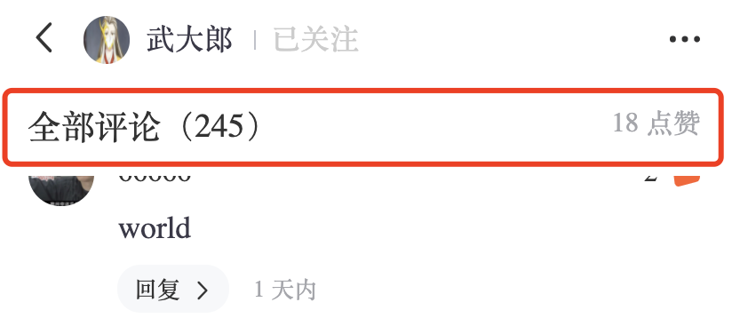


实现思路：

- 监听页面滚动容器元素的 `scroll` 事件，判断要吸顶的元素是否已到达指定位置，如果是，就将它设置成固定定位 `fixed`


**操作步骤**

1. 为提示吸顶效果的复用性，我们封装一个组件 `Sticky`，放在该组件下的元素都将具有吸顶功能：

创建`components/Share/`目录，拷贝资源包对应样式文件到该目录，然后编写`index.js`。

```jsx
import throttle from 'lodash/fp/throttle'
import { useEffect, useRef } from 'react'
import styles from './index.module.scss'

/**
 * 吸顶组件
 * @param {HTMLElement} props.root 滚动容器元素 
 * @param {Number} props.height 吸顶元素的高度
 * @param {HTMLElement} props.offset 吸顶位置的 top 值
 * @param {HTMLElement} props.children 本组件的子元素  
 */
const Sticky = ({ root, height, offset = 0, children }) => {
  const placeholderRef = useRef(null)
  const containerRef = useRef(null)

  useEffect(() => {
    if (!root) return

    const placeholderDOM = placeholderRef.current
    const containerDOM = containerRef.current

    // 滚动事件监听函数
    const onScroll = throttle(60, () => {
      // 获取占位元素的 top 位置
      const { top } = placeholderDOM.getBoundingClientRect()

      // 占位元素的 top 值已达到吸顶位置
      if (top <= offset) {
        // 将要吸顶的容器元素设置成 fixed 固定定位
        containerDOM.style.position = 'fixed'
        containerDOM.style.top = `${offset}px`
        placeholderDOM.style.height = `${height}px`
      } else {
        // 取消固定定位
        containerDOM.style.position = 'static'
        placeholderDOM.style.height = '0px'
      }
    })

    // 添加事件监听
    root.addEventListener('scroll', onScroll)

    return () => {
      // 注销事件监听
      root.removeEventListener('scroll', onScroll)
    }
  }, [root, offset, height])

  return (
    <div className={styles.root}>
      {/* 占位元素 */}
      <div ref={placeholderRef} className="sticky-placeholder" />

      {/* 吸顶显示的元素 */}
      <div className="sticky-container" ref={containerRef}>
        {children}
      </div>
    </div>
  )
}

export default Sticky
```


2. 将文章详情页中的要吸顶的元素用 `Stick` 组件包裹起来：

```jsx
import Sticky from "@/components/Sticky"
```

```jsx
{/* 评论总览信息 */}
<Sticky root={wrapperRef.current} height={51} offset={46}>
  <div className="comment-header">
    <span>全部评论（{info.comm_count}）</span>
    <span>{info.like_count} 点赞</span>
  </div>
</Sticky>
```


---


# 功能性优化


## 解决切换底部 Tab 后首页文章列表的刷新

> 目标：实现当底部 Tab 栏切换后，首页仍然能保持之前的滚动位置


当前问题：

将首页文章列表向下滚动到某一位置，然后切换到其他 Tab 页面（比如“问答”）后再切换回首页，你会发现文章列表刷新并回到页面顶部。


我们期望的效果：

切换 Tab 后，文章列表不刷新，且列表的滚动位置还保持在之前位置。


实现思路：

- Route 组件在路由路径重新匹配后，会销毁和重建它要展示的子组件。不过，我们可以改写它的子组件渲染逻辑，让它的子组件通过 `display` 样式来控制 显示、隐藏，而不是销毁和重建。

> 这种方式我们通常称为：KeepAlive 组件缓存


**操作步骤**

1. 创建 `components/KeepAlive/`目录，并复制资源包中的样式文件到该目录下，然后编写 `index.js`

```jsx
import { Route } from 'react-router-dom'
import styles from './index.module.scss'

/**
 * 缓存路由组件
 * @param {String} props.alivePath 要缓存的路径 
 * @param {ReactElement} props.component 匹配路由规则后显示的组件 
 * @param {rest} props.rest 任何 Route 组件可用的属性 
 */
const KeepAlive = ({ alivePath, component: Component, ...rest }) => {
  return (
    <Route {...rest}>
      {props => {
        const { location } = props
        const matched = location.pathname.startsWith(alivePath)
        return (
          <div className={styles.root} style={{ display: matched ? 'block' : 'none' }}>
            <Component {...props} />
          </div>
        )
      }}
    </Route>
  )
}

export default KeepAlive
```


2. 在 `layouts/TabBarLayout.js` 组件代码中，使用 `KeepAlive` 组件替代 `Route` 组件来做首页的路由：

```jsx
import KeepAlive from '@/components/KeepAlive'
```

```jsx
<KeepAlive alivePath="/home/index" path="/home/index" exact component={Home} />
```


---


## 解决进入详情页后退出时文章列表的刷新

> 目标：实现当点击首页文章列表进入详情页面后再后退到首页，文章列表不刷新并保持滚动位置


实现思路：

- 还是借助之前实现的 `KeepAlive` 组件


**操作步骤**

1. 在根组件 `App.js` 中，删除原先的首页 `Route` 路由组件：

```jsx
{/* <Route path="/home" component={TabBarLayout} /> */}
```


2. 在 `Switch` 外部使用 `KeepAlive` 配置首页的路由，然后在 `Switch` 内配置一个重定向路由：

```jsx
<Router history={history}>
  <KeepAlive alivePath="/home" path="/home" component={TabBarLayout} />

  <Switch>
    <Route path="/" exact>
      <Redirect to="/home/index" />
    </Route>
    <Route path="/home" exact>
      <Redirect to="/home/index" />
    </Route>

    {/* ... */}
  </Switch>
</Router>
```


3. 将原先的 404 错误路由改写成如下形式:

```jsx
{/* 因为 /home 不在 Switch 内部，所以需要手动处理 /home 开头的路由，否则会被当做 404 处理 */}
<Route render={props => {
    if (!props.location.pathname.startsWith('/home')) {
      return <NotFound {...props} />
    }
  }} />
```


# 打包上线


## 利用 CDN 减少打包后的代码大小