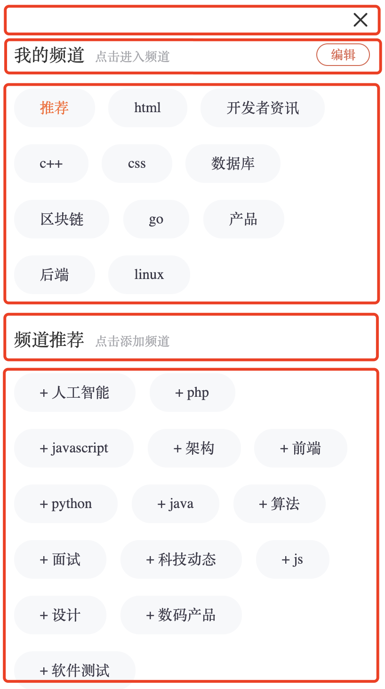
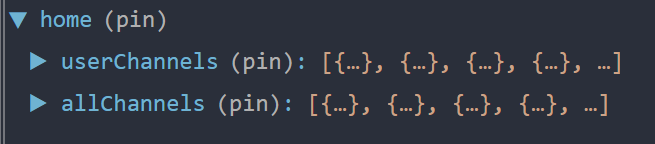
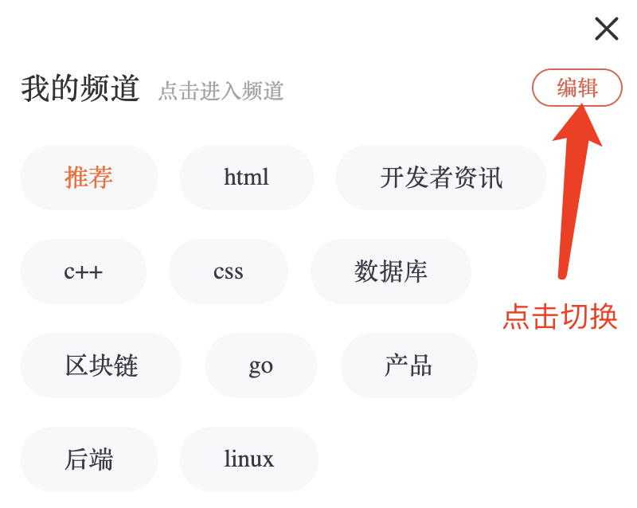
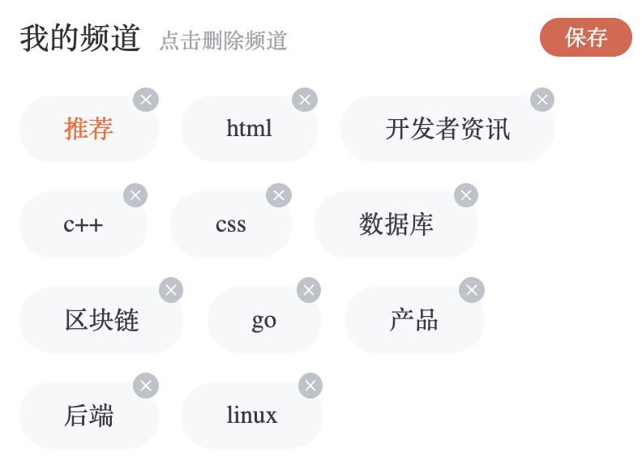
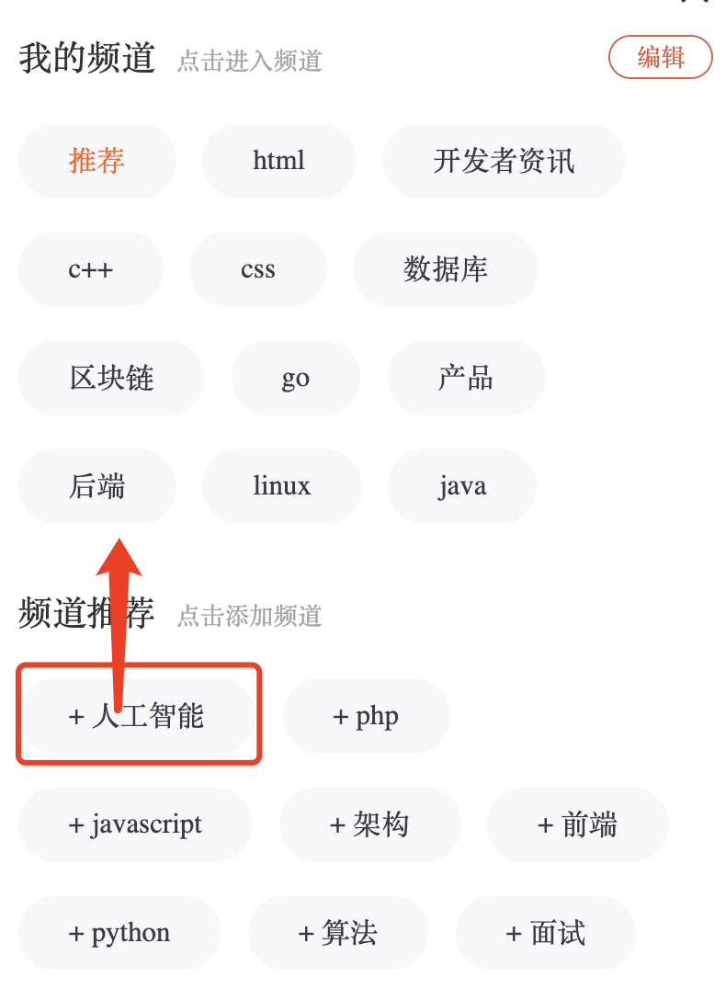
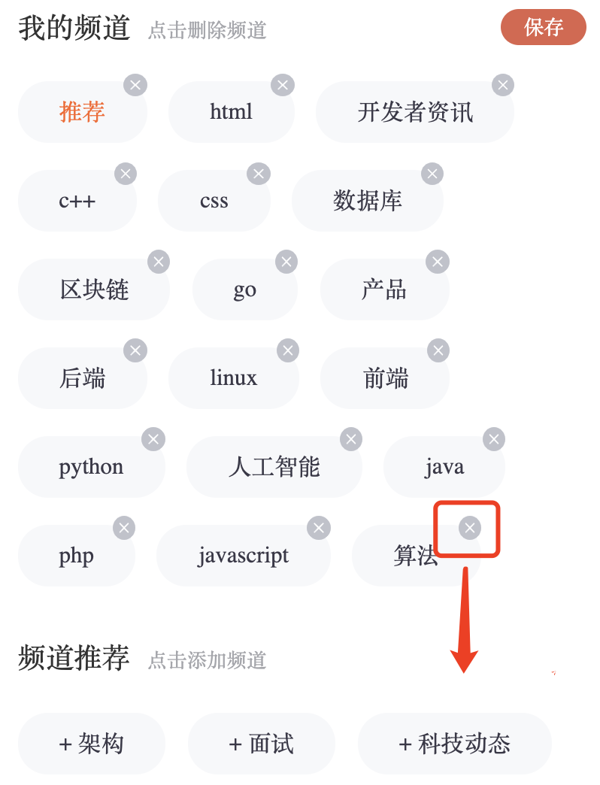
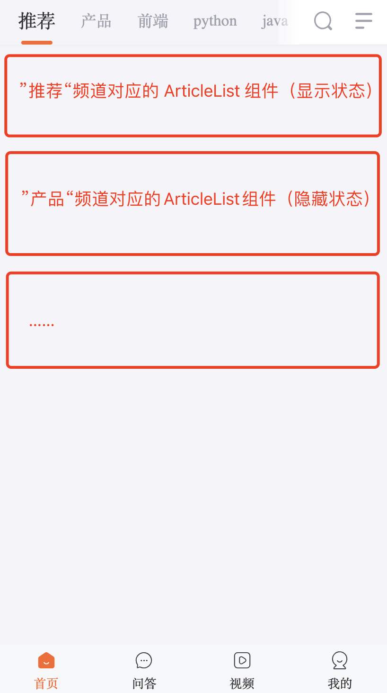
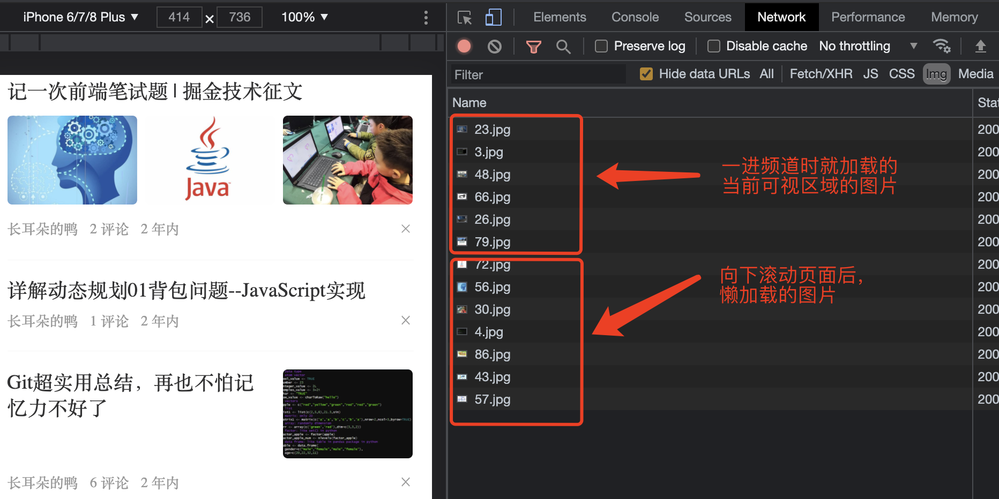
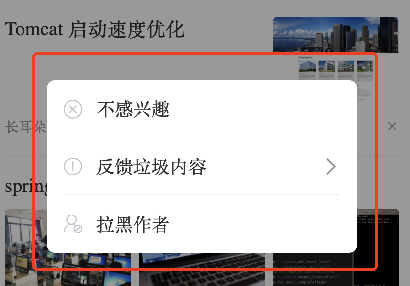

# 《极客园移动端项目》


# 一些不实装功能的静态页面

## 底部导航栏“问答”页面

> 目标：实现问答页面的静态结构和样式

**操作步骤**

将资源包的样式拷贝到 `pages/Question/`目录下，然后在该目录下的 `index.js`中编写组件代码：

```jsx
import NavBar from '@/components/NavBar'
import styles from './index.module.scss'

const Question = () => {
  return (
    <div className={styles.root}>
      {/* 顶部导航栏 */}
      <NavBar>问答</NavBar>

      {/* 问答列表 */}
      <div className="question-list">
        <div className="question-item">
          <div className="left">
            <h3>作为 IT 行业的过来人，你有什么话想对后辈说的？</h3>
            <div className="info">
              <span>赞同 1000+</span>
              <span>评论 500+</span>
              <span>1小时前</span>
            </div>
          </div>
          <div className="right">
            
          </div>
        </div>
        <div className="question-item">
          <div className="left">
            <h3>作为 IT 行业的过来人，你有什么话想对后辈说的？</h3>
            <div className="info">
              <span>赞同 1000+</span>
              <span>评论 500+</span>
              <span>1小时前</span>
            </div>
          </div>
          <div className="right">
            
          </div>
        </div>
        <div className="question-item">
          <div className="left">
            <h3>作为 IT 行业的过来人，你有什么话想对后辈说的？</h3>
            <div className="info">
              <span>赞同 1000+</span>
              <span>评论 500+</span>
              <span>1小时前</span>
            </div>
          </div>
          <div className="right">
            
          </div>
        </div>
        <div className="question-item">
          <div className="left">
            <h3>作为 IT 行业的过来人，你有什么话想对后辈说的？</h3>
            <div className="info">
              <span>赞同 1000+</span>
              <span>评论 500+</span>
              <span>1小时前</span>
            </div>
          </div>
          <div className="right">
            
          </div>
        </div>
        <div className="question-item">
          <div className="left">
            <h3>作为 IT 行业的过来人，你有什么话想对后辈说的？</h3>
            <div className="info">
              <span>赞同 1000+</span>
              <span>评论 500+</span>
              <span>1小时前</span>
            </div>
          </div>
          <div className="right">
            
          </div>
        </div>
      </div>
    </div>
  )
}

export default Question
```


---


## 底部导航栏“视频”页面

> 目标：实现视频页面的静态结构和样式


**操作步骤**

将资源包的样式拷贝到 `pages/Video/`目录下，然后在该目录下的 `index.js`中编写组件代码：

```jsx
import NavBar from '@/components/NavBar'
import styles from './index.module.scss'

const Video = () => {
  return (
    <div className={styles.root}>
      {/* 顶部导航栏 */}
      <NavBar>视频</NavBar>

      {/* 视频列表 */}
      <div className="video-list">
        <div className="video-item">
          <h3 className="title">
            格力电器将继续发展手机业务，并将向全产业覆盖！
          </h3>
          <div className="play">
            <video src="https://ips.ifeng.com/video19.ifeng.com/video09/2021/05/26/p6803231351488126976-102-8-161249.mp4?reqtype=tsl&vid=2c791e3b-444e-4578-83e3-f4808228ae3b&uid=0puFR4&from=v_Free&pver=vHTML5Player_v2.0.0&sver=&se=&cat=&ptype=&platform=pc&sourceType=h5&dt=1622096387396&gid=6a4poXmsep1E&sign=39f76885daca6503ebf90acbfffc1ff1&tm=1622096387396"></video>
          </div>
          <span>1563次播放</span>
        </div>

        <div className="video-item">
          <h3 className="title">
            你用上5G了吗？我国5G手机终端达3.1亿 占全球比例超80％
          </h3>
          <div className="play">
            <video src="https://ips.ifeng.com/video19.ifeng.com/video09/2021/05/26/p6803268684325330944-102-8-184104.mp4?reqtype=tsl&vid=ec74b1e4-d1fa-488b-aaf5-71984ca7d13e&uid=1Vun5L&from=v_Free&pver=vHTML5Player_v2.0.0&sver=&se=&cat=&ptype=&platform=pc&sourceType=h5&dt=1622096310639&gid=fg3vsXmseXFv&sign=38e7c790561e1fd1b57e61a1cbd8031c&tm=1622096310639"></video>
          </div>
          <span>1563次播放</span>
        </div>
      </div>
    </div>
  )
}

export default Video
```


---


## 个人中心“用户反馈”页面

> 目标：实现用户反馈页面的静态结构和样式

**操作步骤**

将资源包的样式拷贝到 `pages/Profile/Feedback/`目录下，然后在该目录下的 `index.js`中编写组件代码：

```jsx
import NavBar from '@/components/NavBar'
import { ImagePicker, InputItem } from 'antd-mobile'
import { useHistory } from 'react-router-dom'
import styles from './index.module.scss'

const ProfileFeedback = () => {
  const history = useHistory()

  return (
    <div className={styles.root}>
      <NavBar onLeftClick={() => history.go(-1)}>意见反馈</NavBar>

      <div className="wrapper">
        <div className="feedback-item">
          <p className="title">简介</p>
          <div className="textarea-wrap">
            <textarea className="textarea" placeholder="请输入"></textarea>
            <div className="count">0/100</div>
          </div>
          <ImagePicker files={[]} multiple />
          <p className="image-picker-desc">最多6张，单个图片不超过20M。</p>
        </div>

        <div className="feedback-item">
          <p className="title">联系方式</p>
          <InputItem placeholder="请输入手机号码便于联系（非必填）" />
        </div>

        <div className="feedback-item feedback-submit">
          <button>提交反馈</button>
        </div>
      </div>
    </div>
  )
}

export default ProfileFeedback
```


---


# 首页-频道管理

## tab栏组件的基本使用

+ tab栏组件封装比较麻烦，但是和业务功能无关，因此我们先使用封装好的tabs组件，等整个首页功能都完成之后，再去实现tabs组件的封装
+ 直接拷贝tabs组件进行使用
+ 提供数据

```jsx
import React from 'react'
import styles from './index.module.scss'
import Tabs from '@/components/Tabs'
export default function Home() {
  const tabs = [
    {
      id: 1,
      name: '频道1',
    },
    {
      id: 2,
      name: '频道2',
    },
    {
      id: 3,
      name: '频道3',
    },
    {
      id: 4,
      name: '频道4',
    },
    {
      id: 5,
      name: '频道5',
    },
  ]
  return (
    <div className={styles.root}>
      <Tabs tabs={tabs}></Tabs>
    </div>
  )
}

```


## 请求频道数据

> 目标：调用后端接口获取用户的频道数据，然后存入 Redux 和 LocalStorage 中

实现思路：

- 实现请求后端接口，获取频道数据的 Action Creator 函数
- 实现将频道数据存入 Redux 中的 Reducer 函数
- 在进入页面时，调用 Action

**操作步骤**

1. 创建 `store/reducers/home.js`，编写存储频道数据的 Reducer 逻辑：

```jsx
// 初始状态
const initialState = {
  userChannels: [],
}

const home = (state = initialState, action) => {
  const { type, payload } = action

  switch (type) {
    case 'home/channel':
      return {
        ...state,
        userChannels: payload,
      }

    default:
      return state
  }
}

export default home

```


2. 在`store/reducer/index.js`中，配置以上新建的 Reducer 模块：

```jsx
import home from './home'

const rootReducer = combineReducers({
  // ...
  home
})
```


3. 创建 `store/actions/home.js`，编写请求频道数据的 Action Creator：

```jsx
import request from '@/utils/request'
/**
 * 将用户频道保存到 Redux
 * @param {Array} channels
 * @returns
 */
export const setUserChannels = (channels) => {
  return {
    type: 'home/channel',
    payload: channels,
  }
}

/**
 * 获取频道
 * @returns thunk
 */
export const getUserChannels = () => {
  return async (dispatch) => {
    // 请求数据
    const res = await request.get('/user/channels')
    const { channels } = res.data

    // 将频道数据保存到 Redux
    dispatch(setUserChannels(channels))
  }
}

```


4. 在 `pages/Home/index.js` 中，通过 `useEffect`在进入首页时调用以上 Action：

```jsx
import { getUserChannels } from '@/store/actions/home'
import { useEffect } from 'react'
import { useDispatch } from 'react-redux'
import styles from './index.module.scss'

const Home = () => {
  const dispatch = useDispatch()

  useEffect(() => {
    dispatch(getUserChannels())
  }, [dispatch])

  return (
    <div className={styles.root}>
    </div>
  )
}

export default Home
```


## 渲染频道数据

+ 从redux中获取数据

```jsx
const tabs = useSelector((state) => state.home.userChannels)
```

+ 渲染

```jsx
return (
  <div className={styles.root}>
    <Tabs tabs={tabs}></Tabs>

    {/* 频道 Tab 栏右侧的两个图标按钮：搜索、频道管理 */}
    <div className="tabs-opration">
      <Icon type="iconbtn_search" />
      <Icon type="iconbtn_channel" />
    </div>
  </div>
)
```

## 频道数据的获取逻辑优化

> 目标：根据用户是否登录，以及本地缓存是否有频道数据，来优化频道数据的存取逻辑

1. 如果用户登录了，发送请求获取该用户的频道信息
2. 如果用户没有登录
   1. 从本地localstorage中获取频道数据，如果本地存储了频道数据，那就可以直接
3. 如果没有登录，且本地没有存储数据，发送请求获取默认的频道数据，把数据存储到本地


**操作步骤**

+ 封装本地频道数据的操作

```jsx

/**
 * 保存频道数据到本地
 * @param {*} channels
 */
export const setLocalChannels = (channels) => {
  localStorage.setItem(CHANNEL_KEY, JSON.stringify(channels))
}

/**
 * 获取本地的频道数据，，，，，，，如果没有数据，不要默认为空数组
 * @returns
 */
export const getLocalChannels = () => {
  return JSON.parse(localStorage.getItem(CHANNEL_KEY))
}

/**
 * 删除本地的频道数据
 */
export const removeLocalChannels = () => {
  localStorage.removeItem(CHANNEL_KEY)
}

```

+ 改造获取频道数据的逻辑

```jsx

/**
 * 获取用户的频道
 * @returns
 */
export const getUserChannels = () => {
  return async (dispatch) => {
    // 1. 判断用户是否登录
    if (hasToken()) {
      const res = await request.get('/user/channels')
      dispatch(saveUserChannels(res.data.channels))
    } else {
      // 2. 没有token,从本地获取频道数据
      const channels = getLocalChannels()
      if (channels) {
        // 没有token，但本地有channels数据
        dispatch(saveUserChannels(channels))
      } else {
        // 没有token, 且本地没有channels数据
        const res = await request.get('/user/channels')
        dispatch(saveUserChannels(res.data.channels))
        // 保存到本地
        setLocalChannels(res.data.channels)
      }
    }
  }
}
```


## 频道管理组件：静态结构

> 目标：实现一个频道选择器，让用户可自定义想要查看的频道





实现思路：

- 频道管理的界面单独封装成一个组件
- 使用抽屉组件 Drawer 弹出以上频道管理界面


**操作步骤**

1. 创建 `pages/Home/components/Channels/`目录，并拷贝资源包中的样式文件到该目录下，然后再新建一个 `index.js`，编写频道管理组件的静态界面代码：

```jsx
import Icon from '@/components/Icon'
import styles from './index.module.scss'

/**
 * 频道管理组件
 * @param {Number} props.tabActiveIndex 用户选中的频道的索引
 * @param {Function} props.onClose 关闭频道管理抽屉时的回调函数
 * @param {Function} props.onChannelClick 当点击频道列表中的某个频道时的会带哦函数
 */
const Channels = ({ tabActiveIndex, onClose, onChannelClick }) => {

  return (
    <div className={styles.root}>
      {/* 顶部栏：带关闭按钮 */}
      <div className="channel-header">
        <Icon type="iconbtn_channel_close" onClick={onClose} />
      </div>

      {/* 频道列表 */}
      <div className="channel-content">
        {/* 当前已选择的频道列表 */}
        <div className="channel-item edit">
          <div className="channel-item-header">
            <span className="channel-item-title">我的频道</span>
            <span className="channel-item-title-extra">
              点击删除频道
            </span>
            <span className="channel-item-edit">
              保存
            </span>
          </div>

          <div className="channel-list">
            <span className="channel-list-item">
              频道1
              <Icon type="iconbtn_tag_close" />
            </span>
            <span className="channel-list-item">
              频道2
              <Icon type="iconbtn_tag_close" />
            </span>
          </div>
        </div>

        {/* 推荐的频道列表 */}
        <div className="channel-item">
          <div className="channel-item-header">
            <span className="channel-item-title">频道推荐</span>
            <span className="channel-item-title-extra">点击添加频道</span>
          </div>
          <div className="channel-list">
            <span className="channel-list-item">
              + 推荐1
            </span>
            <span className="channel-list-item">
              + 推荐2
            </span>
          </div>
        </div>
      </div>
    </div>
  )
}

export default Channels
```


2. 在首页代码中，使用抽屉组件 Drawer 来展示频道管理组件：

```jsx
import { Drawer } from 'antd-mobile'
```

```jsx
// 控制抽屉组件
// 控制频道管理抽屉的显示和隐藏
const [drawerVisible, setDrawerVisible] = useState(false)

const onClose = () => {
  setDrawerVisible(false)
}
```

```jsx
{/* 频道管理抽屉 */}
<Drawer
  className="my-drawer"
  children={''}
  sidebar={<Channels />}
  open={drawerVisible}
/>
```

3. 点击显示频道管理组件

```jsx
{/* 频道 Tab 栏右侧的两个图标按钮：搜索、频道管理 */}
<div className="tabs-opration">
  <Icon type="iconbtn_search" />
  <Icon type="iconbtn_channel" onClick={() => setDrawerVisible(true)} />
</div>
```

4. 点击关闭

```jsx
const Channels = ({ onClose }) => {
  return (
    <div className={styles.root}>
      {/* 顶部栏：带关闭按钮 */}
      <div className="channel-header">
        <Icon type="iconbtn_channel_close" onClick={onClose} />
      </div>
     
```


## 频频到管理组件-渲染我的频道

+ 获取redux中的数据进行渲染

```jsx
const userChannels = useSelector((state) => state.home.userChannels)
```

+ 渲染我的频道

```jsx
{/* 我的频道 */}
<div className="channel-list">
  {userChannels.map((item) => (
    <span className="channel-list-item" key={item.id}>
      {item.name}
      {/* <Icon type="iconbtn_tag_close" /> */}
    </span>
  ))}
</div>
```


## 频道管理组件-推荐频道的数据

> 目标：在进入频道管理界面时，发送请求获取推荐频道的数据

**操作步骤**

1. 编写actions

```js
/**
 * 获取所有的频道
 */
export const getAllChannels = () => {
  return async (dispatch) => {
    // 请求数据
    const res = await request.get('/channels')
    const { channels } = res.data

    // 将所有频道数据保存到 Redux
    dispatch(setAllChannels(channels))
  }
}

/**
 * 保存所有的频道
 * @param {*} channels
 * @returns
 */
export const setAllChannels = (channels) => {
  return {
    type: 'home/allChannel',
    payload: channels,
  }
}

```

2. 编写reducers

```jsx
// 初始状态
const initialState = {
  userChannels: [],
  allChannels: [],
}

const home = (state = initialState, action) => {
  const { type, payload } = action

  switch (type) {
    case 'home/channel':
      return {
        ...state,
        userChannels: payload,
      }
    case 'home/allChannel':
      return {
        ...state,
        allChannels: payload,
      }

    default:
      return state
  }
}

export default home

```

3. 发送请求-获取所有频道的数据

```jsx
  useEffect(() => {
    // 获取所有的频道数据
    dispatch(getAllChannels())
    // 1. 如果用户登录了
    if (hasToken()) {
    // ......
```

4. 查看数据




## 频道管理-渲染推荐频道

+ 获取推荐频道的数据

```jsx
const userChannels = useSelector((state) => state.home.userChannels)
const optionChannels = useSelector((state) => {
  // 推荐频道 = 所有频道 - 我的频道
  const { userChannels, allChannels } = state.home
  return allChannels.filter((item) => {
    const idx = userChannels.findIndex((v) => v.id === item.id)
    if (idx === -1) {
      return true
    } else {
      return false
    }
  })
})
console.log(optionChannels)
```

+ 渲染推荐频道

```
<div className="channel-list">
  {optionChannels.map((item) => (
    <span className="channel-list-item" key={item.id}>
      + {item.name}
    </span>
  ))}
</div>
```

## 频道管理-lodash优化推荐逻辑

+ 安装 `lodash` 工具库

```bash
npm i lodash --save
```

+ lodash的使用

```jsx
import { differenceBy } from 'lodash'

const optionChannels = useSelector((state) => {
  // 推荐频道 = 所有频道 - 我的频道
  const { userChannels, allChannels } = state.home
  return differenceBy(allChannels, userChannels, 'id')
})
```

## 频道管理组件-高亮处理与切换

+ 父组件提供高亮的下标

```jsx
// 处理频道高亮
const [active, setActive] = useState(0)

const changeActive = (index) => {
  setActive(index)
}

```

+ 传递给tabs组件

```jsx
<Tabs tabs={tabs} index={active} onChange={changeActive}></Tabs>
```

+ 传递给Channels组件

```jsx
<Drawer
  className="my-drawer"
  children={''}
  sidebar={
    drawerVisible && (
      <Channels
        onClose={onClose}
        index={active}
        onChange={changeActive}
      />
    )
  }
  open={drawerVisible}
/>
```

+ 控制高亮

```jsx
{/* 我的频道 */}
<div className="channel-list">
  {userChannels.map((item, i) => (
    <span
      className={classNames('channel-list-item', {
        selected: index === i,
      })}
      key={item.id}
    >
      {item.name}
      {/* <Icon type="iconbtn_tag_close" /> */}
    </span>
  ))}
</div>
```

+ 点击切换高亮

```jsx
<span
  className={classNames('channel-list-item', {
    selected: index === i,
  })}
  key={item.id}
  onClick={() => {
    // 修改高亮
    onChange(i)
    // 关闭弹层
    onClose()
  }}
>
  {item.name}
  {/* <Icon type="iconbtn_tag_close" /> */}
</span>
```


## 频道管理组件：切换普通/编辑模式

> 目标：点击界面上的 ”编辑“、”保存“ 按钮，进行普通模式和编辑模式之间的相互切换






实现思路：

- 通过一个 Boolean 类型的状态，控制这两种模式


**操作步骤**

1. 声明布尔类型的状态

```jsx
import { useEffect, useState } from 'react'
```

```jsx
// 控制普通/编辑模式的状态
const [editable, setEditable] = useState(false)
```


2. 为 ”保存“/”编辑“ 按钮添加点击事件来切换 `editable` 状态，并使用该状态控制相关样式和文字：

```jsx
<div className={classnames('channel-item', editable ? 'edit' : '')}>
  <div className="channel-item-header">
    <span className="channel-item-title">我的频道</span>
    <span className="channel-item-title-extra">
      {editable ? '点击删除频道' : '点击进入频道'}
    </span>
    <span className="channel-item-edit" onClick={() => setEditable(!editable)}>
      {editable ? '保存' : '编辑'}
    </span>
  </div>
  
  {editable && <Icon type="iconbtn_tag_close" />}
</div>
```


3. 编辑状态无法跳转

```jsx
onClick={() => {
  if (editable) return
  // 修改高亮
  onChange(i)
  // 关闭弹层
  onClose()
}}
```


## 频道管理组件：添加”我的频道“

> 目标：实现点击一个推荐频道，将它加入到我的频道列表中





实现思路：

- 通过 Redux Action 将点击的频道保存到服务端、及 Redux 中
- 点击推荐频道中的 ”标签“ 时调用以上的 Action


**操作步骤**

1. 在 `store/actions/home.js`中，实现 Action Creator：

```js
// 添加频道
export const addChannel = (channel) => {
  return async (dispatch, getState) => {
    // 获取到所有的userChannels
    const { userChannels } = getState().home
    // 如果登录了，发送请求获取频道信息
    if (hasToken()) {
      await request.patch('/user/channels', {
        channels: [channel],
      })
    } else {
      // 如果没有登录，将频道数据保存到本地
      // 将channels数据保存本地
      setLocalChannels([...userChannels, channel])
    }
    dispatch(setUserChannels([...userChannels, channel]))
  }
}
```

```jsx
const onAddChannel = channel => {
  // 调用 Action 来添加频道
  dispatch(addChannel(channel))
}
```

```jsx
<span
  key={item.id}
  className="channel-list-item"
  onClick={() => onAddChannel(item)}
  >
  + {item.name}
</span>
```


---


## 频道管理组件：删除”我的频道“

> 目标：在编辑模式下，点击”我的频道“内的删除按钮来移除频道，且被移除的频道会回到推荐频道中	





实现思路：

- 通过 Redux Action 来操作 Redux 中的以及后端存放的 ”我的频道“ 和 ”推荐频道“，实现删除功能


**操作步骤**

1. 在 `store/actions/home.js`中，实现 Action Creator：

```jsx
// 删除频道
export const delChannel = (channel) => {
  return async (dispatch, getState) => {
    // 获取到所有的userChannels
    const { userChannels } = getState().home
    // 如果登录了，发送请求获取频道信息
    if (hasToken()) {
      await request.delete(`/user/channels/${channel.id}`)
    } else {
      // 如果没有登录，将频道数据保存到本地
      // 将channels数据保存本地
      setLocalChannels(userChannels.filter((item) => item.id !== channel.id))
    }
    dispatch(
      setUserChannels(userChannels.filter((item) => item.id !== channel.id))
    )
  }
}

```

2. 在删除按钮上添加点击事件，并在监听函数中调用 Action：

```jsx
const onDeleteChannel = async channel => {
  // 调用 Action 来删除频道
  dispatch(removeChannel(channel))
}
```

```jsx
<Icon type="iconbtn_tag_close" onClick={() => onDeleteChannel(item)} />
```

## 删除频道-高亮bug处理

如果删除的频道是当前频道或者当前频道之前的频道，会有bug

```jsx
const del = (channel, i) => {
  if (userChannels.length <= 5) {
    return Toast.info('至少保留5个频道')
  }
  dispatch(delChannel(channel))
  // 需要处理高亮的下标
  if (i < index) {
    onChange(index - 1)
  }
  if (i === index) {
    onChange(0)
  }
}
```


# 文章管理

## 文章展示：为每个频道展示对应文章列表

> 目标：当用户点击顶部 Tab 栏中的频道后，Tab 栏下方显示文章列表


我们的做法是：在 Tab 栏下方放置和频道数量相等的 `ArticleList` 组件（该组件是我们要封装的自定义组件，用来显示实际的文章列表），当切换 Tab 栏中的频道时，所有的 `ArticleList` 会根据当前选中的频道进行显示或隐藏。


 


**操作步骤**

1. 创建`pages/Home/components/ArticleList/`目录，将资源包中的样式文件拷贝到该目录下，然后创建 `index.js`，编写 `ArticleList`组件的基本结构代码：

```jsx
import styles from './index.module.scss'

/**
 * 文章列表组件
 * @param {String} props.channelId 当前文章列表所对应的频道ID
 * @param {String} props.aid 当前 Tab 栏选中的频道ID
 */
const ArticleList = ({ channelId, aid }) => {
  return (
    <div className={styles.root}>
      频道：{channelId} | {aid}
    </div>
  )
}

export default ArticleList
```


2. 在首页的 Tab 栏代码内调用 `ArticleList` 组件，生成与频道数量相等的文章列表：

```jsx
<Tabs
  // ...
  >
  {/* 频道 Tab 对应的内容 */}
  {channels.map(ch => <ArticleList key={ch.id} channelId={ch.id} />)}
</Tabs>
```

至此，当我们切换 Tab 栏频道时，下方可显示出对应的文章列表内容区域了。

## 文章列表-基本结构

+ 准备ArticleItem的基本结构

```jsx
import classnames from 'classnames'
import Icon from '@/components/Icon'
import styles from './index.module.scss'

const ArticleItem = ({ className }) => {
  const type = 3
  // const images = ['http://geek.itheima.net/resources/images/3.jpg']
  const images = [
    'http://geek.itheima.net/resources/images/91.jpg',
    'http://geek.itheima.net/resources/images/3.jpg',
    'http://geek.itheima.net/resources/images/52.jpg',
  ]
  return (
    <div className={styles.root}>
      <div
        className={classnames(
          'article-content',
          type === 3 ? 't3' : '',
          type === 0 ? 'none-mt' : ''
        )}
      >
        <h3>前端js脚本与防止js脚本</h3>
        {type !== 0 && (
          <div className="article-imgs">
            {images.map((item, i) => (
              <div className="article-img-wrapper" key={i}>
                
              </div>
            ))}
          </div>
        )}
      </div>
      <div className={classnames('article-info', type === 0 ? 'none-mt' : '')}>
        <span>bug制造机器</span>
        <span>0 评论</span>
        <span>1年内</span>

        <span className="close">
          <Icon type="iconbtn_essay_close" />
        </span>
      </div>
    </div>
  )
}

export default ArticleItem

```

+ 导入ArticleItem的样式

+ 渲染ArticleItem组件

```jsx
import styles from './index.module.scss'
import ArticleItem from '../ArticleItem'
/**
 * 文章列表组件
 * @param {String} props.channelId 当前文章列表所对应的频道ID
 * @param {String} props.aid 当前 Tab 栏选中的频道ID
 */
const ArticleList = ({ channelId, aid }) => {
  return (
    <div className={styles.root}>
      <div className="articles">
        <div className="article-item">
          <ArticleItem className="article-item"></ArticleItem>
        </div>
      </div>
    </div>
  )
}

export default ArticleList

```


## 文章展示：请求文章列表数据并渲染

+ 先不考虑封装，获取数据并且渲染文章列表数据

```jsx
const [list, setList] = useState([])
useEffect(() => {
  const load = async () => {
    const res = await request.get('/articles', {
      params: {
        channel_id: channelId,
        timestamp: Date.now(),
      },
    })
    setList(res.data.results)
  }
  if (channelId === aid) {
    load()
  }
}, [channelId, aid])
```

+ 渲染文章列表数据

```jsx
return (
  <div className={styles.root}>
    <div className="articles">
      {list.map((item) => (
        <div className="article-item" key={item.art_id}>
          <ArticleItem className="article-item" article={item}></ArticleItem>
        </div>
      ))}
    </div>
  </div>
)
```

+ articleItem中渲染

```jsx
const ArticleItem = ({ article }) => {
  const {
    cover: { type, images },
    title,
    aut_name,
    comm_count,
    pubdate,
  } = article
  const isLogin = useSelector((state) => !!state.login.token)
  return (
    <div className={styles.root}>
      <div
        className={classnames(
          'article-content',
          type === 3 ? 't3' : '',
          type === 0 ? 'none-mt' : ''
        )}
      >
        <h3>{title}</h3>
        {type !== 0 && (
          <div className="article-imgs">
            {images.map((item, i) => (
              <div className="article-img-wrapper" key={i}>
                
              </div>
            ))}
          </div>
        )}
      </div>
      <div className={classnames('article-info', type === 0 ? 'none-mt' : '')}>
        <span>{aut_name}</span>
        <span>{comm_count} 评论</span>
        <span>{pubdate}</span>

        <span className="close">
          {isLogin && <Icon type="iconbtn_essay_close" />}
        </span>
      </div>
    </div>
  )
}
```

+ 使用dayjs处理相对时间

```jsx
import relativeTime from 'dayjs/plugin/relativeTime'
import 'dayjs/locale/zh-cn'
dayjs.extend(relativeTime)
dayjs.locale('zh-cn')

<span>{dayjs().from(pubdate)}</span>
```


## 将数据存redux中

+ 在actions中发送请求

```jsx

// 获取文章列表数据
export const getArticleList = (channelId, timestamp) => {
  return async (dispatch) => {
    const res = await request.get('/articles', {
      params: {
        channel_id: channelId,
        timestamp: timestamp,
      },
    })
    // 将数据保存到redux中
    dispatch(
      setArticleList({
        channelId,
        timestamp: res.data.pre_timestamp,
        list: res.data.results,
      })
    )
  }
}

export const setArticleList = (payload) => {
  return {
    type: 'home/setArticleList',
    payload,
  }
}

```

+ reducers处理

```jsx
case 'home/setArticleList':
  return {
    ...state,
    articles: {
      ...state.articles,
      [payload.channelId]: {
        timestamp: payload.timestamp,
        list: payload.list,
      },
    },
  }
```

+ 组件中发送请求

```jsx
const dispatch = useDispatch()
useEffect(() => {
  if (channelId === aid) {
    dispatch(getArticleList(channelId, Date.now()))
  }
}, [channelId, aid, dispatch])
const res = useSelector((state) => state.home.articles[channelId])
const { list } = res || []
if (!res) return null
```

## antd-mobile v5 新版本的使用

### 同时使用 v2 和 v5 的步骤

1. 安装：`yarn add antd-mobile-v5@npm:antd-mobile@next`

  - 为了让 v5 和 原来的 v2 版本可以在一个项目中同时使用

2. 导入组件：

```js
// 注意：导入组件时，包名是： antd-mobile-v5
import { Button } from 'antd-mobile-v5'
```

### 只使用最新的 v5

1. 安装：`yarn add antd-mobile@next`
2. 导入组件：

```js
import { Button } from 'antd-mobile'
```

## 下拉刷新

+ 结构

```jsx
import { PullToRefresh } from 'antd-mobile-v5'

return (
  <div className={styles.root}>
    <div className="articles">
      <PullToRefresh onRefresh={onRefresh}>
        {current.list.map((item) => (
          <div className="article-item" key={item.art_id}>
            <ArticleItem article={item}></ArticleItem>
          </div>
        ))}
      </PullToRefresh>
    </div>
  </div>
)
```

+ 下拉刷新功能

```jsx
const onRefresh = () => {
  dispatch(getArticleList(channelId, Date.now()))
}
```

## 上拉加载

+ 编写actions

```jsx

// 获取文章列表数据
export const getMoreArticleList = (channelId, timestamp) => {
  return async (dispatch) => {
    const res = await request.get('/articles', {
      params: {
        channel_id: channelId,
        timestamp: timestamp,
      },
    })

    dispatch(
      setMoreArticleList({
        channelId,
        timestamp: res.data.pre_timestamp,
        list: res.data.results,
      })
    )
  }
}

```

+ reducers处理

```jsx
case 'home/setMoreArticleList':
  const channelId = payload.channelId
  const oldList = state.articles[channelId].list
  return {
    ...state,
    articles: {
      ...state.articles,
      [payload.channelId]: {
        timestamp: payload.timestamp,
        list: [...oldList, ...payload.list],
      },
    },
  }
```

+ 加载更多数据

```jsx

const [loading, setLoading] = useState(false)
const [hasMore, setHasMore] = useState(true)
const loadMore = async () => {
  // 如果不是当前频道，不加载数据
  if (channelId !== aid) return
  // 没有更多数据的处理
  if (!timestamp) {
    setHasMore(false)
    return
  }
  // loading的处理
  if (loading) return
  setLoading(true)
  await dispatch(getMoreArticleList(channelId, timestamp))
  setLoading(false)
}

```


## 文章展示：封面图片的懒加载

> 目标：封装一个拥有懒加载功能的图片组件，实现对文章列表项上的封面图片进行懒加载


当前问题：文章列表一旦开始渲染，上面所有的封面图都会一次性加载，可能会浪费网络资源和降低用户体验。

解决方案：只有当用户滚动页面，真正浏览到这些列表项，才开始加载封面图片。


实现思路：

- 利用浏览器提供的 `IntersectionObserver`，监听图片元素是否进入可视区域，进入后才真正去设置图片元素的 `src` 属性进行图片加载


**操作步骤**

1. 创建`components/Image/`目录，将资源包中的对应样式文件拷贝进来，然后新建 `index.js`编写组件的基本界面代码：

```jsx
import classnames from 'classnames'
import { useEffect, useRef, useState } from 'react'
import Icon from '../Icon'
import styles from './index.module.scss'

/**
 * 拥有懒加载特性的图片组件
 * @param {String} props.src 图片地址
 * @param {String} props.className 样式类
 */
const Image = ({ src, className }) => {
  // 记录图片加载是否出错的状态
  const [isError, setIsError] = useState(false)

  // 记录图片是否正在加载的状态
  const [isLoading, setIsLoading] = useState(true)

  // 对图片元素的引用
  const imgRef = useRef(null)

  return (
    <div className={classnames(styles.root, className)}>
      {/* 正在加载时显示的内容 */}
      {isLoading && (
        <div className="image-icon">
          <Icon type="iconphoto" />
        </div>
      )}

      {/* 加载出错时显示的内容 */}
      {isError && (
        <div className="image-icon">
          <Icon type="iconphoto-fail" />
        </div>
      )}

      {/* 加载成功时显示的内容 */}
      {!isError && (
         setIsLoading(false)}
          onError={() => setIsError(true)}
        />
      )}
    </div>
  )
}

export default Image

```


2. 使用 `useEffect` 在组件创建时和销毁时，监听图片元素一旦进入可视区域，就设置它的 `src` 属性进行加载：

```jsx
// 在组件创建时
useEffect(() => {
  // 新建一个浏览器 IntersectionObserver 对象
  // 用来监听 img 图片元素是否和视口交叉（即出现在可视区域）
  const observer = new IntersectionObserver((entries, imgObserver) => {
    entries.forEach(entry => {
      // 如果出现在可视区域，则将存放在 img 标签 data-src 属性中的图片地址，
      // 设置到 src 属性上，即开始真正加载图片
      if (entry.isIntersecting) {
        const img = entry.target
        img.src = img.dataset.src
      }
    })
  })

  // 开始监听
  observer.observe(imgRef.current)
}, [])
```


3. 在组件销毁时，停止监听

```jsx
useEffect(() => {
  // ...

  // 组件销毁时
  return () => {
    // 停止 IntersectionObserver 对象的监听
    observer.disconnect()
  }
}, [])

```


在浏览器调试工具中，可通过 `Network` 查看与确认懒加载效果：




## 文章展示：反馈菜单

> 目标：封装一个弹出菜单，让登录用户可以对自己不喜欢的文章进行举报反馈





实现思路：

由于每一个频道中都需要这样一个弹出菜单，因此，我们可以全局只生成一个该弹出菜单的组件实例，然后通过 Redux 中的共享状态去控制它的显示隐藏及要传递的数据。


**操作步骤**

1. 创建 `pages/Home/components/FeedbackActionMenu`目录，将资源包中的样式文件拷贝到该目录，并创建 `index.js`编写组件界面：

```jsx
import Icon from '@/components/Icon'
import { Modal } from 'antd-mobile'
import { useState } from 'react'
import styles from './index.module.scss'

/**
 * 举报反馈菜单
 */
const FeedbackActionMenu = () => {
  
  // 举报类型：normal 不感兴趣或拉黑作者 | junk 垃圾内容
  const [type, setType] = useState('normal')

  // 关闭弹框时的事件监听函数
  const onClose = () => {
  }

  return (
    <div className={styles.root}>
      <Modal
        className="more-action-modal"
        title=""
        transparent
        maskClosable
        footer={[]}
        onClose={onClose}
      >
        <div className="more-action">
          {/* normal 类型时的菜单内容 */}
          {type === 'normal' && (
            <>
              <div className="action-item">
                <Icon type="iconicon_unenjoy1" /> 不感兴趣
              </div>
              <div className="action-item" onClick={() => setType('junk')}>
                <Icon type="iconicon_feedback1" />
                <span className="text">反馈垃圾内容</span>
                <Icon type="iconbtn_right" />
              </div>
              <div className="action-item">
                <Icon type="iconicon_blacklist" /> 拉黑作者
              </div>
            </>
          )}

          {/* junk 类型时的菜单内容 */}
          {type === 'junk' && (
            <>
              <div className="action-item" onClick={() => setType('normal')}>
                <Icon type="iconfanhui" />
                <span className="back-text">反馈垃圾内容</span>
              </div>
              <div className="action-item">旧闻重复</div>
              <div className="action-item">广告软文</div>
              <div className="action-item">内容不实</div>
              <div className="action-item">涉嫌违法</div>
              <div className="action-item">
                <span className="text">其他问题</span>
                <Icon type="iconbtn_right" />
              </div>
            </>
          )}
        </div>
      </Modal>
    </div>
  )
}

export default FeedbackActionMenu
```


2. 在首页组件中引入以上弹出菜单组件：

```jsx
import FeedbackActionMenu from './components/FeedbackActionMenu'
```

```jsx
{/* 举报反馈弹出菜单 */}
<FeedbackActionMenu />
```


3. 在 `store/reducers/home.js`中，编写反馈弹出菜单相关的 Reducer 逻辑：

```js
// 初始状态
const initialState = {
  // ...
  feedbackAction: {
    // 控制弹出菜单的显示隐藏
    visible: false,
    // 当前反馈的目标文章ID
    articleId: 0
  }
}

export const home = (state = initialState, action) => {
  const { type, payload } = action

  switch (type) {
    case 'home/feedback_action':
      return {
        ...state,
        feedbackAction: payload
      }

      // ...
  }
}
```


4. 在`store/actions/home.js`中，编写 Action Creator：

```js
/**
 * 设置举报反馈菜单信息
 */
export const setFeedbackAction = ({ visible, articleId }) => ({
  type: 'home/feedback_action',
  payload: {
    visible,
    articleId,
  },
})
```


5. 在文章列表项组件 `ArticleItem` 中编写扩展功能：点击右下角的 `x` 按钮后能执行组件传入的回调函数

先为组件添加一个 onClose 属性：

```jsx
const ArticleItem = ({
	// ...
  onClose
}) => {
  // ...
}
```

再添加 x 按钮的点击事件：

```jsx
{/* 只有登录用户可以举报反馈 */}
{hasToken() && (
  <span className="close" onClick={e => {
      // 防止事件穿透
      e.stopPropagation()
      // 调用传入的回调函数，并将当前文章ID作为参数传出
      onClose(articleId)
    }}>
    <Icon type="iconbtn_essay_close" />
  </span>
)}
```


6. 在文章列表组件`ArticleList` 中，为文章列表项组件 `ArticleItem` 设置 `onClose` 回调函数，并在该回调函数中调用 Action 去改变弹出菜单的相关状态值：

```jsx
import { useDispatch } from 'react-redux'
import { setFeedbackAction } from '@/store/actions/home'
```

```jsx
const onArticleItemFeedback = (articleId) => {
    dispatch(setFeedbackAction({
      articleId,
      visible: true
    }))
  }
```

```jsx
<ArticleItem
  // ...
  onClose={onArticleItemFeedback}
  />
```


7. 在弹出菜单 `FeedbackActionMenu` 组件中，从 Redux 中获取相关状态来控制显示与隐藏：

```jsx
// 弹框的状态
const feedbackAction = useSelector(state => state.home.feedbackAction)

const dispatch = useDispatch()

// 关闭弹框时的事件监听函数
const onClose = () => {
  // 更新弹出菜单的状态
  dispatch(setFeedbackAction({
    visible: false,
    articleId: 0
  }))
}
```


