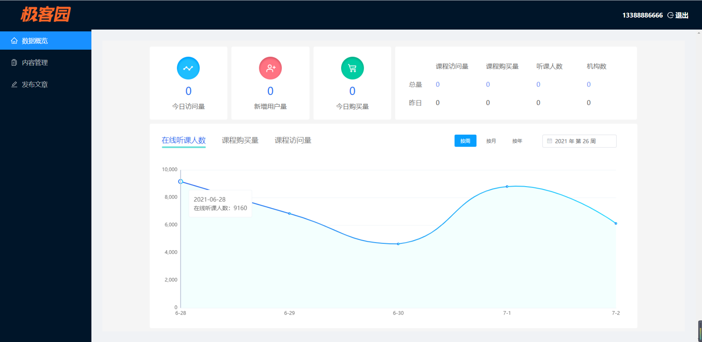

# react样式冲突 

## 组件样式覆盖问题

+ 在Layout组件的`index.scss`中添加样式

```css
.navBar {
  background-color: pink;
}
```

+ 在`Home`组件中的样式也跟着发生了改变，说明组件中的样式是相互影响的。
+ 原因：在配置路由时，Layout和 Home 组件都被导入到项目中，那么组件的样式也就被导入到项目中了。如果组件之间样式名称相同，那么一个组件中的样式就会在另一个组件中也生效，从而造成组件之间样式相互覆盖的问题。
+ 结论：默认，只要导入了组件，不管组件有没有显示在页面中，组件的样式就会生效。
+ 解决方案
  + 手动处理 （起不同的类名）
  + `CSS IN JS` ： 以js的方式来处理css   
  + css不是一门编程语言，css没有所有的局部作用域全局作用域这样的区分。。。css只有全局作用域

##  CSS IN JS

+ CSS IN JS：是使用 JavaScript 编写 CSS 的统称，用来解决 CSS 样式冲突、覆盖等问题
+ [CSS IN JS](<https://github.com/MicheleBertoli/css-in-js>) 的具体实现有 50 多种，比如：CSS Modules、[styled-components](<https://www.styled-components.com/>) 等

+ 推荐使用：[CSS Modules](<https://github.com/css-modules/css-modules>) （React脚手架已集成，可直接使用）

## CSS Modules 的说明 

+ CSS Modules 通过对 CSS 类名重命名，保证每个类名的唯一性，从而避免样式冲突的问题 
+ 换句话说：所有类名都具有“局部作用域”，只在当前组件内部生效
+ 在 React 脚手架中：文件名、类名、hash（随机）三部分，只需要指定类名即可  BEM
+ `xxxx.module.css`

```js
/* 自动生成的类名，我们只需要提供 classname 即可 */
[filename]_[classname]_[hash]
```

```css
// 类名
.error {}  .red{}
// 生成的类名为：
.NavHeader_error__ax7yz   .NavHead_red_abcdc
```

## 在项目中使用css Modules

+ 创建名为 `[name].module.css` 的样式文件（React脚手架中的约定，与普通 CSS 作区分）

```js
// 在 CityList 组件中创建的样式文件名称：
index.module.css
```

+ 组件中导入该样式文件（注意语法）

```js
// 在 CityList 组件中导入样式文件：
import styles from './index.module.css'
```

+ 通过 styles 对象访问对象中的样式名来设置样式

```js
<div className={styles.test}></div>
```

## css module的注意点

+ 类名最好使用驼峰命名，因为最终类名会生成`styles`的一个属性

```js
.tabBar {}

styles.tabBar
```

+ 如果没有使用驼峰命名，对于不合法的命名，需要使用[]语法 

```js
.tab-bar {}

styles['tab-bar']
```

+ 如果是全局的类名，应该使用`:global(.类名)`的方式，不然会把全局类名给修改掉 

```js
:global(.icon-map) {   }

这样css modules就不会修改掉类名了
```

## css module配合sass

+ css moudule也可以配合sass来使用，创建名为`[name].module.scss`

```css
.father {
  .son {
    font-size: 30px;
  }

  :global {
    .son2 {
      font-size: 20px;
    }
  }
}
```

+ 使用css modules解决Login组件样式冲突问题


## css modules的使用步骤

1. 把`index.scss`改成`index.module.scss`

```scss
.list {
  background-color: pink;
  color: red;
    :global {
        xxxx
    }
}

```

2. 导入样式的时候进行修改

```diff
- import './index.scss'

+ import styles from './index.module.scss'
```


3. 使用的时候需要修改

```diff
- <div className="list">文章列表组件</div>

+ <div className={styles.list}>文章列表组件</div>
```


# 项目功能 - 首页



## 搭建布局组件结构

+ 准备基本结构

```jsx
<div className="layout">
  <Layout>
    <Header className="header">
      <div className="logo" />
    </Header>
    <Layout>
      <Sider width={200} className="site-layout-background">
        <Menu
          mode="inline"
          defaultSelectedKeys={['1']}
          defaultOpenKeys={['sub1']}
          style={{ height: '100%', borderRight: 0 }}
        >
          <Menu.Item key="1">option1</Menu.Item>
          <Menu.Item key="2">option2</Menu.Item>
          <Menu.Item key="3">option3</Menu.Item>
        </Menu>
      </Sider>
      <Layout style={{ padding: '0 24px 24px' }}>
        <Content
          className="site-layout-background"
          style={{
            padding: 24,
            margin: 0,
            minHeight: 280,
          }}
        >
          Content
        </Content>
      </Layout>
    </Layout>
  </Layout>
</div>
```

+ 提供样式文件`index.scss`

```scss
.layout {
  .logo {
    float: left;
    width: 120px;
    height: 31px;
    margin: 16px 24px 16px 0;
    background: rgba(255, 255, 255, 0.3);
  }

  .ant-row-rtl .logo {
    float: right;
    margin: 16px 0 16px 24px;
  }

  .site-layout-background {
    background: #fff;
  }
}

```

## 头部结构与样式

+ 头部结构

```jsx
<Header className="header">
  <div className="logo" />
  <div className="profile">
    <span>黑马先锋</span>
    <span>
      <LogoutOutlined></LogoutOutlined>
      {'  '}退出
    </span>
  </div>
</Header>
```

+ 头部样式

```css
.layout {
  .profile {
    position: absolute;
    right: 20px;
    color: #fff;
    font-weight: 700;
    span + span {
      margin-left: 20px;
      cursor: pointer;
    }
  }
}

```

## 左侧菜单

+ 导入图标

```jsx
import {
  LogoutOutlined,
  HomeOutlined,
  DiffOutlined,
  EditOutlined,
} from '@ant-design/icons'
```

+ 展示图标

```jsx
<Menu.Item key="1" icon={<HomeOutlined />}>
  数据概览
</Menu.Item>
<Menu.Item key="2" icon={<DiffOutlined />}>
  内容管理
</Menu.Item>
<Menu.Item key="3" icon={<EditOutlined />}>
  发布文章
</Menu.Item>
```

## 整体样式处理

+ 样式

```scss
.layout {
  height: 100vh;
  .ant-layout {
    height: 100%;
  }
}
```

+ 内容样式修改

```jsx
<Layout style={{ padding: '24px' }}>
```

## 嵌套路由的配置

+ 新增组件 `Home/index.js`  `ArticleList/index.js`   `ArticlePublish/index.js`

```jsx
import React, { Component } from 'react'

export default class Home extends Component {
  render() {
    return <div className="home">Home首页</div>
  }
}

```

+ 增加配置  layout/index.js组件中

```jsx

import Home from '../Home'
import ArticleList from '../ArticleList'
import ArticlePublish from '../ArticlePublish'

<Route exact path="/home" component={Home}></Route>
<Route path="/home/list" component={ArticleList}></Route>
<Route path="/home/publish" component={ArticlePublish}></Route>
```

## 退出功能

+ 结构

```jsx
import { Layout, Menu, Popconfirm } from 'antd'

<Popconfirm
  title="你确定要退出本系统么？"
  okText="确定"
  cancelText="取消"
  onConfirm={this.onConfirm}
>
  <span>
    <LogoutOutlined></LogoutOutlined>
    {'  '}退出
  </span>
</Popconfirm>
```

+ 功能

```jsx
onConfirm = () => {
  // 点击了确定
  localStorage.removeItem('itcast_geek_pc')
  // 跳转到登录页
  this.props.history.push('/login')
  // 提示消息
  message.success('退出成功')
}
```

## 本地存储操作的封装

+ 封装token操作 `utils/storage.js`

```jsx
const TOKEN_KEY = 'itcast-geek-token'

const setToken = (token) => {
  localStorage.setItem(TOKEN_KEY, token)
}

const removeToken = () => {
  localStorage.removeItem(TOKEN_KEY)
}

const getToken = () => {
  return localStorage.getItem(TOKEN_KEY)
}

export { setToken, getToken, removeToken }

```

+ 修改登录代码

```jsx
submit = async (values) => {
  const { mobile, code } = values
  try {
    const res = await login(mobile, code)
    // 存储token
    // localStorage.setItem('itcast_geek_pc', res.data.token)
    setToken(res.data.token)
    // 跳转到首页
    this.props.history.push('/home')
    message.success('登录成功', 1)
  } catch (err) {
    message.warning(err.response.data.message, 1)
  }
}
```

+ 修改退出功能

```jsx
onConfirm = () => {
  // 点击了确定
  // localStorage.removeItem('itcast_geek_pc')
  removeToken()
  // 跳转到登录页
  this.props.history.push('/login')
  // 提示消息
  message.success('退出成功')
}
```

## 登录访问控制 - 鉴权

对于极客园 PC 端项目来说，

- 有的页面*不需要登录*就可以访问，比如，登录页
- 有的页面*需要登录*后才能访问，比如，项目后台首页、内容管理等（除了登录页面，其他页面需要登录才能访问）

因此，就需要对项目进行登录访问控制，让需要登录才能访问的页面，必须在登录后才能访问。
在没有登录时，直接跳转到登录页面，让用户进行登录。

- 如何实现登录访问控制呢？
  - 分析：不管哪个页面都是通过**路由**来访问的，因此，需要从路由角度来进行控制
  - 思路：创建 `AuthRoute` 组件，判断是否登录，1 登录直接显示要访问的页面 2 没有登录跳转到登录页面

**难点：react中没有导航守卫，需要自己封装**

### 分析 AuthRoute 鉴权路由组件

+ 场景：限制某个页面只能在登录的情况下访问。
+ 说明：在 React 路由中并没有直接提供该组件，需要手动封装，来实现登录访问控制（类似于 Vue 路由的导航守卫）。
+ 如何封装？参考 react-router-dom 文档中提供的鉴权示例 。
+ 如何使用？使用 AuthRoute 组件代替默认的 Route 组件，来配置路由规则。
+ AuthRoute 组件实际上就是对原来的 Route 组件做了一次包装，来实现了一些额外的功能。
+ `<Route  path component render>`   render 方法，指定该路由要渲染的组件内容（类似于 component 属性）。
+ Redirect 组件：重定向组件，通过 to 属性，指定要跳转到的路由信息。
+ state 属性：表示给路由附加一些额外信息，此处，用于指定登录成功后要进入的页面地址。

```js
// 使用方式：
<AuthRoute path="/rent/add" component={Rent} />
```

### 实现自己的AuthRoute组件

+ 新增hasToken方法

```jsx
const hasToken = () => !!getToken()

export { setToken, getToken, removeToken, hasToken }
```

+ 权限判断

```js
import React from "react"
import { Route, Redirect } from "react-router-dom"
import { hasToken } from 'utils/storage'
function AuthRouter({ component: Component, ...rest }) {
  return (
    <Route
      {...rest}
      render={(props) => {
        // console.log("props", props)
        if (hasToken()) {
          return <Component {...props}></Component>
        } else {
          return (
            <Redirect
              to={{ pathname: "/login", state: { from: props.location } }}
            ></Redirect>
          )
        }
      }}
    ></Route>
  )
}

export default AuthRouter

```

+ 使用AuthRoute

```jsx
{/* 路由规则 */}
<Switch>
  <Redirect exact from="/" to="/home"></Redirect>
  <AuthRoute path="/home" component={Layout}></AuthRoute>
  <Route path="/login" component={Login}></Route>
</Switch>
```

+ 登录成功处理

```jsx
submit = async (values) => {
  const { mobile, code } = values
  console.log(this.props)
  try {
    const res = await login(mobile, code)
    // 存储token
    // localStorage.setItem('itcast_geek_pc', res.data.token)
    setToken(res.data.token)
    // 跳转到首页
    const { state } = this.props.location
    if (state) {
      this.props.history.push(state.from.pathname)
    } else {
      this.props.history.push('/home')
    }
    message.success('登录成功', 1)
  } catch (err) {
    message.warning(err.response.data.message, 1)
  }
}
```

### route组件的作用

```jsx
<Route path="/home" component={Home}></Route>
<Route path="/login" component={Login}></Route>
```

Route组件会根据当前地址的中地址 和 Route的path进行匹配，，，如果路径一直，那么这个对应的组件就会被渲染出来

Route没有判断用户是否登录的能力，只会根据path判断是否要渲染对应的组件。

**需求：让Route组件能够有逻辑，能够判断用户是否登录，，，，需要通过Route组件的render属性**


## 获取个人信息

+ 拦截器添加token

```jsx
// 请求拦截器
instance.interceptors.request.use(
  function (config) {
    const token = getToken()
    if (token) {
      config.headers.Authorization = `Bearer ${token}`
    }
    return config
  },
  function (error) {
    return Promise.reject(error)
  }
)
```

+ 封装接口，获取用户信息

```jsx
/**
 * 获取用户信息
 * @returns Promise
 */
export const getUserInfo = () => {
  return request({
    url: '/user/profile',
    method: 'get',
  })
}

```

+ 发送请求进行登录

```jsx
state = {
  profile: {},
}

async componentDidMount() {
  const res = await getUserProfile()
  console.log(res)
  this.setState({
    profile: res.data,
  })
}
```

+ 渲染

```jsx
<div className="profile">
  <span>{this.state.profile.name}</span>
  <Popconfirm
    title="你确定要退出本系统么？"
    okText="确定"
    cancelText="取消"
    onConfirm={this.onConfirm}
  >
    <span>
      <LogoutOutlined></LogoutOutlined>
      {'  '}退出
    </span>
  </Popconfirm>
</div>
```

## 处理token过期

> 使用响应拦截器拦截未登录的用户
>
> 难点：react-router-dom如何在非组件中实现路由跳转

+ 响应拦截器处理

```jsx
// 响应拦截器
instance.interceptors.response.use(
  function (response) {
    return response.data
  },
  function (error) {
    console.log(error.response)
    if (error.response.status === 401) {
      // token过期
      removeToken()
      window.location.href = '/login'
    }
    return Promise.reject(error)
  }
)
```

缺点：window.localtion会导致页面刷新

+ history处理 `utils/history.js`

```
import { createHashHistory } from 'history'

const history = createHashHistory()

export default history

```

+ App.js修改

```jsx
import history from 'utils/history'

<Router history={history}>
</Router>
```


+ 修改响应拦截器

```jsx
import history from './history'
// 响应拦截器
instance.interceptors.response.use(
  function (response) {
    return response.data
  },
  function (error) {
    console.log(error.response)
    if (error.response.status === 401) {
      // token过期
      removeToken()
      // 跳转到登录页
      history.push('/login')
      message.warning('用户信息已过期')
    }
    return Promise.reject(error)
  }
)
```

## 左侧菜单与高亮

```jsx
<Menu
  theme="dark"
  mode="inline"
  defaultSelectedKeys={[this.props.location.pathname]}
  style={{ height: '100%', borderRight: 0 }}
>
  <Menu.Item key="/home" icon={<HomeOutlined />}>
    <Link to="/home">首页</Link>
  </Menu.Item>
  <Menu.Item key="/home/list" icon={<DiffOutlined />}>
    <Link to="/home/list">内容管理</Link>
  </Menu.Item>
  <Menu.Item key="/home/publish" icon={<EditOutlined />}>
    <Link to="/home/publish">发布文章</Link>
  </Menu.Item>
</Menu>
```

