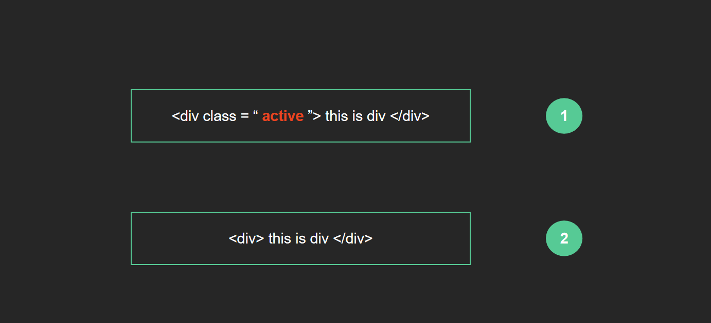
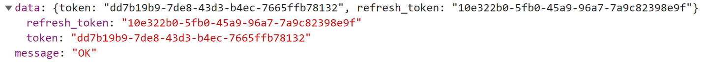
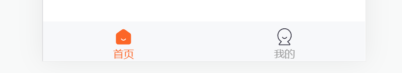
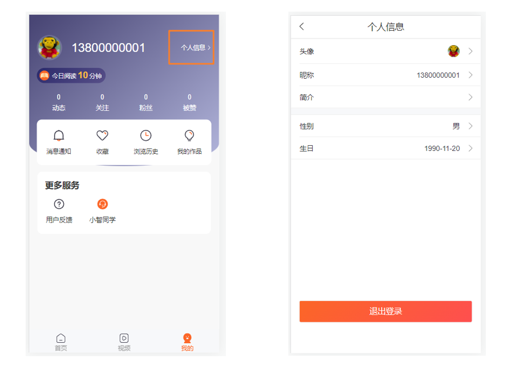
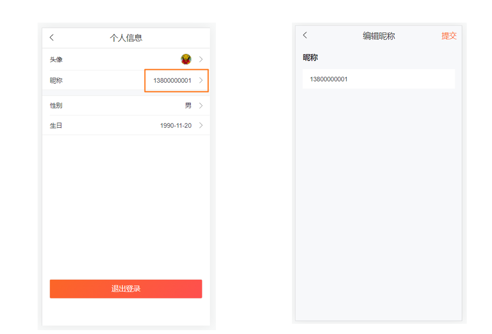
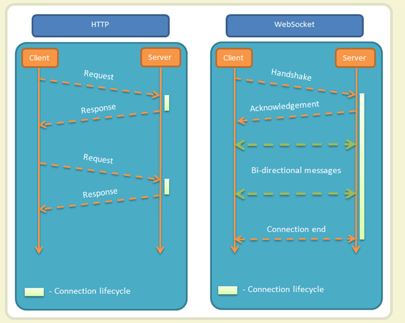

# 项目准备

## 1. 项目介绍

`本节目标:` 了解项目功能和技术栈

在线演示：http://toutiao.itheima.net/

- 项目功能
  - 用户登录、退出
  - 首页-频道管理，文章列表，更多操作
  - 文章详情-文章详情，文章评论，评论回复，点赞，收藏，关注
  - 个人中心-个人资料展示，个人资料编辑

- 技术栈
  - 项目搭建：React 官方脚手架 `create-react-app`
  - react hooks
  - 状态管理：`mobx`
  - UI 组件库：`antd-mobile`
  - ajax请求库：`axios`
  - 路由：`react-router-dom` 以及 `history`
  - CSS 预编译器：`sass`
  - CSS Modules 避免组件之间的样式冲突
  - **TypeScript**
  - 工具库：lodash
  - websocket 即时通讯

## 2. 项目初始化

`本节目标:`  能够基于脚手架搭建支持TypeScript的项目

**安装步骤**

1. 使用create-react-app创建项目  `npx create-react-app geek-mobile --template typescript`

1. 进入项目根目录：`cd geek-mobile`

2. 启动项目：`yarn start`

3. 调整目录结构

   ```
   /src
     /assets         项目资源文件，比如，图片 等
     /components     通用组件
     /styles         样式
     /pages          页面
     /store          Mobx 状态仓库
     /types          TS 类型，包括：接口、redux等类型
     /utils          工具函数 比如token、axios 的封装等
     App.scss        根组件样式文件
     App.tsx         根组件
     index.scss      全局样式
     index.tsx       项目入口
   ```

**其它修改**

安装sass

```bash
yarn add sass
```

修改`src/index.tsx`

```jsx
import ReactDOM from 'react-dom'
import './index.scss'
import App from './App'

ReactDOM.render(<App />, document.getElementById('root'))
```

修改`src/index.scss`

```scss
* {
  margin: 0;
  padding: 0;
}

html,
body,
#root {
  height: 100%;
}
```

修改`src/App.tsx` 根组件

```jsx
import './App.scss'

function App() {
  return <div className="app"></div>
}

export default App
```

修改`src/App.scss` 

```scss
.app {
  height: 100%;
}
```

## 3. 使用gitee管理项目

`本节目标:`  能够将项目使用gitee管理起来

**步骤**

1. 在项目根目录打开终端，并初始化 git本地仓库命令：`git init`
2. 添加项目内容到暂存区：`git add .`
3. 提交项目内容到仓库区：`git commit -m 项目初始化`
4. 添加 remote 仓库地址：`git remote add origin [gitee 仓库地址]`
5. 将项目内容推送到 gitee：`git push origin master -u`

## 4. 配置基础路由

`本节目标:`  能够使用react-router配置登录和Layout布局页路由

**实现步骤**

1. 安装路由

   ````bash
   # 安装路由
   yarn add react-router-dom
   # 安装路由类型文件
   yarn add @types/react-router-dom -D
   ````

2. 在 pages 目录中创建两个文件夹：Login、Layout

3. 分别在两个目录中创建 index.tsx 文件，并创建一个简单的组件后导出

4. 在 App 组件中，导入路由组件以及两个页面组件

5. 配置 Login 和 Layout 的路由规则

**代码实现**

1. `pages/Login/index.tsx `

   ```jsx
   const Login = () => {
     return <div>登录页面</div>
   }
   export default Login
   ```

2. `pages/Layout/index.tsx `

   ```jsx
   const Layout = () => {
     return <div>布局组件</div>
   }
   export default Layout
   ```

3. `App.tsx`

   ```jsx
   import { BrowserRouter as Router, Routes, Route } from 'react-router-dom'
   import Login from './pages/Login'
   import Layout from './pages/Layout'
   const App = () => {
     return (
       <Router>
         <div className="app">
           <Routes>
             <Route path="/login" element={<Login />}></Route>
             <Route path="/" element={<Layout />}></Route>
           </Routes>
         </div>
       </Router>
     )
   }
   
   export default App
   ```

## 5. ant-design安装

`本节目标:`  能够使用 antd-mobile 的 Button 组件渲染按钮

**使用步骤**

1. 安装antd组件库  `yarn add antd-mobile@next`
2. 导入Button组件
3. 在Login页面渲染Button组件

**测试使用**

`page/Login/index.tsx`

```jsx
import { Button } from 'antd-mobile'

const Login = () => (
  <div>
    <Button color="primary">Button</Button>
  </div>
)
export default Login
```

## 6. ant-design主题定制

`本节目标:`  能够使用原生CSS变量来定制极客园项目的主题

`src/index.scss`

```css
:root:root {
  --adm-color-primary: #fc6627;
  --adm-color-success: #00b578;
  --adm-color-warning: #ff8f1f;
  --adm-color-danger: #ff3141;
  --adm-color-white: #ffffff;
  --adm-color-weak: #999999;
  --adm-color-light: #cccccc;
  --adm-border-color: #eeeeee;
  --adm-font-size-main: 13px;
  --adm-color-text: #333333;
}
```

## 7. 配置别名路径

`本节目标:`  能够配置@路径别名简化路径处理

**安装步骤**

1. 安装修改 CRA 配置的包：`yarn add -D @craco/craco`
2. 在项目根目录中创建 craco 的配置文件：`craco.config.js`，并在配置文件中配置路径别名
3. 修改 `package.json` 中的脚本命令
4. 在代码中，就可以通过 `@` 来表示 src 目录的绝对路径
5. 重启项目，让配置生效

**代码实现**

`craco.config.js`

```js
const path = require('path')
module.exports = {
  // webpack 配置
  webpack: {
    // 配置别名
    alias: {
      // 约定：使用 @ 表示 src 文件所在路径
      '@': path.resolve(__dirname, 'src')
    }
  }
}

```

`package.json`

```json
// 将 start/build/test 三个命令修改为 craco 方式
"scripts": {
  "start": "craco start",
  "build": "craco build",
  "test": "craco test",
  "eject": "react-scripts eject"
}
```

## 8. 配置别名路径提示

`本节目标:`  能够让vscode识别@路径并给出路径提示

**分析说明**

因为项目使用了 TS，而 TS 带有配置文件 tsconfig.json。因此，不需要再使用 jsconfig.json（实际上，jsconfig.json 是参考 tsconfig.json 的）

VSCode 会自动读取 `tsconfig.json` 中的配置，让 vscode 知道 @ 就是 src 目录

**实现步骤**

1. 创建 `path.tsconfig.json` 配置文件
2. 在该配置文件中添加以下配置
3. 在 `tsconfig.json` 中导入该配置文件，让配置生效

**代码实现**

`path.tsconfig.json`

```json
{
  "compilerOptions": {
    "baseUrl": "./",
    "paths": {
      "@/*": ["src/*"]
    }
  }
}
```

`tsconfig.json`

```json
{
  // 导入配置文件
  "extends": "./path.tsconfig.json",
}
```

## 9. 移动端等比适配

`本节目标:`  能跟通过配置实现自动适配移动端项目

**实现步骤**

1. 安装 px 转 vw 的包：`yarn add -D postcss-px-to-viewport`
   - 包的作用：将 `px` 转化为 `vw`，所以有了该工具，只需要在代码中写 `px` 即可
2. 在 `craco.config.js` 添加相应配置
3. 重启项目让项目配置生效 （尝试调整视口大小，观察字体变化也可以查看样式面板单位）

**核心代码**

`craco.config.js`

```js
const path = require('path')
const pxToViewport = require('postcss-px-to-viewport')
const vw = pxToViewport({
  viewportWidth: 375
})

module.exports = {
  // webpack 配置
  style: {
    postcss: {
      mode: 'extends',
      loaderOptions: {
        postcssOptions: {
          ident: 'postcss',
          plugins: [vw]
        }
      }
    }
  }
}
```

## 10. classnames

`本节目标:`  通过使用className插件动态控制class类名显示



**基础样例**

`app.tsx`

```jsx
import classnames from 'classnames'
import { useState } from 'react'
import './App.css'
function App() {
  const [showFlag, setShowFlag] = useState(true)
  return (
    <div className={classnames({ active: showFlag })}>
      this is test color
      <button onClick={() => setShowFlag(!showFlag)}>switch</button>
    </div>
  )
}

export default App
```

`App.css`

```css
.active {
  color: red;
}
```

**其它语法**

```js
classNames('foo', 'bar'); // => 'foo bar'
classNames('foo', { bar: true }); // => 'foo bar'
classNames({ 'foo-bar': true }); // => 'foo-bar'
classNames({ 'foo-bar': false }); // => ''
classNames({ foo: true }, { bar: true }); // => 'foo bar'
classNames({ foo: true, bar: true }); // => 'foo bar'
```

## 11. cssModule

### 基础介绍

`本节目标:`  能够说出 CSSModules 如何解决组件之间的样式冲突问题

> 使用场景：CSS 模块，可以理解为对 CSS 进行模块化处理，为了在 React 开发时，**解决组件之间类名重复导致的样式冲突问题**

React 脚手架中为 CSSModules 自动生成的类名格式为：`[filename]_[classname]__[hash]`

- filename：文件名称
- classname：自己在 CSS 文件中写的类名
- hash：随机生成的哈希值

```css
/* GeekLayout 组件的 css 文件中：*/
.header {}
/* React 项目中，CSS Modules 处理后生成的类名：*/
.GeekLayout_header__adb4t {}
```

### 基础使用

`本节目标:`  能够在 React 项目中使用 CSSModules

**使用规则**

1. CSS 文件名称以 `.module.css` 结尾的，此时，React 就会将其当做 CSSModules 来处理，比如，`index.module.scss`
2. 如果不想使用 CSSModules 的功能，只需要让样式文件名称中不带`.module` 即可，比如，`index.css`

**实现步骤**

1. 创建样式文件，名称格式为：`index.module.scss`
2. 在 `index.module.scss` 文件中，按照原来的方式写 CSS 即可
3. **在 JS 中通过 `import styles from './index.module.scss'` 来导入样式文件**
4. 在 JSX 结构中，通过 `className={styles.类名}` 形式来使用样式（此处的 类名 就是 CSS 中写的类名）

**核心代码**

`Login/index.modules.css`

```css
.a {  color: red;}
```

` Login/index.js`

```jsx
import styles from './index.module.css'
// 对象中的属性 a 就是：我们自己写的类名
// 属性的值 就是：React 脚手架帮我们自动生成的一个类名，这个类名是随机生成的，所以，是全局唯一的！！！
// styles => { a: "Login_a__2O2Gg" }
const Login = () => {  
    return (   
        <div>     
            <span className={styles.a}>Login</span>   
        </div>  
   )
}
export default Login
```

**规则推荐**

1. **CSSModules 类名推荐使用驼峰命名法**，这有利于在组件的 JS 代码中访问
2. **不推荐嵌套样式**

### 全局样式

`本节目标:`  能够在 CSSModules 中使用全局样式

> 在`.module.css` 中，类名都是局部生效的，也就是只在当前组件生效
>
> 但是有些情况下，如果不想要让某个类名是局部的，要是全局的，就需要通过`:global()`  来处理，处理之后类名就变成全局的了

```css
/* 该类型会被CSSModules处理 */
.title{
  color: red;
}

/* 如果这个类名不需要进行CSSModules处理, 可以通过添加:global() 来包裹*/
:global(.title) {
   color:blue;
}
```

## 12. 字体图标

`本节目标:`  能够使用字体图标

**实现步骤**

1. 在 public 下 index.html head 中引入该文件

```html
<!-- 字体图标地址： -->
<script src="//at.alicdn.com/t/font_2503709_f4q9dl3hktl.js"></script>
```

2. 在 `index.scss` 中添加通过 css 代码

```css
.icon {
  width: 1em; height: 1em;
  vertical-align: -0.15em;
  fill: currentColor;
  overflow: hidden;
}
```

3. 在组件中使用

```html
<svg className="icon" aria-hidden="true">
  {/* 使用时，只需要将此处的 iconbtn_like_sel 替换为 icon 的名称即可*/}
  <use xlinkHref="#iconbtn_like_sel"></use>
</svg>
```

## 13. 封装Icon组件

`本节目标:`  能够封装通用的Icon组件，简化图标使用

**实现步骤**

1. 在 components 目录中，创建 Icon/index.tsx 文件

2. 创建 Icon 组件，并指定 props 类型，这里包括

   icon的类型 - 渲染哪个图标

   点击事件 -  支持点击事件触发

**代码实现**

`components/Icon/index.tsx`

```tsx
// 组件 props 的类型
type Props = {
  // icon 的类型
  type: string
  // 点击事件
  onClick?: () => void
}

const Icon = ({ type, onClick }: Props) => {
  return (
    <svg
      className="icon"
      aria-hidden="true"
      onClick={ onClick }
    >
      <use xlinkHref={`#${type}`}></use>
    </svg>
  )
}

export default Icon
```

**测试组件**

`pages/Login/index.tsx`

```html
// 测试基础渲染
<Icon type="iconbtn_like_sel" />
// 测试事件
<Icon
  type="iconbtn_like_sel"
  onClick={() => {
    console.log('图标事件触发')
  }}
/>
```


# 登录模块

## 1. 基本结构实现

`本节目标:` 能够手动搭建登录界面的基本结构

**实现步骤**

1. 完成导航栏和登录标题 - [NavBar 组件](https://mobile.ant.design/zh/components/nav-bar)
2. 添加登录表单 - [Form 组件](https://mobile.ant.design/zh/components/form)

**代码实现**

`page/Login/index.tsx`

```jsx
import { Button, NavBar, Form, Input, List } from 'antd-mobile'

import styles from './index.module.scss'

const Login = () => {
  return (
    <div className={styles.root}>
      <NavBar></NavBar>
      <div className="login-form">
        <h2 className="title">账号登录</h2>
        <Form>
          <Form.Item name="mobile" className="login-item">
            <Input placeholder="请输入姓名" />
          </Form.Item>
          <List.Item
            className="login-code-extra"
          >
            <Form.Item name="code" className="login-item">
              <Input placeholder="请输入验证码" autoComplete="off" />
            </Form.Item>
          </List.Item>

          <Form.Item noStyle>
            <Button
              block
              type="submit"
              color="primary"
              className="login-submit"
            >
              提交
            </Button>
          </Form.Item>
        </Form>
      </div>
    </div>
  )
}
export default Login
```

`page/Login/index.module.scss`

```scss
.root {
  :global {
    .login-form {
      padding: 0 33px;
      .title {
        margin: 54px 0 13px 0;
      }
      .adm-list {
        --align-items: end !important;
        --border-inner: none !important;
      }
      .adm-list-default {
        border: none;
      }
      .adm-list-item {
        padding: 0;
      }
      .login-item {
        border-bottom: 1px solid #f0f0f0;
        > .adm-list-item-content {
          height: 70px;
        }
      }
      .adm-list-item-content {
        position: relative;
        border-bottom: none;
      }

      .adm-input-wrapper {
        --placeholder-color: #a5a6ab;
      }
      .code-extra {
        color: #595769;
        font-size: 14px;

        &-disabled {
          color: #a5a6ab;
        }
      }
      .adm-list-item-description {
        position: absolute;
        bottom: -25px;
      }

      .login-submit {
        height: 50px;
        margin-top: 38px;
        border: none;
        font-size: 16px;
        background: linear-gradient(315deg, #fe4f4f, #fc6627);
      }
    }
  }
}
```

## 2. 表单校验

`本节目标:` 能够实现表单的校验

**校验要求**

1. 手机号校验规则为11个数字
2. 验证码规则为必填项

> 主要通过rules属性进行校验规则定义，rules是一个数组，支持定义多个校验规则，每个规则都是一个对象

`Login/index.tsx`

```tsx
<Form.Item
  className="login-item"
  name="mobile"
  rules={[
    { required: true, message: '请输入手机号' },
    {
      pattern: /^1[3-9]\d{9}$/,
      message: '手机号格式错误'
    }
  ]}
></Form.Item>
<Form.Item
  className="login-item"
  name="code"
  rules={[{ required: true, message: '请输入验证码' }]}
></Form.Item>
```

## 3. 获取登录表单数据

`本节目标:`  能够拿到手机号和验证码数据

**实现步骤**

1.  Form 表单添加 `onFinish` 属性
2. 创建 onFinish 函数，作为 Form 属性 `onFinish` 的值
3. 指定函数 onFinish 的参数类型
4. 通过参数获取到表单数据

> 组件Form有自动收集表单信息的机制，只需要给Form组件绑定`onFinish属性`即可，点击提交按钮时会自动触发onFinish回调，并把表单数据传入

**代码实现**

`Login/index.tsx`

```tsx
// 提交参数类型
type LoginForm = {
  mobile: string
  code: string
}
const Login = () => {
  const onFinish = (values: LoginForm) => {
    console.log(values)
    // todo login
  }
  return (
    <Form onFinish={onFinish}></Form>
  )
}
```

## 4. Axios封装

`本节目标:`  安装axios并进行基础封装

**实现步骤**

1. 安装axios包  `yarn add axios`
2. 封装request.ts模块 包括新实例创建，拦截器

`utils/request.ts`

```ts
// 封装axios
import axios from 'axios'
import { Toast } from 'antd-mobile'
const http = axios.create({
  baseURL: 'http://geek.itheima.net/v1_0/',
  timeout: 5000
})

// 添加请求拦截器
instance.interceptors.request.use(
  (config)=> {
    // 在发送请求之前做些什么
    return config
  },
  (error)=> {
    // 对请求错误做些什么
    return Promise.reject(error)
  }
)

// 添加响应拦截器
instance.interceptors.response.use(
  (response)=> {
    // 对响应数据做点什么
    return response
  },
  (error) => {
    // 对响应错误做点什么
    // 接口错误信息提示
    Toast.show({
      content: error.response?.data.message,
      duration: 1000
    })
    return Promise.reject(error)
  }
)

export { http }
```

## 5. mobx实现登录逻辑

`本节目标:`  使用mobx管理登录用户信息

**实现步骤**

1. 定义Login模块store，**重点定义各种ts类型**
2. 在store入口中组合Login模块
3. 在业务组件中使用store  



`store/user.store.ts`

```ts
// 用户信息模块
import { makeAutoObservable } from 'mobx'
import { http } from '../utils'

// 定义后端实际返回的token,data类型
type TokenInfo = {
  token: string
  refresh_token: string
}
// 定义通用的返回值结构
type LoginResponse = {
  messsage: string
  data: TokenInfo
}

type LoginForm = {
  mobile: string
  code: string
}

class userStore {
  tokenInfo: TokenInfo
  constructor() {
    makeAutoObservable(this)
    this.tokenInfo = {
      refresh_token: '',
      token: '',
    }
  }
  login = async ({ mobile, code }: LoginForm) => {
    const res = await http.post<LoginResponse>('/authorizations', {
      mobile,
      code,
    })
    this.tokenInfo = res.data.data
  }
}
export default userStore
```

`store/index.ts`

```ts
import UserStore from "./user.Store"
import React from "react"
import { configure } from "mobx"
configure({
  enforceActions: "never",
})

class RootStore {
  userStore: UserStore
  // 组合模块
  constructor() {
    this.userStore = new UserStore()
  }
}
// 把生成的根实例store存入context
const StoresContext = React.createContext(new RootStore())
// 导出方法 用来获取contex中的数据
export const useStore = () => React.useContext(StoresContext)
```

`pages/Login/index.ts`

```js
import { useStore } from '@/store'
import type { LoginForm } from '@/types/login'

// 使用observer方法包裹组件 让组件可响应变化
const Login = ()=>{
   // 得到useStore实例
   const { userStore } = useStore()
   const finish = async (values: LoginForm) => {
        // 调用登录异步方法
        await userStore.login(values)
   }
   return (
    {/* 模板 */}
   )
}
```

## 6. 登录后跳转首页

`本节任务:` 实现登录之后跳转首页

**实现步骤**

1. 导入`Toast`方法和`useHistory`方法
2. 登录成功之后完成提示和跳转

**代码实现**

```js
import { useNavigate} from 'react-router-dom'
import { Toast } from 'antd-mobile'

const Login = ()=>{
   const { userStore } = useStore()
   const navigate  = useNavigate()
   const finish = async (values: LoginForm) => {
        // 调用登录异步方法
        await userStore.login(values)
        // 后续处理
        Toast.show({
          content: '登录成功',
          duration: 600,
          afterClose: () => {
            // 返回首页
            navigate('/')
          }
        })
   }
   return (
     {/* 模板 */}
   )
}
```

## 7. 持久化Token

`本节目标:` 封装token通用方法对token数据进行持久化缓存

**实现步骤**

1. 封装关于token的增删改查方法
2. 改造user.Store进行token缓存

**代码实现**

`utils/Token.ts`

```typescript
// 封装token的存取本地方法

import { TokenInfo } from '@/type'

const KEY = 'geek-mobile'

function getToken() {
  // parse方法本身要求的参数时一个string类型
  // 而window.localStorage.getItem(KEY) 得到的可能是一个string也可能是一个null
  const value = window.localStorage.getItem(KEY)
  // 类型的安全判断(守卫) 如果value有值 相当于null的类型不存在 只可能是一个string类型了
  if (value) {
    return JSON.parse(value)
  }
}

function setToken(tokenInfo: TokenInfo): void {
  return window.localStorage.setItem(KEY, JSON.stringify(tokenInfo))
}

function removeToken() {
  window.localStorage.removeItem(KEY)
}

export { getToken, setToken, removeToken }
```

`store/user.store.ts`

```ts
class userStore {
  tokenInfo: Token
  constructor() {
    makeAutoObservable(this)
    // 以本地缓存作为初始值
    this.tokenInfo = getToken() || {
        token:'',
        refresh_token:''
    }
  }
  // 登录的action
  login = async ({ mobile, code }: LoginForm) => {
    const res = await request.post<LoginResponse>('/authorizations', { mobile, code })
    this.tokenInfo = res.data.data
    // 在拿到token之后往本地存一份
    setToken(res.data.data)
  }
}
```

## 8. 拦截器注入Token

`本节目标:`  在axios的请求拦截器中拦截 token，做统一注入

`utils/reqeust.ts`

```js
// 添加请求拦截器
instance.interceptors.request.use(
 (config) => {
    // 在发送请求之前做些什么
    const token = getToken().token
    if (token) {
      config.headers!['Authorization'] = `Bearer ${token}`
    }
    return config
  },
  (error)=> {
    // 对请求错误做些什么
    return Promise.reject(error)
  }
)
```

# Layout模块

## 1. TabBar结构渲染

`本节目标:`  实现TabBar的基础渲染



**核心代码**

`Pages/Layout/index.tsx`

```tsx
import styles from './index.module.scss'
import { TabBar } from 'antd-mobile'
import Icon from '@/components/Icon'
const Layout = () => {
  // tab列表数组
  const tabs = [
    { path: '/', icon: 'iconbtn_home', text: '首页' },
    { path: '/profile', icon: 'iconbtn_mine', text: '我的' },
  ]

  return (
    <div className={styles.root}>
      {/* 使用 antd 的 TabBar 组件，并指定类名 tab-bar */}
      <TabBar className="tab-bar">
        {tabs.map((item) => (
          <TabBar.Item
            key={item.path}
            icon={(active) => (
              <Icon type={active ? `${item.icon}_sel` : item.icon} />
            )}
            title={item.text}
          />
        ))}
      </TabBar>
    </div>
  )
}
export default Layout
```

`Pages/Layout/index.module.scss`

```scss
.root {
  height: 100%;
  :global {
    // 底部 tabbar 的样式
    .tab-bar {
      position: fixed;
      z-index: 1;
      bottom: 0;
      width: 100%;
      height: 46px;
      background-color: #f7f8fa;
      .icon {
        color: #fc6627;
      }
    }
  }
}

```

## 2. 二级路由配置

`本节目标:`  能够实现二级路由的配置

声明Home组件 - `pages/Home/index.tsx`

```tsx
const Home = () => {
  return <div>this is home</div>
}

export default Home
```

声明Profile组件 - `pages/Profile/index.tsx`

```tsx
const Profile = () => {
  return <div>this is profile</div>
}

export default Profile
```

配置嵌套关系 - `app.tsx`  

```tsx
import { BrowserRouter as Router, Routes, Route } from 'react-router-dom'
import Login from './pages/Login'
import Layout from './pages/Layout'
import Home from './pages/Home'
import Profile from './pages/Profile'
const App = () => {
  return (
    <Router>
      <div className="app">
        <Routes>
          <Route path="/login" element={<Login />}></Route>
          <Route path="/" element={<Layout />}>
            <Route index element={<Home />} />
            <Route path="profile" element={<Profile />} />
          </Route>
        </Routes>
      </div>
    </Router>
  )
}

export default App
```

配置二级路由出口 - `Layout.tsx`

```tsx
<div className={styles.root}>
      {/* 二级路由渲染位置 */}
      <Outlet />
      {/* 使用 antd 的 TabBar 组件，并指定类名 tab-bar */}
</div>
```

## 3. 点击切换路由

`本节目标:`  能够实现tab点击切换路由

> TabBar组件配置 onChange 参数 可以在切换tab的时候自动执行回调函数，并且传入当前的key值

```tsx
const navigate = useNavigate()
const tabChange = (key: string) => {
    navigate(key)
}

return (
    <div className={styles.root}>
      <Outlet />
      {/* 使用 antd 的 TabBar 组件，并指定类名 tab-bar */}
      <TabBar className="tab-bar" onChange={tabChange}>
        {tabs.map((item) => (
          <TabBar.Item
            key={item.path}
            icon={(active) => (
              <Icon type={active ? `${item.icon}_sel` : item.icon} />
            )}
            title={item.text}
          />
        ))}
      </TabBar>
    </div>
 )
```

## 4. 刷新保持激活tab

`本节目标:`  能够在刷新的时候保持当前激活项的状态

> TabBar组件有一个用于激活的属性叫做  `activeKey`   只需要获取当前的路由路径配置上去即可

```tsx
const location = useLocation()

return (
    <TabBar 
       activeKey={location.pathname}>
    </TabBar>
)
```

# 个人中心

## 1. 基础结构搭建

`本节目标:` 把个人中心对应的组件渲染到对应位置

**实现步骤**

1. 把`静态模板` 中的 `个人中心` 复制到我们的 `pages` 页面目录中

## 2. 获取用户信息

`本节目标:`  能够获取个人用户信息

**实现步骤**

1. 按照接口文档定义用户信息类型Type
2. 新建一个userStore模块，定义用户数据和修改数据的异步请求
3. 在store的入口中组合新建立的useStore模块
4. 在业务组件中发起action函数，并使用数据

**核心代码**

1）定义接口数据类型 - `type/index.ts`

```typescript
// 用户信息
export type User = {
  id: string
  name: string
  photo: string
  art_count: number
  follow_count: number
  fans_count: number
  like_count: number
}
```

2）通过mobx管理数据 - `store/user.Store.js`

```typescript
// 用户信息模块
import { makeAutoObservable } from "mobx"
import request from '@/utils/request'
import type { User,ApiRes } from '@/types'

class UserStore {
  // 声明用户信息
  userInfo: User
  constructor() {
    makeAutoObservable(this)
    this.userInfo = {} as User
  }
  // 获取用户数据的action
  getUser = async ()=>{
    const res = await request.get<ApiRes<User>>('/user')
    this.userInfo = res.data.data
  }
}
export default UserStore
```

3）触发action并使用数据 - `pages/profile/index.ts`

```jsx
import { useStore } from '@/store'
import { useEffect } from 'react'
import { observer } from 'mobx-react-lite'
const Profile = () => {
  // ...
  const { userStore } = useStore()
  useEffect(() => {
    // 触发action
    userStore.getUser()
  }, [userStore])
  
  return ()
}

export default observer(Profile)
```


# 权限控制

`本节目标:`  实现路由权限控制和token失效跳转控制

## 1. 路由权限控制

**实现步骤**

1. 定义`AuthRoute`组件 
2. 在一级路由 `我的` 中进行测试使用

**代码实现**

```tsx
import type { ReactChildren, ReactChild } from 'react'
import { Navigate } from 'react-router-dom'

interface AuxProps {
  children: ReactChild | ReactChildren
}

// 鉴权组件
const AuthRoute = ({ children }: AuxProps) => {
  return !hasToken() ? <Navigate to="/login" replace /> : <>{children}</>
}

export { AuthRoute }
```

## 2. token失效控制

# 编辑资料



## 1. 基本结构搭建

`本节目标:` 把个人资料对应的组件渲染到对应位置

**实现步骤**

1. 把`静态模板` 中的 `个人中心` 中的`Edit` 目录复制到我们的 `pages` 目录下的 `Profile`中

## 2. 信息的初始渲染

`本节目标:` 把个人信息渲染到组件模板中

**实现步骤**

1. 根据接口文档准备个人信息对应的Type类型
2. 在userStore模块下新增action函数
3. 在业务组件中触发action函数并使用数据渲染模板

**代码实现**

`type/index.ts`

```typescript
// 用户个人资料
export type UserProfile = {
  id: string
  photo: string 
  name: string
  gender: string
  birthday: string
  intro: string
}
```

`store/user.Store.js`

```typescript
// 用户信息模块
import { makeAutoObservable } from "mobx"
import { http } from '@/utils/request'
import type { UserProfile, ApiRes } from '@/type'

class UserStore {
  userProfile: UserProfile
  constructor() {
    makeAutoObservable(this)
    this.userProfile = {} as UserProfile
  }
  // 获取用户个人信息
  getUserProfile = async () => {
    const res = await http.get<ApiRes<UserProfile>>('/user/profile')
    this.userProfile = res.data.data
  }
}

export default UserStore
```

`pages/profile/Edit/index.tsx`

```jsx
import { useStore } from '@/store'
import { useEffect } from 'react'
import { observer } from 'mobx-react-lite'
const Item = List.Item

const ProfileEdit = () => {
  const { userStore } = useStore()
  useEffect(() => {
    const runAction = async () => {
      await userStore.getUserProfile()
    }
    runAction()
  }, [userStore])
}

export default observer(ProfileEdit)
```

## 3. popup组件的使用

`本节目标:`  掌握popup组件的基础用法

**主要属性**

1. visible属性决定Popup组件是否显示
2. position属性决定Popup组件从哪个方向弹出
3. bodyStyle属性用来定制样式

```jsx
const [visible,setVisible] = useState(false)

return (
    <Popup
        visible={visible}
        position="right"
        bodyStyle={{ height: '100%', width: '100vw ' }}
        >
        {/* 主体内容 */}
    </Popup>
)
```

## 4. 修改昵称



`本节目标:`  完成昵称的修改

**实现步骤**

1. 把Edit组件放置Popup组件中
1. 回填用户昵称
2. 在store中封装更新的action函数
3. 点击提交按钮调用action函数并且关闭弹框

**代码实现**

回填数据 - `EditInput/index.tsx`

```tsx
import { useStore } from '@/store'
import { useState } from 'react'

// 声明prop类型注解
type Props = {
  hidePopup: () => void
}
const EditInput = ({ hidePopup }: Props) => {
  const { userStore } = useStore()
  const [value, setValue] = useState(userStore.userProfile.name)
  const onChange = (value: string) => {
    // 从store拿到的数据仅仅可以作为一个初始值而存在 不能作为直接修改的数据
    // 因为input输入修改的时候是一个临时的UI状态
    // 每次拿到新输入值时 修改这个临时的value数据
    setValue(value)
  }
  return (
    <Input placeholder="请输入" onChange={onChange} value={value} />
  )
}

export default EditInput
```

添加action函数  `store/user.Store.ts`

```typescript
updateUserProfile = async (value: string) => {
    await request.patch('/user/profile', {
      name: value,
    })
    // 重新渲染数据
    await this.getUserProfile()
}
```

点击提交按钮调用接口 - `EditInput/index.tsx`

```tsx
async function updateUserProfile() {
    await userStore.updateUserProfile(value)
}
return (
  <NavBar
    className="navbar"
    right={<span className="commit-btn" onClick={updateUserProfile}>提交</span>}
  >
)
```

关闭弹框 - 子组件调用父组件的关闭方法

`Edit/index.tsx`

```tsx
<Popup
    visible={inputVisible.visible}
    position="right"
    bodyStyle={{ height: '100%', width: '100vw ' }}
    destroyOnClose>
    {/* 主体内容 */}
    <EditInput hideInput={hideInput}></EditInput>
</Popup>
```

`EditInput/index.tsx`

```tsx
async function updateUserProfile() {
    await userStore.updateUserProfile(value)
    // 关闭弹框
    hideInput()
}
return (
  <NavBar
    className="navbar"
    right={<span className="commit-btn" onClick={updateUserProfile}>提交</span>}
    onBack={hideInput}
  >
)
```

## 5. 退出登录

`本节目标:` 实现退出登录的功能

> 退出登录要做的事儿就是清空token和跳转登录页

**实现步骤**

1. 在userStore中封装退出登录action，清空本地数据
2. 在业务组件中，调用action函数，跳回登录页

**代码实现**

`store/user.Store.ts`

```js
// 清空个人信息
removeUser = () => {
    this.tokenInfo = {} as TokenInfo
    this.userInfo = {} as User
    this.userProfile = {} as UserProfile
    removeToken()
}
```

`Profile/Edit/index.tsx`

```js
 const loginOut = () => {
    // todo remove
    Dialog.show({
      title: '温馨提示',
      content: '确定退出吗？',
      closeOnAction: true,
      actions: [
        [
          {
            key: 'cancel',
            text: '取消',
          },
          {
            key: 'confirm',
            text: '确定',
            danger: true,
            onClick: () => {
              // 1.清除token
              // 2.跳转到登录页
              userStore.removeUser()
              navigate('/login')
            },
          },
        ],
      ],
    })
  }
```

# 频道管理

## 1. 准备静态资源文件

`本节目标:` 把提前准备好的静态模板放入项目完成路由渲染

> 我们把`首页模板` 中的 `Home` 目录复制到 项目的 `pages` 目录下，然后在`Layout/index.tsx`中引入 渲染到对应位置

## 2. 频道列表实现

`本节目标:` 实现频道列表的获取和渲染

**实现步骤**

1. 搭建静态的tabs结构，熟悉tabs的渲染方式
2. 根据接口文档定义tabs需要的类型Type
3. 在store中新增homeStore模块，定义数据和action
4. 在组件中发起action的调用并渲染数据

**代码实现**

1）定义tabs类型Type

`type/index.ts`

```typescript
// 频道类型
export type ChannelItem = {
  id: number
  name: string
}

export type Channel = {
  channels: ChannelItem[]
}
```

2）定义新的homeStore

`store/channel.Store.ts`

```ts
import type { ApiRes, ChannelRes } from '@/type'
import { http } from '@/utils'
import { makeAutoObservable } from 'mobx'

class ChannelStore {
  channelData: ChannelRes
  constructor() {
    makeAutoObservable(this)
    this.channelData = { channels: [] } as ChannelRes
  }
  // 获取channel列表
  getChannelList = async () => {
    const res = await http.get<ApiRes<ChannelRes>>('/user/channels')
    this.channelData = res.data.data
  }
}

export default ChannelStore
```

3）在组件中发起action并渲染数据

`pages/Home/index.tsx`

```jsx
import Icon from '@/components/Icon'
import { useStore } from '@/store'
import { useEffect } from 'react'
import { Tabs } from 'antd-mobile'

import styles from './index.module.scss'
import { observer } from 'mobx-react-lite'
const Home = () => {
  // 获取频道列表
  const { channelStore } = useStore()
  useEffect(() => {
    channelStore.getChannelList()
  }, [])
  return (
    <div className={styles.root}>
      {/* 频道 Tabs 列表 */}
      <Tabs className="tabs" activeLineMode="fixed" defaultActiveKey="0">
        {channelStore.channelData.channels.map((channel) => {
          return (
            <Tabs.Tab title={channel.name} key={channel.id}>
              {/* 这里是每个tab下对应的内容显示 可以自定义 */}
              {channel.name} cp
            </Tabs.Tab>
          )
        })}
      </Tabs>
      <div className="tabs-opration">
        <Icon type="iconbtn_search" />
        <Icon type="iconbtn_channel" />
      </div>
    </div>
  )
}

export default observer(Home)
```

## 3. 频道管理-控制弹框

`本节目标:`  能够实现点击控制弹框打开

**实现步骤**

1. 引入Channel组件
2. 准备Popup组件，绑定visible属性
3. 点击控制visible属性为true，打开弹框
4. 通过父传子传递hide关闭函数，子组件点击关闭按钮执行hide函数

**代码实现**

`Home/index.tsx`

```jsx
import Channels from './Channels'
// 控制弹框打开
const [visible, setVisible] = useState(false)
// 关闭弹框
const hide = () => {
	setVisible(false)
}
{/* 绑定点击 */}
<Icon type="iconbtn_channel" onClick={() => setVisible(true)} />
{/* 频道管理 */}
<Popup visible={visible} position='left'>
	<Channels hide={hide}></Channels>
</Popup>
```

`Home/Channels/index.tsx`

```tsx
type Props = {
  hide: () => void
}

const Channels = ({ hide }: Props) => {
  return (
    <div className={styles.root}>
      <div className="channel-header">
        <Icon type="iconbtn_channel_close"  onClick={hide} />
      </div>
    </div>
  )
}

export default Channels
```

## 4. 频道管理-我的频道

`本节目标:`  获取我的频道数据并完成视图渲染

> 我的频道就是已经完成的频道列表，我们只需要从store中把数据在组件中渲染出来即可

```jsx
import { useStore } from '@/store'
import { observer } from 'mobx-react-lite'

const Channels = ({ hide }: Props) => {
  const { channelStore } = useStore()
  return (
     <div className="channel-list">
        {/* 选中时，添加类名 selected */}
        {channelStore.channelData.channels.map((channel) => {
          return (
            <span
              key={channel.id}
              className={classnames('channel-list-item')}>
              {channel.name}
              <Icon type="iconbtn_tag_close" />
            </span>
          )
        })}
      </div>
  )
}

export default observer(Channels)
```

## 5. 频道管理-推荐频道

`本节目标:`  使用计算属性获取推荐频道的数据并完成渲染

> 推荐频道 = 所有频道 - 用户已选频道

**实现步骤**

1. 在homeStore模块中，声明一个新的allChannel属性
2. 新增一个获取所有频道列表的action
3. 新增一个get属性，通过计算得到推荐列表

**代码实现**

`store/home.Store.ts`

```typescript
import type { ApiRes, ChannelRes } from '@/type'
import { http } from '@/utils'
import { makeAutoObservable, computed } from 'mobx'

class ChannelStore {
  channelData: ChannelRes // 已选频道
  allChannelData: ChannelRes // 所有频道
  constructor() {
    makeAutoObservable(this, {
      choseChannelList: computed,
    })
    this.channelData = { channels: [] } as ChannelRes
    this.allChannelData = { channels: [] } as ChannelRes
  }
  // 通过计算属性计算可选列表
  get choseChannelList() {
    // 所有频道减去已选频道
    // 数组筛选: 遍历所有频道列表 然后拿到每一项的id去已选频道中匹配
    // 如果匹配了 代表当前项不能出现在可选列表中 如果没匹配是符合条件的
    const list = this.allChannelData.channels.filter((item) => {
      const index = this.channelData.channels.findIndex((v) => item.id === v.id)
      if (index === -1) {
        return item
      }
    })
    return list
  }
  // 获取channel列表
  getChannelList = async () => {
    const res = await http.get<ApiRes<ChannelRes>>('/user/channels')
    this.channelData = res.data.data
  }
  // 获取所有频道列表
  getAllChannelList = async () => {
    const res = await http.get<ApiRes<ChannelRes>>('/channels')
    this.allChannelData = res.data.data
  }
}

export default ChannelStore
```

## 6. lodash优化

`本节目标:`  安装loadash插件优化数据筛选逻辑

```typescript
import { differenceBy } from 'lodash'

// 推荐频道 = 所有频道 - 用户频道
 get choseChannelList() {
    // 所有频道减去已选频道
    // 数组筛选: 遍历所有频道列表 然后拿到每一项的id去已选频道中匹配
    // 如果匹配了 代表当前项不能出现在可选列表中 如果没匹配是符合条件的
    return differenceBy(
      this.allChannelData.channels,
      this.channelData.channels,
      'id'
    )
 }
```

## 7. 频道管理-切换高亮

`本节目标:`  实现我的频道的点击高亮切换

**实现步骤**

1. 在channelStore模块中，新增一个控制高亮的属性activeKey和控制属性的action方法
2. 点击我的频道中的item的时候，把当前点击项的id通过触发action修改activeKey
3. 使用activeKey适配模板高亮的状态

**代码实现**

1）新增activeKey属性和action方法

`store/channel.Store.ts`

```typescript
class HomeStore {
  activeKey: Number
  constructor() {
    makeAutoObservable(this, {
      recommendChannels: computed
    })
    this.activeKey = 0
  }
  // 切换激活key
  changeActiveKey = (id: Number) => {
    this.activeKey = id
  }
}
export default HomeStore
```

2）点击我的频道触发action，并适配模板

`pages/Home/Channels/index.tsx`

```tsx
const Channels = ({ hide }: Props) => {
  const { channelStore } = useStore()
  // 切换频道
  const userChannelChange = (id: Number) => {
    channelStore.changeActiveKey(id)
  }
  return (
     <div className="channel-list">
        {/* 选中时，添加类名 selected */}
        {
          homeStore.userChannel.channels.map(channel => {
            return (
              <span
                className={
                  classnames(
                    'channel-list-item',
                    channel.id === channelStore.activeKey ? 'selected' : ''
                  )
                }
                onClick={() => userChannelChange(channel.id)}
                key={channel.id}>
                {channel.name}
                <Icon type="iconbtn_tag_close" />
              </span>
            )
          })
        }
      </div>
  )
}
export default observer(Channels)
```

## 8. Tabs的高亮处理

`本节目标:`  实现首页中Tabs组件点击切换激活高亮的功能

**实现步骤**

1. 给Tabs组件绑定`onChange事件`，拿到当前点击的key
2. 在事件回调函数中，触发action函数，把key交给store中的activeKey
3. 给Tabs组件绑定`activeKey属性`控制激活样式

**代码实现**

`pages/Home/index.tsx`

```tsx
const Home = () => {
  // 切换tab
  const channelChange = (key: string) => {
    channelStore.changeActiveKey(Number(key))
  }
  return (
    <div className={styles.root}>
      {/* 频道 Tabs 列表 */}
      <Tabs
        className='tabs'
        activeLineMode='fixed'
        activeKey={channelStore.activeKey.toString()}
        onChange={(key) => channelChange(key)}>
      </Tabs>
    </div>
  )
}

export default observer(Home)
```

## 9.  频道管理-切换编辑状态

`本节目标:`  实现频道管理中的编辑状态的切换

**实现步骤**

1. 使用useState声明控制编辑状态的变量和方法
2. 给编辑按钮绑定点击事件，进行取反操作

**代码实现**

```tsx
// 切换编辑状态
const [isEdit, setEdit] = useState(false)
const switchEdit = () => {
	setEdit(!isEdit)
}
return (
    <div className={classnames('channel-item', isEdit && 'edit')}></div>
)
```

## 10. 频道管理-删除我的频道

`本节目标:`  实现我的频道列表中的单项删除功能

**业务要求**

1. 在登录时调用删除接口进行删除操作
2. 在非登录是进行本地删除
3. 删除成功之后需要实时看到删除之后的数据

**实现步骤**

1. 在channelStore中添加删除的action函数
2. 在action函数中变成登录时和非登录状态的下的修改操作
3. 业务组件中点击删除按钮调用action函数完成删除业务

**代码实现**

`store/channel.Store.ts`

```ts
// 删除我的频道
delUserChannel = async (id: number) => {
    if (hasToken()) {
      // 调用删除接口
      await http.delete('/user/channels', {
        data: {
          channels: [id]
        }
      })
      // 更新数据
      this.getChannel()
    } else {
      // 删除本地
      this.userChannel.channels = this.userChannel.channels.filter(item => item.id !== id)
    }
    this.activeKey = 0
}
```

`Channels/index.tsx`

```tsx
<Icon type="iconbtn_tag_close" onClick={() => homeStore.delUserChannel(channel.id)} />
```

## 11. 频道管理-添加功能

`本节目标:`  实现推荐频道里的添加频道功能

**业务要求**

1. 在登录时调用更新接口进行添加操作
2. 在非登录是进行本地添加
3. 添加成功之后更新数据

**实现步骤**

1. 在homeStore中增加添加频道的的action函数
2. 在action函数中变成登录时和非登录状态的下的修改操作
3. 业务组件中点击推荐列表中的项触发action函数

**代码实现**

`store/channel.Store.ts`

```tsx
// 添加我的频道
addUserChannel = async (channel: ChannelItem) => {
    if (hasToken()) {
      await http.patch('/user/channels', {
        channels: [
          {
            id: channel.id,
            seq: this.userChannel.channels.length
          }
        ]
      })
      // 更新频道
      this.getChannel()
    } else {
      this.userChannel.channels.push(channel)
    }
}
```

`Channels/index.tsx`

```tsx
<span onClick={() => homeStore.addUserChannel(channel)}/>
```

# 文章列表

## 1. 准备静态模板结构

`本节目标:` 把提前准备好的静态模板放入项目完成文章列表组件的渲染

> 把首页模板中的 `ArticleList` 目录和 `ArticleItem` 目录 复制到我们自己的项目中的`pages/Home`目录中，然后在每个tab下渲染一个ArticleList组件，并传入对应的频道id，因为每个列表都需要渲染对应tab下的文章列表

```tsx
<Tabs
    className='tabs'
    activeLineMode='fixed'
    activeKey={homeStore.activeKey.toString()}
    onChange={(key) => channelChange(key)}>
    {
      homeStore.userChannel.channels.map((channel) => {
        return (
          <Tabs.Tab title={channel.name} key={channel.id}>
             {/* 给每个tab下都渲染一个ArticleList组件 */}
            <AricleList channelId={channel.id}></ArticleList>
          </Tabs.Tab>
        )
      })
    }
</Tabs>
```

## 2. 获取文章数据并渲染

`本节目标:` 完成文章列表数据的获取并完成渲染

**实现步骤**

1. 根据接口文档定义文章数据类型
2. 在store中新增articleStore模块，定义文章的数据对象和获取请求的action函数
3. 文章列表组件中触发action函数并渲染数据

**代码实现**

1）定义类型 - `store/data.ts`

```typescript
// 文章列表
export type ArticleItemType = {
  art_id: string
  title: string
  aut_id: string
  aut_name: string
  comm_count: string
  pubdate: string
  cover: {
    type: 0 | 1 | 3,
    images: string[]
  }
}

export type Article = {
  pre_timestamp: string
  results: ArticleItemType[]
}
```

2）新增articleStore模块 - `store/article.Store.js`

```typescript
// 用户信息模块
import { makeAutoObservable } from "mobx"
import request from '@/utils/request'
import type { Article, ApiRes } from '@/types/data'

class ArticleStore {
  // 声明文章信息
  article: Article
  constructor() {
    makeAutoObservable(this)
    this.article = { results: [], pre_timestamp: '' } as Article
  }
  
  // 获取列表
  getArticleList = async (channel_id: number) => {
    const res = await request.get<ApiRes<Article>>('/articles', {
      params: {
        channel_id,
        timestamp: Date.now()
      }
    })
    // 拼接数据
    this.article.results = res.data.data.result
    // 存储时间戳
    this.article.pre_timestamp = res.data.data.pre_timestamp
  }
}

export default ArticleStore
```

3）业务组件触发action并渲染模板 - `Home/ArticleList/index.tsx`

```tsx
import { useStore } from '@/store'
import ArticleItem from '../ArticleItem/ArticleItem'
import styles from './index.module.scss'
import { observer } from 'mobx-react-lite'

type Props = {
  channelId: number
}

const ArticleList = ({ channelId }: Props) => {
  const { articleStore } = useStore()
  // 触发action
  useEffect(()=>{
      const runAction = async ()=>{
          await articleStore.getArticleList(channelId)
      }
      runAction()
  },[channelId])
    
  return (
    <div className={styles.root}>
        {/* 文章列表中的每一项 */}
        <div className="article-item">
          {
            articleStore.article.results.map(item => {
              return <ArticleItem type={item.cover.type} item={item} key={item.art_id} />
            })
          }
        </div>
    </div >
  )
}

export default observer(ArticleList) 
```

## 3. 实现上拉加载功能

`本节目标:` 使用`InfiniteScroll` 组件实现文章列表的上拉加载功能

**原理解析**

> 当滚动到底部的时候，触发下一页数据的获取，拿到下一页数据和已经渲染出来的数据做拼接处理，拼接到尾部即可

**实现步骤**

1. 把InfiniteScroll组件放置到对应的位置，并绑定关键属性`loadMore` 和`hasMore`
2. 由于组件默认上来就会触发一次，所以把我们单独通过useEffect触发的部分去掉
3. 适配数据赋值的部分，改为数组拼接
4. 适配接口参数的部分，对`pre_timestamp` 做兼容处理，如果有值就使用该值，如果没有就初始化为当前时间戳

**代码实现**

1）业务组件 - `Home/ArticleList/index.tsx`

```tsx
// 上拉加载
const loadMore = async () => {
    await articleStore.getArticleList(channelId)
}


<div className="article-item">
  {
    articleStore.article.results.map(item => {
      return <ArticleItem type={item.cover.type} item={item} key={item.art_id} />
    })
  }
</div>
{/* 放置上拉加载组件 绑定事件回调函数 */}
<InfiniteScroll loadMore={loadMore} hasMore={true} />
```

2）适配数据操作部分 - `store/article.Store.js`

```ts
// 获取列表
getArticleList = async (channel_id: number) => {
    const res = await request.get<ApiRes<Article>>('/articles', {
      params: {
        channel_id,
        timestamp: this.article.pre_timestamp || Date.now() // 适配参数
      }
    })
    // 拼接数据
    this.article.results = [...this.article.results, ...res.data.data.results]
    // 存储时间戳
    this.article.pre_timestamp = res.data.data.pre_timestamp
}
```

3）在tab切换时重新拉去数据 - `store跨模块调用`

`store/channel.Store.ts`

```ts
// 切换activeKey
switchActiveKey(key: number) {
    this.activeKey = key
    // 重新执行获取最新的文章列表
    rootStore.articleStore.refreshList(key)
}
```

`store/article.Store.ts`

```ts
refreshList = async (channelId: number) => {
    const res = await http.get<ApiRes<Article>>('/articles', {
      params: {
        channel_id: channelId,
        timestamp: Date.now(),
      },
    })
    // 使用新数据整体覆盖
    this.articleData = res.data.data
}
```

## 4. 实现下拉刷新功能

`本节目标:` 使用`PullToRefresh` 组件实现文章列表的下拉刷新功能

**原理解析**

> 当触发下拉刷新时，以当前最新时间戳为接口参数获取最新列表数据，完成渲染

**实现步骤**

1. 导入 `PullToRefresh` 组件并绑定 `onRefresh` 属性
2. 在articleStore中新增刷新列表的action函数
3. 在`onRefresh`的回调函数中，触发action函数

**代码实现**

1）组件中使用PullToRefresh组件

```tsx
import {  PullToRefresh } from 'antd-mobile'

type Props = {
  channelId: number
}

const ArticleList = ({ channelId }: Props) => {
  const { articleStore } = useStore()
  // 下拉刷新
  const onRefresh = async () => {
    await articleStore.refreshList(channelId)
  }
  return (
    <div className={styles.root}>
      <PullToRefresh
        onRefresh={ onRefresh }
      >
        {/* 文章列表中的每一项 */}
      </PullToRefresh>
    </div >
  )
}

export default observer(ArticleList) 
```


# 搜索联想关键词

## 1.准备静态模板结构

把搜索模板中的 文件夹复制到`pages`文件夹中的`search` 目录下，然后把search配置为一级路由，再然后实现点击跳转到搜索路由

## 2. 收集输入框数据

```jsx
const [keyword, setKeyword] = useState('')

const onChange = (value: string) => {
   setKeyword(value)
}

<SearchBar
  placeholder="请输入关键字搜索"
  value={keyword}
  onChange={onChange}
/>
```

通过调试工具，可以查到用户输入的数据已经存入了`keyword`状态中

## 3. 搜索联想关键词

1）准备接口类型

```typescript
export type SuggestDataRes = {
  options: string[]
}
```

2）新增searchStore编写逻辑

```typescript
import { makeAutoObservable } from 'mobx'
import type { ApiRes, SuggestDataRes } from '@/type'
import { http } from '@/utils'
class SearchStore {
  suggestData: SuggestDataRes
  constructor() {
    makeAutoObservable(this)
    this.suggestData = { options: [] }
  }
  getSuggestion = async (keyword: string) => {
    const res = await http.get<ApiRes<SuggestDataRes>>('/suggestion', {
      params: {
        q: keyword,
      },
    })
    this.suggestData = res.data.data
  }
}

export default SearchStore
```

3）业务组件触发action函数调用接口

```tsx
const { searchStore } = useStore()
const onChange = async (value: string) => {
    // 发起搜索
    await searchStore.getSuggestion(value)
}
```

4）渲染视图

```tsx
<div className={classnames('search-result', true ? 'show' : '')}>
    {searchStore.suggestData.options.map((suggestItem) => {
      return (
        <div className="result-item" key={suggestItem}>
          <Icon type="iconbtn_search" />
          <div className="result-value text-overflow">{suggestItem}</div>
        </div>
      )
    })}
 </div>
```

## 4. 高亮关键词

```tsx
const [keyword, setKeyword] = useState('')

const onChange = async (value: string) => {
    setKeyword(value)
    await searchStore.getSuggestion(value.trim())
}
const highKeyword = (suggestData: string) => {
    return suggestData.replaceAll(keyword, `<span>${keyword}</span>`)
}


<div
    className="result-value text-overflow"
    dangerouslySetInnerHTML={{
      __html: highKeyword(suggestItem),
    }}
 >
</div>
```

## 5. 清除关键词

1）在store中定义清除方法

```ts
reset = () => {
    this.suggestData = { options: [] }
}
```

2）为`SearchBar`组件绑定清除回调

```tsx
// 监听关键词变化 进行数据清空
useEffect(() => {
    if (!keyword) {
      searchStore.reset()
    }
}, [keyword])

// 清空关键词
const onClear = () => {
	setKeyword('')
}


<SearchBar
  placeholder="请输入关键字搜索"
  onClear={onClear}
/>
```


# 搜索结果页实现

## 1.准备静态模板结构

把搜索模板中的`Result` 文件夹复制到`pages`文件夹中的`search` 目录下，然后把searchResult配置为一级路由，再然后完成跳转参数的拼接，拼接格式为`url?q=keyword`


## 2. 获取基础结果数据

`本节目标:`  使用关键词获取搜索结果并完成渲染

**实现步骤**

1. 定义搜索结构相关的类型type
2. 在`searchStore` 中编写数据相关的逻辑
3. 在业务组件中调用store中的action方法调用接口

**代码实现**

1）编写searchStore中的相关逻辑

```ts
import type { SuggestDataRes, ApiRes, SearchResultRes } from '@/type'
import { http } from '@/utils'
import { makeAutoObservable } from 'mobx'

class SearchStore {
  searchResult: SearchResultRes
  constructor() {
    makeAutoObservable(this)
    this.searchResult = {} as SearchResultRes
  }
  // 获取搜索结果
  getSearchResult = async (keyword: string) => {
    const res = await http.get<ApiRes<SearchResultRes>>('search', {
      params: {
        page: 1,
        per_page: 10,
        q: keyword,
      },
    })
    this.searchResult = res.data.data
  }
}
export default SearchStore
```

2）组件初始渲染时调用action方法

```tsx
const [params] = useSearchParams()
const keyword = params.get('q')
useEffect(() => {
    if (keyword) {
      searchStore.getSearchResult(keyword)
    }
}, [])
```

3）展示数据

```tsx
// 渲染结果列表
const renderArticleList = () => {
    return searchStore.searchResult.results?.map((item) => {
      return (
        <div key={item.art_id} className="article-item">
          <ArticleItem type={item.cover.type} articleData={item} />
        </div>
      )
    })
}
```

## 3. 上拉加载更多实现


# 文章详情

## 1. 准备静态模板结构

把模板中的文章详情所有文件赋值到pages目录里，并且配置一级路由

## 2. 渲染文章数据

`本节目标:`  渲染文章数据

**实现步骤**

1. 准备文章数据类型type
2. 创建管理文章数据的store相关逻辑
3. 在文章详情组件中触发action获取文章数据
4. 渲染文章详情视图

**代码实现**

1）准备文章数据类型

```typescript
export type ArticleDetail = {
  art_id: string
  title: string
  pubdate: string
  aut_id: string
  aut_name: string
  aut_photo: string
  is_followed: boolean
  attitude: number
  content: string
  is_collected: boolean
  // 接口中缺失
  comm_count: number
  like_count: number
  read_count: number
}
```

2）创建文章articleStore

```typescript
import { ApiRes, ArticleDetail } from '@/type'
import { http } from '@/utils'
import { makeAutoObservable } from 'mobx'
class ArticleDetailStore {
  articleData: ArticleDetail
  constructor() {
    makeAutoObservable(this)
    this.articleData = {} as ArticleDetail
  }
  getArticleDetail = async (id: string) => {
    const res = await http.get<ApiRes<ArticleDetail>>(`/articles/${id}`)
    this.articleData = res.data.data
  }
}

export default ArticleDetailStore
```

3）文章详情组件触发action函数

```tsx
const { articleDetailStore } = useStore()
const [params] = useSearchParams()
const id = params.get('id')
useEffect(() => {
   if (id) {
      articleDetailStore.getArticleDetail(id)
   }
}, [])
```

4）渲染视图（别忘了加observer）

```tsx
  const RenderArticle = () => {
    // 文章详情
    return (
      <div className="wrapper">
        <div className="article-wrapper">
          <div className="header">
            <h1 className="title">{articleDetailStore.articleData.title}</h1>
            <div className="info">
              <span>{articleDetailStore.articleData.pubdate}</span>
              <span>{articleDetailStore.articleData.read_count}阅读</span>
              <span>{articleDetailStore.articleData.comm_count} 评论</span>
            </div>
            <div className="author">
              
              <span className="name">
                {articleDetailStore.articleData.aut_name}
              </span>
              <span
                className={classNames(
                  'follow',
                  articleDetailStore.articleData.is_followed ? 'followed' : ''
                )}>
                {articleDetailStore.articleData.is_followed ? '已关注' : '关注'}
              </span>
            </div>
          </div>

          <div className="content">
            <div
              className="content-html dg-html"
              dangerouslySetInnerHTML={{
                __html: articleDetailStore.articleData.content,
              }}
            />
          </div>
        </div>

        <div className="comment">
          <div className="comment-header">
            <span>全部评论 32</span>
            <span>100 点赞</span>
          </div>

          <div className="comment-list">
            {/* 没有评论显示占位 有评论显示正常评论列表 */}
          </div>
        </div>
      </div>
    )
  }
  return (
    <div className={styles.root}>
      <div className="root-wrapper">
        <NavBar
          right={
            <span>
              <Icon type="icongengduo" />
            </span>
          }>
          <div className="nav-author">
            
            <span className="name">
              {articleDetailStore.articleData.aut_name}
            </span>
            <span
              className={classNames(
                'follow',
                articleDetailStore.articleData.is_followed ? 'followed' : ''
              )}>
              {articleDetailStore.articleData.is_followed ? '已关注' : '关注'}
            </span>
          </div>
        </NavBar>
        {/* 文章详情和评论 */}
        <RenderArticle />
        {/* 底部评论栏 */}
        <CommentFooter />
      </div>
    </div>
  )
```

## 3. 文章内容代码高亮

`本节目标:`  能够实现文章内容代码高亮功能

**实现步骤**

1. 安装 highlight.js：`yarn add highlight.js`
2. 使用插件编写高亮函数
3. 在useEffect钩子里进行高亮函数调用

https://highlightjs.org/

**代码实现**

```js
import hljs from 'highlight.js'
import 'highlight.js/styles/github.css'
// 代码高亮
const hightLight = () => {
  // 配置 highlight.js
  hljs.configure({
    // 忽略未经转义的 HTML 字符
    ignoreUnescapedHTML: true,
  })
  // 获取到内容中所有的code标签
  const codes = document.querySelectorAll('.dg-html pre code')
  codes.forEach((el) => {
    // 让code进行高亮
    hljs.highlightElement(el as HTMLElement)
  })
}
```

## 4. 骨架屏loading效果

`本节目标:`  能够实现文章骨架屏展示效果

**实现步骤**

1. 安装：`yarn add react-content-loader`
2. 如果是加载中，就渲染 loading 效果

**代码实现**

https://skeletonreact.com/

```tsx
 if (!articleDetailStore.articleData.art_id) {
    return (
      // 根据当前页面结构，设计好的 loading 效果
      <ContentLoader
        speed={2}
        width={375}
        height={430}
        viewBox="0 0 375 230"
        backgroundColor="#f3f3f3"
        foregroundColor="#ecebeb">
        <rect x="16" y="8" rx="3" ry="3" width="340" height="10" />
        <rect x="16" y="26" rx="0" ry="0" width="70" height="6" />
        <rect x="96" y="26" rx="0" ry="0" width="50" height="6" />
        <rect x="156" y="26" rx="0" ry="0" width="50" height="6" />
        <circle cx="33" cy="69" r="17" />
        <rect x="60" y="65" rx="0" ry="0" width="45" height="6" />
        <rect x="304" y="65" rx="0" ry="0" width="52" height="6" />
        <rect x="16" y="114" rx="0" ry="0" width="340" height="15" />
        <rect x="263" y="208" rx="0" ry="0" width="94" height="19" />
        <rect x="16" y="141" rx="0" ry="0" width="340" height="15" />
        <rect x="16" y="166" rx="0" ry="0" width="340" height="15" />
      </ContentLoader>
    )
  }
```


## 5. 关注作者实现

`本节目标:`  能够实现对作者的关注和取消关注

**实现步骤**

1. 在articleDetail store中添加关注作者的action函数，编写关注逻辑
2. 在组件中触发action函数
3. 加入**乐观更新**

**代码实现**

`articleDetail.Store.js`

```typescript
class ArticleDetailStore {
  // 关注作者
  followAnt = async () => {
    if (this.articleData.is_followed) {
      // 取关
      this.articleData.is_followed = false
      await http.delete(`/user/followings/${this.articleData.aut_id}`)
    } else {
      this.articleData.is_followed = true
      // 关注
      await http.post('/user/followings', {
        target: this.articleData.aut_id,
      })
    }
  }
}

export default ArticleDetailStore
```

`pages/Article/index.tsx`

```tsx
<span
    onClick={() => articleDetailStore.followAnt()}
    className={classNames(
      'follow',
      articleDetailStore.articleData.is_followed ? 'followed' : ''
    )}>
    {articleDetailStore.articleData.is_followed ? '已关注' : '关注'}
</span>
```

## 6. 收藏文章实现

`本节目标:`  能够实现对文章的收藏和取消收藏

**实现步骤**

1. 在articleDetail store中添加收藏的相关逻辑
2. 在组件点击收藏中触发action函数
3. 根据修改之后的状态适配视图显示

**代码实现**

`articleDetail.Store.tsx`

```tsx
// 收藏文章
collectArticle = async () => {
    if (this.articleData.is_collected) {
      this.articleData.is_collected = false
      // 取消收藏
      http.delete(`/article/collections/${this.articleData.art_id}`)
    } else {
      // 收藏
      this.articleData.is_collected = true
      http.post('/article/collections', {
        target: this.articleData.art_id,
      })
    }
}
```

`CommentFooter/index.tsx`

```tsx
<div
    className="action-item"
    onClick={() => articleDetailStore.collectArticle()}>
    <Icon
      type={
        articleDetailStore.articleData.is_collected
          ? 'iconbtn_collect_sel'
          : 'iconbtn_collect'
      }
    />
    <p>收藏</p>
 </div>
```


# 文章评论

## 1. 获取评论基础数据

`本节目标:`  能够实现文章评论数据的获取和渲染

**实现步骤**

1. 定义评论数据类型Type
2. 在store下增加commentStore模块，并定义相关逻辑
3. 在文章详情组件中触发action函数，发起接口调用

**代码实现**

1）定义类型 - `type/index.ts`

```typescript
// 评论项的类型
export type ArtComment = {
  com_id: string;
  aut_id: string;
  aut_name: string;
  aut_photo: string;
  like_count: number;
  reply_count: number;
  pubdate: string;
  content: string;
  is_liking: boolean;
  is_followed: boolean;
};
// 文章评论的类型
export type ArticleComment = {
  total_count: number;
  end_id: string | null;
  last_id: string | null;
  results: ArtComment[];
}
```

2）定义store - `store/comment.Store.js`

```typescript
import { ApiRes, ArticleComment } from '@/type'
import { http } from '@/utils'

class CommentStore {
  commentData: ArticleComment
  constructor() {
    this.commentData = {
      total_count: 0,
      end_id: '',
      last_id: '',
      results: [],
    }
  }
  getComment = async (type: string, id: string) => {
    const res = await http.get<ApiRes<ArticleComment>>('/comments', {
      params: {
        type,
        source: id,
      },
    })
    this.commentData = res.data.data
  }
}

export default CommentStore
```

3）触发action函数 - `pages/Article/index.tsx`

```ts
const { commentStore } = useStore()
const [params] = useSearchParams()
const id = params.get('id')
// 触发action函数 发送接口
useEffect(() => {
    if (id) {
      commentStore.getComment('normal', id)
    }
}, [])
```

4）渲染对应视图 - `pages/Article/index.tsx`

```tsx
<div className="comment">
  <div className="comment-header">
    <span>全部评论 {articleDetailStore.articleData.comm_count}</span>
    <span>{articleDetailStore.articleData.like_count} 点赞</span>
  </div>

  <div className="comment-list">
    {/* 没有评论显示占位 有评论显示正常评论列表 */}
    {commentStore.commentData.total_count > 0 ? (
      commentStore.commentData.results.map((item) => <CommentItem />)
    ) : (
      <NoComment />
    )}
  </div>
</div>
```

## 2. 发表评论

`本节目标:`  完成发表评论的功能

**实现步骤**

1. 准备弹出框模板部分
2. 实现点击打开关闭弹框
3. 在commentStore中增加新增评论action函数
4. 在组件中点击发表按钮完成提交

**代码实现**

1）准备弹出框模板

```tsx
import { Popup } from 'antd-mobile'
import CommentInput from './CommentInput'
const [commentShow, setCommentShow] = useState(true)
{/* 发表评论弹层 */}
<Popup
    visible={commentShow}
    position="bottom"
    bodyStyle={{ height: '50vh' }}>
    <CommentInput />
</Popup>
```

2）点击打开弹框，点击蒙层关闭

`CommentFooter/index.tsx`

```tsx
{/* 增加Props类型 */}
type Props = {
  popupShow?: () => void
}
{/* 点击触发父组件传过来的关闭弹框的函数 */}
<div className="input-btn" onClick={popupShow}>
    <Icon type="iconbianji" />
    <span>抢沙发</span>
 </div>
```

`Article/index.tsx`

```tsx
{/* 底部评论栏 */}
<CommentFooter popupShow={() => setCommentShow(true)} />
{/* 蒙层点击关闭 */}
<Popup
    visible={commentShow}
    position="bottom"
    onMaskClick={() => setCommentShow(false)}
    bodyStyle={{ height: '50vh' }}>
    <CommentInput />
</Popup>
```

3）在commentStore中增加新增逻辑

```ts
// 新增评论
addComment = async (target: string, content: string) => {
    const res = await http.post('/comments', {
      target,
      content,
    })
    // 乐观更新
    this.commentData.results.push(res.data.data.new_obj)
}
```

4）组件中收集数据触发action

```tsx
import styles from './index.module.scss'
import { NavBar, TextArea } from 'antd-mobile'
import { useState } from 'react'
import { useStore } from '@/store'
import { useSearchParams } from 'react-router-dom'

export default function CommentInput() {
  // 收集数据
  const [value, setValue] = useState('')
  const onChange = (value: string) => {
    setValue(value)
  }
  // 获取id
  const [params] = useSearchParams()
  const id = params.get('id')
  const { commentStore } = useStore()
  // 提交action
  const submit = () => {
    if (id) {
      commentStore.addComment(id, value)
    }
  }

  return (
    <div className={styles.root}>
      <NavBar
        right={
          <span className="publish" onClick={submit}>
            发表
          </span>
        }>
        {'评论文章'}
      </NavBar>
      <div className="input-area">
        {/* 评论内容输入框 */}
        <TextArea
          placeholder="说点什么~"
          rows={10}
          value={value}
          onChange={onChange}
        />
      </div>
    </div>
  )
}

```

## 3. 评论点赞

`本节目标:`  实现评论点赞的功能

**实现步骤**

1. 在commentStore中添加点赞的action函数
2. 按照当前是否点赞编写相关逻辑
3. 进行乐观更新

**代码实现**

1）增加action函数

```ts
like = (comment_id:string, is_liking:boolean)=>{
    if (is_liking) {
      // 取消点赞
      await http.delete(`/comment/likings/${comment_id}`);
    } else {
      // 点赞
      await http.post('/comment/likings', {
        target: comment_id,
      });
    }
}
```

2）进行乐观更新（包括icon图标，数量）

```ts
 like = async (comment_id: string, is_liking: boolean) => {
    if (is_liking) {
      // 取消点赞
      const item = this.commentData.results.find(
        (item) => item.com_id === comment_id
      )
      if (item) {
        item.is_liking = false
        item.like_count--
      }
      await http.delete(`/comment/likings/${comment_id}`)
    } else {
      // 点赞
      // 取消点赞
      const item = this.commentData.results.find(
        (item) => item.com_id === comment_id
      )
      if (item) {
        item.is_liking = true
        item.like_count++
      }
      await http.post('/comment/likings', {
        target: comment_id,
      })
    }
  }
```

## 4.自动跳转到评论区

**实现思路**

1. 给评论按钮绑定一个事件 click
2. 控制元素盒子滚动行为的发生 `scrollTo`（原生就支持）
3. 得到评论距离容器顶部的所有距离 `getBoundingClientRect` （原生支持的api）

**代码实现**

`pages/Article/index.tsx`

```tsx
// 获取comment盒子距离顶部的像素值
const commentRef = useRef<HTMLDivElement>(null)
// 获取滚动的容器盒子
const wrapperRef = useRef<HTMLDivElement>(null)
// 这里作为判断条件 使用useRef作为临时存储 不能使用useState(异步)
const isComment = useRef<boolean>(false)
const scrollToComment = () => {
    // 如果现在已经滚动到了评论区再点击就返回顶部 反之，如果没有滚动到评论区 就去评论区
    if (!isComment.current) {
      const top = commentRef.current?.getBoundingClientRect().top
      wrapperRef.current?.scrollTo({
        top: top! + wrapperRef.current.scrollTop, // 初始的距离顶部的像素值 + 已经滚动的像素值
        behavior: 'smooth',
      })
      isComment.current = true
    } else {
      wrapperRef.current?.scrollTo({
        top: 0,
        behavior: 'smooth',
      })
      isComment.current = false
    }
}
```

`pages/CommentFooter/index.tsx`

```tsx
type Props = {
  scrollToComment?: () => void
}

<div className="action-item" onClick={scrollToComment}>
    <Icon type="iconbtn_comment" />
    <p>评论</p>
    {!!1 && (
      <span className="bage">
        {commentStore.commentData.results.length}
      </span>
    )}
</div>
```

# 小智童靴 

## 1. 准备静态模板结构

把个人中心中的 `Chat` 文件夹复制到`pages`文件夹中，然后把chat配置为一级路由

## 2. 认识websocket

WebSocket 是一种数据通信协议，类似于我们常见的 http 协议

我们已经有了 HTTP 协议，为什么还需要另一个协议？它能带来什么好处？

HTTP 协议有一个缺陷：通信只能由客户端（浏览器、手机等）发起

举例来说，我们想了解今天的天气，只能是客户端向服务器发出请求，服务器返回查询结果。HTTP 协议做不到服务器主动向客户端推送信息。

这种单向请求的特点，注定了如果服务器有连续的状态变化，客户端要获知就非常麻烦。因此，有没有更好的方法呢？这就有了 WebSocket

WebSocket API 是一种先进的技术，它可以在用户的浏览器和服务器之间打开一个**双向**的交互式通信会话，最典型的场景就是聊天室

使用此 API，您可以向服务器发送消息并接收事件驱动的响应，而无需通过轮询服务器的方式以获得响应，

WebSocket 协议在 2008 年诞生，2011 年成为国际标准，所有浏览器都已经支持了。

它的最大特点就是：**服务器可以主动向客户端推送信息，客户端也可以主动向服务器发送信息，是真正的双向平等对话**，属于服务器推送技术的一种





## 3. 使用socket.io-client

**实现步骤**

1. 安装 `socket.io-client` 包
2. 在组件中初始化连接
3. 按照接口格式发送消息数据
4. 接收返回的消息数据
5. 渲染消息列表

**代码实现**

```jsx
import Icon from '@/components/Icon'
import { NavBar, Input, Button } from 'antd-mobile'
import styles from './index.module.scss'
import { getToken } from '@/utils'
import { useState, useRef, useEffect } from 'react'
import { io, Socket } from 'socket.io-client'

const Chat = () => {
  // 受控input组件
  const [message, setMessage] = useState('')
  const onChange = (value: string) => {
    setMessage(value)
  }
  // 定义消息类型
  type Chat = {
    message: string
    type: 'user' | 'xz'
  }
  const [chatList, setChatList] = useState<Chat[]>([])
  const socketRef = useRef<Socket>()
  useEffect(() => {
    // 1 建立连接
    const socketio = io('http://toutiao.itheima.net', {
      // 参数
      query: {
        token: getToken().token,
      },
      // 连接方式
      transports: ['websocket'],
    })
    // 2 连接成功
    socketio.on('connect', () => {
      console.log('websocket 连接成功')
    })
    // 暂存socketio实例对象 全局使用
    socketRef.current = socketio
    // 3. 接收服务端返回的信息
    socketio.on('message', (data) => {
      setChatList((list) => [
        ...list,
        {
          message: data.msg,
          type: 'xz',
        },
      ])
    })
    
    // 组件销毁时清除
    return () => {
      socketio.close()
    }
  }, [])
  // 发送消息
  const send = () => {
    socketRef.current?.emit('message', {
      msg: message,
      timestamp: Date.now() + '',
    })
    setChatList([
      ...chatList,
      {
        type: 'user',
        message: message,
      },
    ])
    setMessage('')
  }
  return (
    <div className={styles.root}>
      {/* 顶部导航栏 */}
      <NavBar className="fixed-header">小智同学</NavBar>

      {/* 聊天记录列表 */}

      <div className="chat-list">
        {chatList.map((item) => {
          if (item.type === 'xz') {
            return (
              <div className="chat-item">
                <Icon type="iconbtn_xiaozhitongxue" />
                <div className="message">{item.message}</div>
              </div>
            )
          } else {
            return (
              <div className="chat-item user">
                
                <div className="message">{item.message}</div>
              </div>
            )
          }
        })}
      </div>


      {/* 底部消息输入框 */}
      <div className="input-footer">
        <div>
          <Icon type="iconbianji" />
          <Input
            value={message}
            onChange={onChange}
            className="no-border"
            placeholder="请描述您的问题"
          />
        </div>
        <Button size="mini" onClick={send}>
          发送
        </Button>
      </div>
    </div>
  )
}
export default Chat
```

# 架构模式说明

### 1. 项目架构模式

数据管理  和  组件 相分离的模式

store      ----     component

### 2. 模式特点

业务逻辑数据部分单独由mobx进行集中管理，而UI的临时状态通过组件自己来维护

业务数据：和实际的业务逻辑绑定，需要不断的跟随后端的业务处理之后发生变化，而且它经常是持久化的

UI临时状态：在用户实现交互的过程中临时存放的状态，不是持久化的，也不需要走数据库，比如

1. 可控的方式维护的输入框中的value 
2. 上拉加载，维护了一个决定上拉加载是否结束的 hasMore 属性

总结：业务数据都放在集中的store中进行维护，其中包括数据的各种同步异步操作，而组件的功能仅仅是维护UI临时状态，并且接收用户事件，触发store中action函数

### 3. 架构的优势

1. 结构存在明确的职责分工，组件做什么事儿，store做什么事很清楚
2. 可以很大程度上避免，由复杂的组件嵌套导致的通信问题
3. 架构可迁移，store中的业务数据和逻辑都是可复用的
4. 可测试性强，因为业务js和UI结构是完全分离的
