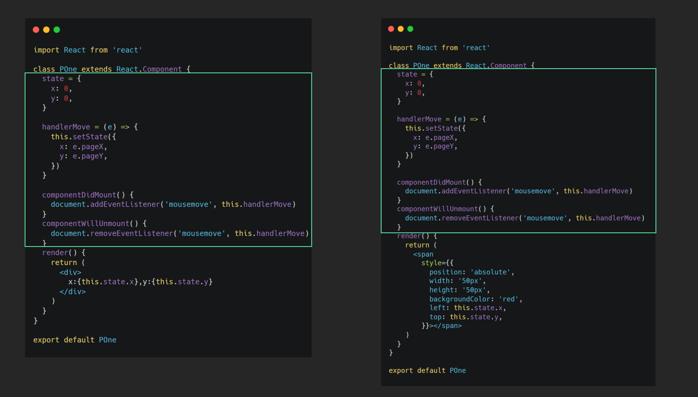
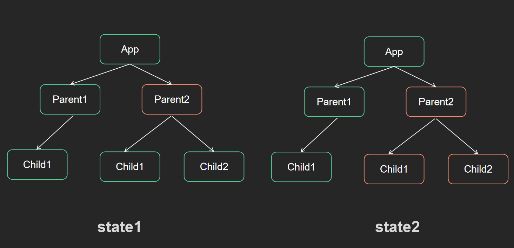
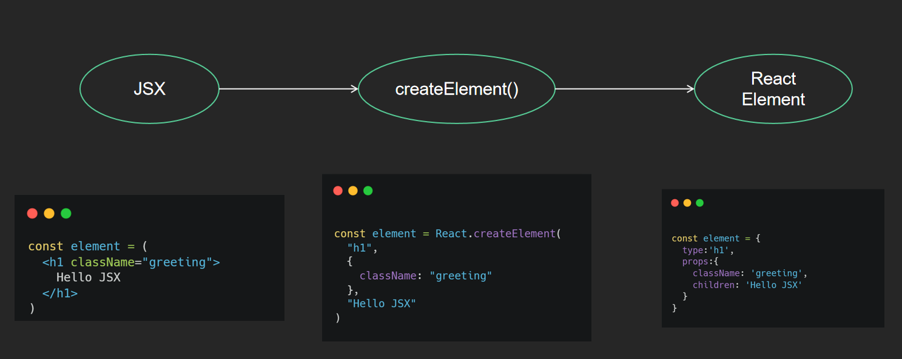
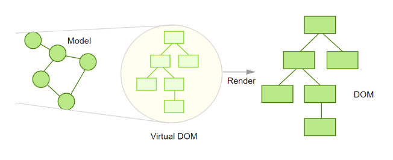
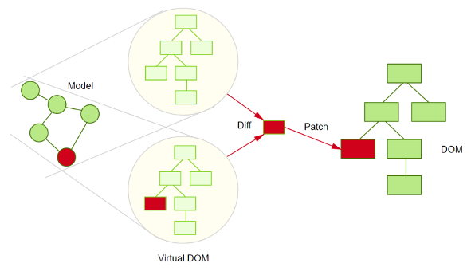

# 1. 状态逻辑复用

## 来个需求

> 分别实现俩个组件
>
> 组件One：在页面中显示鼠标在页面中的位置
>
> 组件Two：在页面中实现span标签跟随鼠标移动



思考：图中圈出的两部分是不是一样的，既然是一样的，有必要重复写两次吗？很明显，是可以进行复用的，这里要进行复用的部分就是我们要说的`状态逻辑复用`，其中的状态是：state里的x/y，逻辑为：x/y随着鼠标位置的移动而发生变化

## 高阶组件

> 什么是高阶组件？
>
> 高阶组件本质是一个函数，类比高阶函数，入参为组件，返回值也为组件，可以在函数体内给入参组件携带更多参数

高阶组件代码实现 -  `HocWrapper.jsx`

```jsx
// 高阶组件
import React from 'react'
const withMouse = (BaseComponent) => {
  class Wrapper extends React.Component {
    // 状态和逻辑公共部分
    state = {
      x: 0,
      y: 0,
    }
    moveHandler = (e) => {
      this.setState({
        x: e.pageX,
        y: e.pageY,
      })
    }
    componentDidMount() {
      document.addEventListener('mousemove', this.moveHandler)
    }
    componentWillUnmount() {
      document.removeEventListener('mousemove', this.moveHandler)
    }
    render() {
      const { x, y } = this.state
      // 数据状态x,y 想怎么用 不一定，给它传下来，自己看着办吧
      return <BaseComponent x={x} y={y} />
    }
  }

  return Wrapper
}

export { withMouse }
```

使用高阶组件

```jsx
import React from 'react'
import { withMouse } from './HocWrapper'

function AComponent({ x, y }) {
  return (
    <div>
      x:{x},y:{y}
    </div>
  )
}
// 调用高阶组件包裹源组件
const WrapperA = withMouse(AComponent)

class App extends React.Component {
  render() {
    return (
      <div>
        <WrapperA />
      </div>
    )
  }
}

export default App
```

## render props

> 什么是render props？
>
> render props本质是一个`组件`，将组件的children属性设计为一个函数，在调用函数的同时传入额外参数

render props定义 `renderProps.jsx`

```jsx
// render Props
import React from 'react'

class WithMouse extends React.Component {
  state = {
    x: 0,
    y: 0,
  }
  moveHandler = (e) => {
    this.setState({
      x: e.pageX,
      y: e.pageY,
    })
  }
  componentDidMount() {
    document.addEventListener('mousemove', this.moveHandler)
  }
  componentWillUnmount() {
    document.removeEventListener('mousemove', this.moveHandler)
  }
  render() {
    return <div>{this.props.children(this.state)}</div>
  }
}

export default WithMouse
```

使用render props

```jsx
import React from 'react'
import WithMouse from './renderProps'

function AComponent({ x, y }) {
  return (
    <div>
      x:{x},y:{y}
    </div>
  )
}

class App extends React.Component {
  render() {
    return (
      <div>
        <WithMouse>{(state) => <AComponent {...state} />}</WithMouse>
      </div>
    )
  }
}

export default App
```

## hooks

> 天生为组合而生

hook实现

```js
import { useState, useEffect } from 'react'

function useMouse () {
  const [p, setP] = useState({
    x: 0,
    y: 0
  })
  function moveHandler (e) {
    setP({
      x: e.pageX,
      y: e.pageY
    })
  }
  useEffect(() => {
    document.addEventListener('mousemove', moveHandler)
    return () => {
      document.removeEventListener('mousemove', moveHandler)
    }
  }, [])
  return [p.x, p.y]
}
export { useMouse }
```

hook使用

```jsx

import { useMouse } from './withMouse'
function AComponent() {
  const [x, y] = useMouse()
  return (
    <div>
      x:{x},y:{y}
    </div>
  )
}
```


# 2. 性能优化

## 优化的方向

> 重点：减少没必要的组件更新

React组件默认更新的特性：只要父组件更新，子组件都会无条件更新




但是，在某些情况下，子组件是没必要更新的，比如

1. 子组件仅是一个展示型组件，没有动态内容，纯静态JSX模板
2. 子组件没有从父组件接收任何props
3. 父组件传给子组件的引用虽然变了，但是本质内容没变，比如父组件给子组件传递了一个回调函数

如果我们要避免这些没必要的组件更新，就需要做优化

**示例代码**

```jsx
import { useState } from 'react'
// 子组件
function Son() {
  console.log('我是son组件,我更新了')
  return <div>this is son </div>
}
// 父组件(更新)
function App() {
  const [count, setCount] = useState(0)
  return (
    <div className="App">
      <button onClick={() => setCount(count + 1)}>+{count}</button>
      <Son />
    </div>
  )
}

export default App
```

当我们对父组件中的状态进行更新时，子组件Son也跟着一起来更新了，这显然是没有必要的

## React.memo

> React.memo是一个高阶组件，其实就是一个函数，通过比较**`props的变化`**决定是否重新渲染，如果通过内部的对比发现props并没有变化，则不会重新渲染，从而达到提高渲染性能的目的

### 基础使用

1）props不变不重新渲染

```jsx
import React, { useState } from 'react'
// 通过React.memo包裹子组件
const Son = React.memo(() => {
  console.log('我是son组件,我更新了')
  return <div>this is son </div>
})

function App() {
  const [count, setCount] = useState(0)
  return (
    <div className="App">
      <button onClick={() => setCount(count + 1)}>+{count}</button>
      <Son />
    </div>
  )
}
export default App
```

再次运行发现，子组件只会在首次渲染时执行一次，后续App组件的更新不再影响它

2）props变化重新渲染

```jsx
import React, { useState } from 'react'

const Son = React.memo(() => {
  console.log('我是son组件,我更新了')
  return <div>this is son </div>
})

function App() {
  const [count, setCount] = useState(0)
  return (
    <div className="App">
      <button onClick={() => setCount(count + 1)}>+{count}</button>
      <Son count={count} />
    </div>
  )
}

export default App
```

再次运行发现，子组件会随着count的变化而变化

### 复杂类型的Props

> 由于react内部对于复杂类型数据进行的是浅对比，只对比引用，如果引用不同，则代表俩次的props是不一致的，如果不一致，就重新渲染

```jsx
import React, { useState } from 'react'

const Son = React.memo(() => {
  console.log('我是son组件,我更新了')
  return <div>this is son </div>
})

function App() {
  const [count, setCount] = useState(0)
  // 这里我们每次 修改count进行App组件更新 list都会生成一个不同的引用 所以造成子组件又重新渲染了
  const list = [1, 2, 3]
  return (
    <div className="App">
      <button onClick={() => setCount(count + 1)}>+{count}</button>
      <Son list={list} />
    </div>
  )
}

export default App
```

### 自定义props对比

> 如果不想使用React.memo内置的对比方式，而是想自己做判断，也是可以的，它为我们开放了对比函数，只需要在memo函数中传入第二个参数即可

```jsx
import React, { useState } from 'react'

const Son = React.memo(
  () => {
    console.log('我是son组件,我更新了')
    return <div>this is son </div>
  },
  (prev, next) => {
    // 自定义对比关系 决定是否要重新渲染
    // 如果返回false 代表俩次props发生了改变 组件重新渲染
    // 如果返回true  代表来此props没有发生变化 组件不会重新渲染
    return prev.list.length === next.list.length
  }
)

function App() {
  const [count, setCount] = useState(0)
  const list = [1, 2, 3]
  return (
    <div className="App">
      <button onClick={() => setCount(count + 1)}>+{count}</button>
      <Son list={list} />
    </div>
  )
}

export default App
```

##  useCallBack

> 作用：缓存一个函数，只在依赖项变化的时候才会更新引用值，经常与React.memo配合使用

**未优化版本**

我们上一节刚讲过，通过React.memo虽然可以在一定程度上避免子组件务必要的渲染，但是对于引用类型是无效的，那函数也是一个引用类型，且在父传子的时候也是可以把函数传给子组件的，这个时候就可以利用useCallBack和React.memo配合使用

```jsx
import React, { useState } from 'react'

const Son = React.memo(() => {
  console.log('Son组件更新了')
  return <div>this is son</div>
})

function App() {
  const [count, setCount] = useState(0)
  const getName = () => {
    return 'this is app'
  }
  return (
    <div className="App">
      <button onClick={() => setCount(count + 1)}>+{count}</button>
      {/* 传给子组件一个函数引用 每次子组件都会跟着更新 */}
      <Son getName={getName} />
    </div>
  )
}

export default App
```

**优化版本**

```jsx
import React, { useState, useCallback } from 'react'

const Son = React.memo(() => {
  console.log('Son组件更新了')
  return <div>this is son</div>
})

function App() {
  const [count, setCount] = useState(0)
  // 缓存
  const getName = useCallback(() => {
    return 'this is app'
  }, [])

  return (
    <div className="App">
      <button onClick={() => setCount(count + 1)}>+{count}</button>
      {/* 传给子组件一个函数引用 每次子组件都会跟着更新 */}
      <Son getName={getName} />
    </div>
  )
}

export default App

```

## useMemo

> 作用：缓存一个函数，该函数只在依赖项变化时才会重新执行此函数，在一些计算量很大的场景中非常有用

**错误演示**

```jsx
import React, { useState } from 'react'

function App() {
  const [count, setCount] = useState(0)
  const getNums = () => {
    // 模拟昂贵计算
    const nums = new Array(10000).fill(0).map((item) => item)
    console.log('计算了')
    return nums
  }
  return (
    <div className="App">
      <button onClick={() => setCount(count + 1)}>+{count}</button>
      {getNums()}
    </div>
  )
}

export default App
```

getNums内部有一个很大的计算，每次只有count发生变化，组件重新执行，计算也跟着重新执行，然后这个计算很明显只计算一次就可以了，这时候，就需要使用useMemo来进行优化

**优化版本**

```jsx
import React, { useMemo, useState } from 'react'

function App() {
  const [count, setCount] = useState(0)
  const getNums = useMemo(() => {
    // 模拟昂贵计算
    const nums = new Array(10000).fill(0).map((item) => item)
    console.log('计算了')
    return nums
  }, [])
  return (
    <div className="App">
      <button onClick={() => setCount(count + 1)}>+{count}</button>
      {getNums}
    </div>
  )
}

export default App
```


# 3. 虚拟DOM与diff算法

## 虚拟dom概念

> 虚拟DOM(Virtual DOM)，就是一个js对象，用来描述真实dom

为什么使用虚拟DOM？

1. React要做跨平台开发，虚拟dom由于是纯js对象，方便对接三方API
2. 提升性能

```jsx
const vdom = {
  type: 'h1',
  props: {
    className: 'greeting',
    children: 'hello jsx'
  }
}

// jsx
<div>123</div>
// 虚拟dom { type:'div', props:{children:'123'}}
<div className="tab">123</div>
// 虚拟dom { type:'div', props:{children:'123',className:'tab'}}
```

## React JSX语法转换的过程

> 转化过程： JSX =>  React.createElement() / _jsxRuntime => 虚拟DOM(React Element) => 真实DOM



更多阅读：https://zh-hans.reactjs.org/blog/2020/09/22/introducing-the-new-jsx-transform.html

## Diff算法的说明

### 1. 流程说明

1. 第一次页面渲染的过程中，JSX + State =>  虚拟Dom树（JS对象）=> HTML结构树（真实dom）

2. 当更改了状态 state ，就会重新渲染组件，会重新生成一颗新的虚拟dom树

3. Diff算法在这里就会：**对比 初始虚拟 DOM 树 和 更新后的虚拟 DOM 树，找到不同之处，最终，只将不同的地方更新到页面中**

   






**注意事项**

1. React在运行中最多会同时存在俩个虚拟DOM对象，最新的一次由状态生成的虚拟DOM和上一次的虚拟DOM

2. 只要状态更新，组件就会重新渲染，都会重复这个过程

   组件中的代码重新执行 ->  重新生成新的虚拟dom对象 -> diff算法介入进行diff找不同

3. 整个diff的过程都是纯js的操作，不涉及到DOM操作，最终只会将变化的内容更新到浏览器中（这里涉及到DOM操作）

### 2. 算法说明

1. 如果俩棵虚拟dom数的根元素类型不同，React会销毁旧树，创建新树

   ```html
   // 旧树
   <div>
     <Counter />
   </div>
   
   // 新树
   <span>
     <Counter />
   </span>
   ```

2. 类型相同的React DOM元素，React会对比俩者的属性是否相同，只更新的属性

   ```html
   <!-- 只更新class属性 -->
   // 旧
   <div className="before" title="stuff"></div>
   // 新
   <div className="after" title="stuff"></div>
   
   <!-- 只更新color属性 -->
   // 旧
   <div style={{color: 'red', fontWeight: 'bold'}}></div>
   // 新
   <div style={{color: 'green', fontWeight: 'bold'}}></div>
   ```

3. 列表list后序新增（简单情况）

   ```html
   // 旧
   <ul>
     <li>first</li>
     <li>second</li>
   </ul>
   
   // 新
   <ul>
     <li>first</li>
     <li>second</li>
     <li>third</li>
   </ul>
   <!-- 
   执行过程: 
   React会匹配新旧两个<li>first</li>, 匹配两个<li>second</li>, 然后添加 <li>third</li> 
   -->
   ```

4. 列表list插入新增（复杂情况）

   ```html
   // 旧
   <ul>
     <li>1</li>
     <li>2</li>
   </ul>
   
   // 新
   <ul>
     <li>3</li>
     <li>1</li>
     <li>2</li>
   </ul>
   
   <!--
    执行过程:
    React 将改变每一个子节点，而非保持 <li>1</li> 和 <li>2</li> 不变 这显然是一种浪费,大部分的节点都被浪  费掉了
   -->
   ```

5. key属性

   ```html
   // 旧
   <ul>
     <li key="2015">1</li>
     <li key="2016">2</li>
   </ul>
   
   // 新
   <ul>
     <li key="2014">3</li>
     <li key="2015">1</li>
     <li key="2016">2</li>
   </ul>
   
   <!-- 
   执行过程:
   现在 React 知道带有key '2014' 的元素是新的，对于 '2015' 和 '2016' 仅仅移动位置即可
   -->
   ```

   
